# WEB 安全

## 总览

|            攻击类型             | 描述                                                         |
| :-----------------------------: | :----------------------------------------------------------- |
|         XSS（跨站脚本）         | 攻击者向Web页面注入恶意脚本，当用户浏览该页时，脚本会在用户的浏览器上执行，从而窃取敏感信息、会话劫持等。 |
|      CSRF（跨站请求伪造）       | 攻击者诱使用户在当前已登录的Web应用程序上执行不期望的操作，如转账、发送消息等，而这些操作是由攻击者精心构造的恶意请求触发的。 |
|             SQL注入             | 攻击者通过Web表单或输入域向应用程序提交恶意的SQL代码，使后端数据库执行非预期的SQL命令，从而获取、篡改或删除数据库中的数据。 |
|            命令注入             | 类似于SQL注入，但攻击者注入的是可以在服务器上执行的操作系统命令，从而控制服务器或访问敏感文件。 |
|            目录遍历             | 攻击者通过请求包含特殊路径字符（如"../"）的URL来访问Web服务器上的受限目录和文件。 |
|           缓冲区溢出            | 攻击者向Web应用程序发送超出其处理能力的数据，导致程序崩溃或执行恶意代码。 |
|          文件上传漏洞           | Web应用程序允许用户上传文件时，如果没有对上传的文件进行充分的验证和过滤，攻击者可能会上传恶意文件（如病毒、木马），从而控制服务器或执行恶意操作。 |
|            会话劫持             | 攻击者通过拦截用户的会话标识符（如Cookie），从而接管用户的会话，执行用户的权限范围内的操作。 |
| 跨站请求伪造（CSRF）Token未验证 | Web应用程序未能正确验证CSRF Token，使得攻击者能够构造恶意请求，诱使用户在不知情的情况下执行敏感操作。 |
|           HTTP头注入            | 攻击者通过向Web应用程序注入恶意的HTTP头部字段，影响应用程序的行为或窃取敏感信息。 |
|            逻辑漏洞             | Web应用程序中的业务逻辑错误或漏洞，使得攻击者能够绕过安全控制，执行未授权的操作。 |


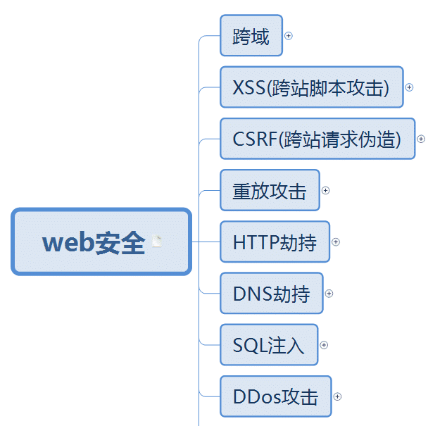

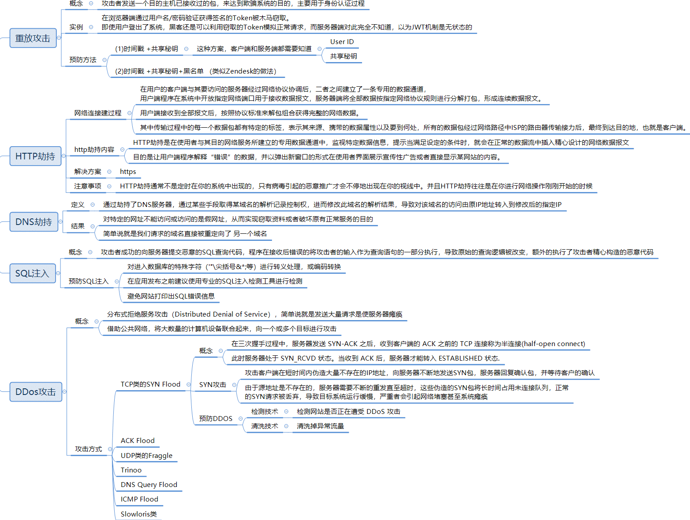

## 同源策略

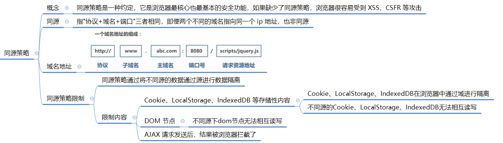

同源策略主要表现在以下三个方面：DOM、Web 数据和网络。

- **DOM 访问限制**：同源策略限制了网页脚本（如 JavaScript）访问其他源的 DOM。这意味着通过脚本无法直接访问跨源页面的 DOM 元素、属性或方法。这是为了防止恶意网站从其他网站窃取敏感信息。
- **Web 数据限制**：同源策略也限制了从其他源加载的 Web 数据（例如 XMLHttpRequest 或 Fetch API）。在同源策略下，XMLHttpRequest 或 Fetch 请求只能发送到与当前网页具有相同源的目标。这有助于防止跨站点请求伪造（CSRF）等攻击。
- **网络通信限制：同源策略还限制了跨源的网络通信**。浏览器会阻止从一个源发出的请求获取来自其他源的响应。这样做是为了确保只有受信任的源能够与服务器进行通信，以避免恶意行为。

出于安全原因，浏览器限制从脚本内发起的跨源 HTTP 请求，XMLHttpRequest 和 Fetch API，只能从加载应用程序的同一个域请求 HTTP 资源，除非使用 CORS 头文件

## 跨域

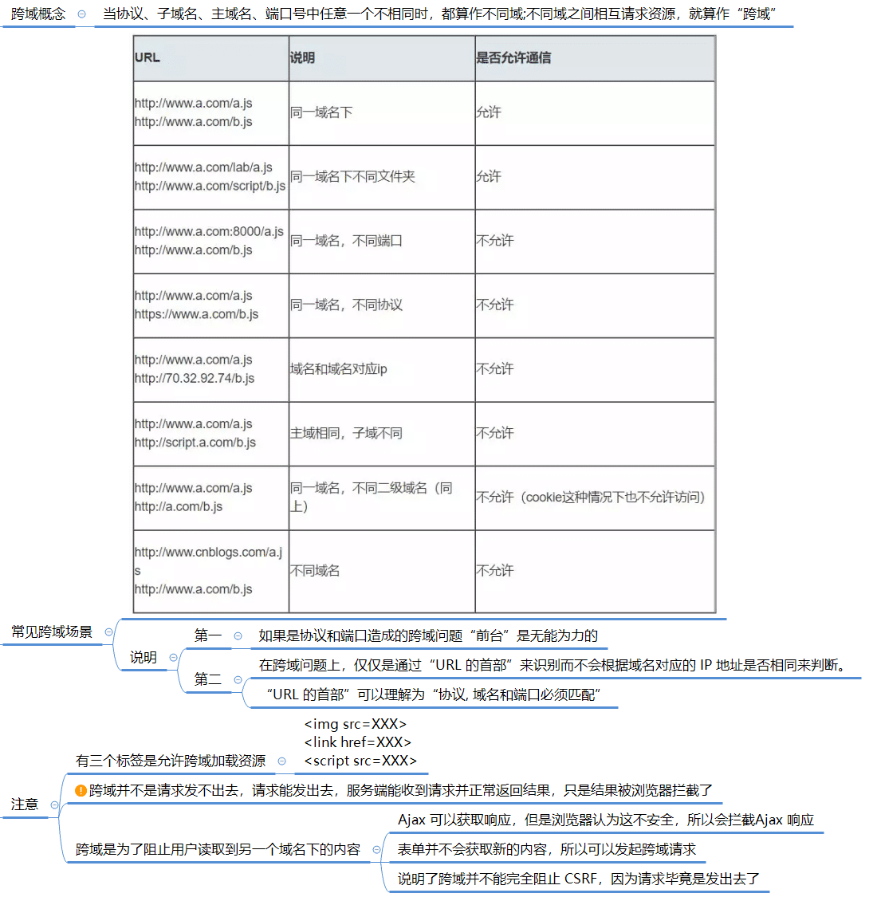

### 判断是否跨域

在前端开发中，可以使用以下几种方法来判断是否存在跨域请求：

1. **浏览器控制台显示跨域错误信息：** 当浏览器发起跨域请求时，如果服务器没有设置正确的跨域相关响应头，浏览器会在控制台中显示跨域错误信息，例如 "Access to XMLHttpRequest at 'URL' from origin 'Origin' has been blocked by CORS policy"。这是最直观且常见的跨域错误提示。

   

2. **网络请求的响应头信息：** 在浏览器的开发者工具中，可以查看网络请求的响应头信息。如果响应头中包含 "Access-Control-Allow-Origin" 字段，并且其值不包含当前页面的域名，则表示存在跨域。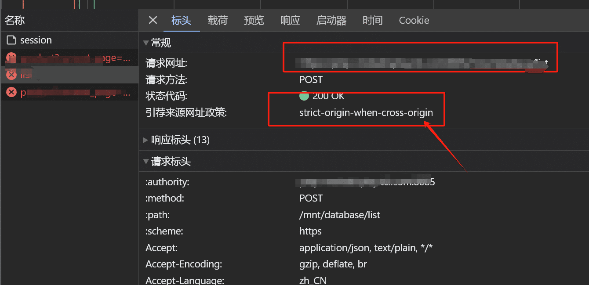

3. **浏览器地址栏的协议、域名、端口不一致：** 当前页面的协议、域名、端口与请求的目标地址不一致时，会触发跨域请求。

   > 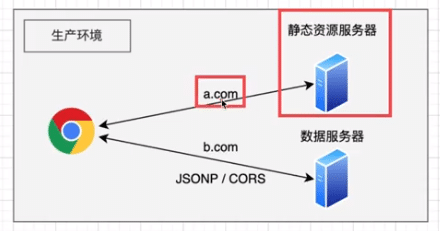
   >
   > 例如：前端打包后的静态资源文件部署在 `a.com` 的静态资源服务器，页面请求的是 `b.com` 的接口数据！

4. **JavaScript中的Error对象：** 如果通过JavaScript代码发起了跨域请求并得到响应，可以判断响应中的Error对象的相关属性，如status属性。如果请求返回的状态码为0或者大于等于400，很可能是跨域请求被阻止。

需要注意的是，以上方法只适用于前端浏览器环境下的跨域判断。在后端服务器环境中，可以通过查看请求的来源头（Referer）来判断是否跨域。

### 跨域解决方案

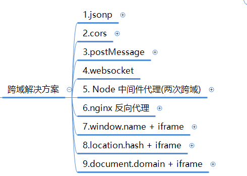

### JSONP

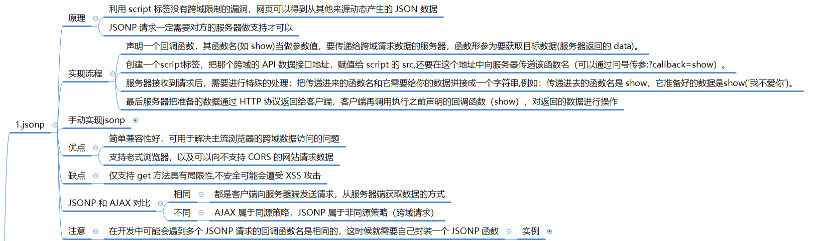

#### **概念**

JSONP（JSON with Padding）是一种解决跨域数据访问问题的技术。

由于同源策略的限制，位于不同源的网页无法直接进行数据交互。

而HTML的`<script>`元素是一个例外，它允许动态加载JavaScript代码，不受同源策略的限制。JSONP利用这一特性，通过动态创建`<script>`标签，从其他源获取JSON数据。

#### **原理**

 JSONP 的原理是动态地向 HTML 中插入一个 `<script src="url"></script>` 标签去加载异步资源。

具体来说，JSONP的工作原理如下：

1. 在客户端注册一个函数。
2. 将这个函数的名字传给服务器。
3. 服务器生成JSON数据，并以JavaScript语法的方式将数据传入客户端注册的函数中。
4. 在客户端的注册函数中接收JSON数据。

通过这种方式，客户端可以通过动态创建`<script>`标签，从其他源获取JSON数据，从而实现了跨域数据访问。


#### **手写  JSONP**

以下是一个简单的 JSONP 实现示例：

```javascript
// 创建 script，并插入 body
function createScriptTag(src) {  
  var script = document.createElement('script');  
  script.src = src;  
  document.body.appendChild(script);  
}  
//接受服务器响应
function handleResponse(data) {  
  console.log('Received data:', data);  
  // 在这里处理接收到的数据  
}  
// 获取 JSONP 方法
function jsonpRequest(url, callback) {  
  var callbackName = 'jsonp_callback_' + Math.round(100000 * Math.random());  
  var scriptTag = document.createElement('script');  
  window[callbackName] = function(data) {  
    scriptTag.parentNode.removeChild(scriptTag);  
    callback(data);  
  };  
  scriptTag.src = url + '?callback=' + callbackName;  
  document.body.appendChild(scriptTag);  
}
```

使用方法：

1. 创建一个 `script` 标签并设置其 `src` 属性为要请求的 JSONP 地址。例如：

```javascript
createScriptTag('https://api.example.com/data');
```

1. 定义一个处理响应的函数，例如：

```javascript
function handleResponse(data) {  
  console.log('Received data:', data);  
  // 在这里处理接收到的数据  
}
```

1. 调用 `jsonpRequest` 函数，传递要请求的 URL 和处理响应的函数作为参数。例如：

```javascript
jsonpRequest('https://api.example.com/data', handleResponse);
```

> 在上面的示例中:
>
> 1. `jsonpRequest` 函数首先生成一个唯一的回调函数名称，并将其存储在全局 `window` 对象上。
>
> 2. 然后，创建一个 `script` 标签，将其 `src` 属性设置为请求的 URL，并在 URL 中添加回调函数的名称作为参数。
>
> 3. 最后，将 `script` 标签添加到文档的 `body` 中。
>
> 4. 当服务器返回数据时，回调函数将被调用，并将数据传递给处理响应的函数。
> 5. 在处理响应的函数中，可以执行所需的操作，例如更新 UI、处理数据等。


#### **优点**

1. 它可以解决跨域数据访问的问题。由于同源策略的限制，不同源的网页无法直接进行数据交互。而JSONP通过动态创建`<script>`标签，从其他源获取JSON数据，从而实现了跨域数据访问。
2. 它能够绕过浏览器的同源策略，使得请求可以不受限制地从其他源获取数据。


#### **缺点**

1. 它只支持GET请求而不支持POST等其它类型的HTTP请求。
2. 它只支持跨域HTTP请求这种情况，不能解决不同域的两个页面之间如何进行JavaScript调用的问题。
3. JSONP在调用失败的时候不会返回各种HTTP状态码，因此难以进行错误处理。
4. JSONP在安全性方面存在一些问题。例如，如果提供JSONP的服务存在页面注入漏洞，那么返回的JavaScript的内容可能被人控制，导致安全风险。


### CORS

CORS（跨源资源共享，Cross-Origin Resource Sharing）是一种基于HTTP头的机制，用于控制不同源（域、协议或端口）之间的资源共享。

它是现代Web开发中处理跨域请求的一种重要方式，旨在**克服同源策略**（Same-Origin Policy）的限制，允许Web应用安全地进行跨域数据传输。

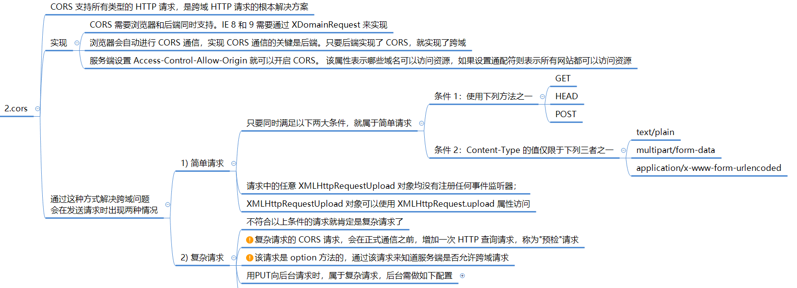

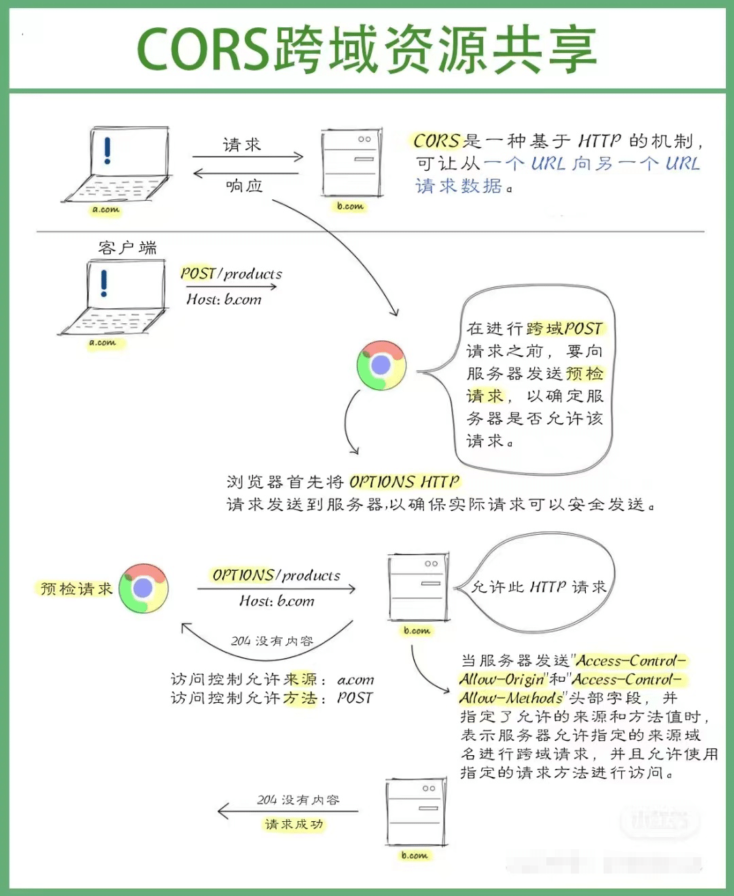

#### **CORS 的基本思想**

- CORS是一份浏览器技术的规范，允许Web服务器通过HTTP头部来告知浏览器，哪些跨源请求是被允许的。
- 当浏览器发现AJAX请求跨源时，会自动添加一些附加的头信息（如Origin字段），并可能**发起一个预检请求**（Preflight Request），以确认服务器是否允许该跨源请求。
- 服务器则通过**响应头中的CORS相关字段（如Access-Control-Allow-Origin）来告知浏览器是否允许该请求**。


#### **CORS请求的分类**

CORS请求被浏览器分为两类：简单请求（Simple Request）和非简单请求（Not-So-Simple Request）。

- **简单请求：**

满足以下条件的请求被认为是简单请求：

1. 请求方法只能是HEAD、GET或POST。
2. HTTP头信息只能包含以下字段：Accept、Accept-Language、Content-Language、Last-Event-ID以及Content-Type（但Content-Type的值只能为application/x-www-form-urlencoded、multipart/form-data或text/plain）。

对于简单请求，**浏览器直接发出CORS请求，并在请求头中添加Origin字段**。

- **非简单请求**：不满足上述条件的请求被认为是非简单请求。例如，使用PUT、DELETE等HTTP方法，或者Content-Type字段的类型是application/json。

**对于非简单请求，浏览器会先使用OPTIONS方法发起一个预检请求**，以确认服务器是否允许该跨源请求。预检请求会包含真实的HTTP方法和请求头信息，服务器通过响应头中的CORS相关字段来告知浏览器是否允许该请求。


#### CORS的响应头字段

CORS机制引入了一系列HTTP响应头字段，用于控制跨域请求的行为：

- **Access-Control-Allow-Origin**：指定哪些源可以访问资源。可以设置为具体的源地址，或者使用通配符*表示接受任意域名的请求。

> **示例配置：**
>
> - 允许所有源访问：
>
>   - 设置值为 `*`，表示接受来自任何域的请求。但出于安全考虑，这种做法通常不推荐，因为它允许任何网站访问你的资源。
>   - 示例（在Node.js中）：`res.setHeader('Access-Control-Allow-Origin', '*');`
>
> - 允许指定源访问：
>
>   - 将值设置为特定的域名，只有来自该域名的请求才会被允许。
>   - 示例（在Node.js中）：`res.setHeader('Access-Control-Allow-Origin', ' https://example.com');`
>
> - 允许多个源访问:
>
>   （注意：这种方法的具体实现可能因服务器和配置环境而异，通常不推荐直接在头部使用逗号分隔多个域名，因为并非所有浏览器都支持这种写法）：
>
>   - 一种常见的做法是在服务器端编写逻辑，根据请求的 `Origin` 头部来判断是否允许访问。

- **Access-Control-Allow-Methods**：指定哪些HTTP方法可以被允许访问。
- **Access-Control-Allow-Headers**：指定哪些头部可以包含在请求中。
- **Access-Control-Allow-Credentials**：指定了当请求的凭证（如cookies或授权头）应该被处理时，是否允许发送凭证。如果设置为true，则表示允许发送凭证。
- **Access-Control-Expose-Headers**：允许将某些头部暴露给浏览器，使得XMLHttpRequest对象的getResponseHeader()方法能够获取这些头部的值。


#### **CORS的配置和使用**

CORS的配置通常是在服务器端进行的。不同的服务器端技术栈有不同的配置方式，但基本原理相同，即通过在响应头中添加CORS相关的字段来告知浏览器哪些跨源请求是被允许的。

对于前端开发者来说，CORS的配置是透明的，他们只需要像处理同源请求一样发起跨域请求即可。如果服务器配置了CORS，并且允许该跨域请求，那么请求就会成功；否则，浏览器会抛出一个错误，并且该错误无法被JavaScript代码捕获（出于安全考虑）


#####  **在使用 CORS 的 POST 请求时候，浏览器会发送两次请求！**

> 根据CORS规范，进行跨域POST请求时，浏览器会先发送一个预检请求（Preflight Request）来检查服务器是否支持跨域请求!

####  **预检请求**

预检请求是一种OPTIONS方法的请求，其中包含了一些额外的请求头信息，例如`Access-Control-Request-Method`和`Access-Control-Request-Headers`等。服务器收到预检请求后，会检查这些请求头信息，并返回相应的CORS响应头。

如果服务器返回的CORS响应头中包含了对跨域POST请求的允许，浏览器会继续发送正式的POST请求。这个正式的POST请求与普通的同域POST请求一样，将请求数据发送给服务器，并等待服务器返回响应。

这样的设计是为了确保服务器允许跨域请求，并防止跨域请求对服务器的未经授权的访问。

预检请求的目的是为了确认服务器是否支持跨域请求，并获取服务器返回的CORS响应头信息，以决定是否继续发送正式的POST请求。

预检请求是在实际POST请求之前发送的，因此会增加一定的网络开销和请求延迟。不过，预检请求的缓存时间较长，浏览器会将预检请求的结果缓存起来，以减少后续相同跨域请求的预检开销。


#### **POST 发送两次请求的情况**

1. **重定向：** 当服务器返回一个重定向响应（如HTTP状态码为301或302），浏览器会自动跳转到新的URL。如果原始请求是POST请求，浏览器会在重定向之前先发送一个GET请求，然后才发送POST请求，这样就导致了两次请求。
2. **表单重复提交：** 当用户提交一个表单时，如果用户在提交后刷新了页面，浏览器会提示用户是否要重新提交表单数据。如果用户确认重新提交，浏览器会再次发送POST请求，这样就会导致两次请求。
3. **前端框架或库的影响：** 在使用某些前端框架或库时，可能会导致POST请求发送两次。这可能是由于框架或库的内部机制，或者是由于开发者错误地配置了事件处理程序或表单提交行为。
4. **浏览器的预加载机制 OPTIONS：** 一些现代浏览器具有预加载机制，会在用户可能要点击的链接上提前加载资源，以提高网页加载速度。如果用户在一个页面中点击了一个链接，而该链接指向的页面中包含一个POST表单，浏览器可能会预加载该页面，并发送一个POST请求，这样就导致了两次请求。

需要注意的是，POST请求发送两次并不是POST方法本身的特性，而是由于上述原因导致的。

为了避免这种情况，开发者可以在设计应用程序时注意处理重定向、避免表单重复提交，检查前端框架或库的配置和使用方式，以及了解浏览器的预加载机制。

因此，POST 请求发送两次的情况有多种，不一定就是 CORS 导致！


####  **Node.js 配置 CORS**

首先，安装`cors`模块：

```shell
npm install cors
```

然后，在Express应用程序中引入`cors`模块，并使用`app.use()`方法将其作为中间件添加到应用程序中：

```js
const express = require('express');
const cors = require('cors');

const app = express();

// 允许所有跨域请求
app.use(cors());

// 或者根据需求配置具体的跨域选项
// app.use(cors({
//   origin: 'http://example.com', // 允许的请求源
//   methods: 'GET,POST', // 允许的请求方法
//   allowedHeaders: 'Content-Type,Authorization', // 允许的请求头
//   credentials: true // 是否允许发送身份凭证信息（如cookies）
// }));

// 其他路由和中间件...
```

在上述示例中，`app.use(cors())`将启用一个简单的CORS配置，允许所有的跨域请求。如果你想要更精细地控制跨域请求，可以根据需要配置相关选项，例如指定允许的请求源、请求方法、请求头和是否允许发送身份凭证信息（如cookies）等。

请注意，在实际开发中，根据项目需求和安全性考虑，应该仔细配置CORS选项，限制跨域请求的访问权限。


### **postMessage**

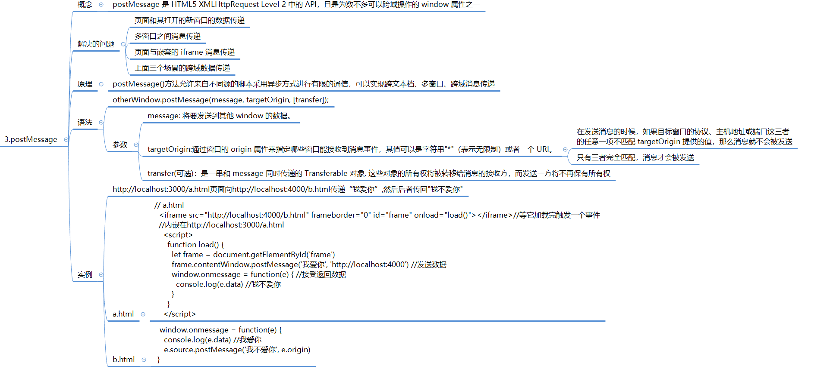


### **Node 中间代理**


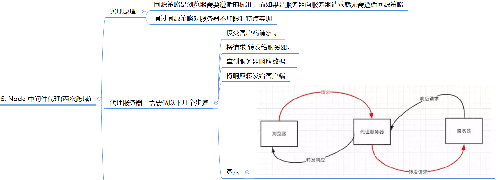


#### webpack dev server

>  **为什么本地使用 webpack 进行 dev 开发时，不需要服务器端配置 CORS 的情况下访问到线上接口？**

当你使用Webpack进行本地开发时，通常会配置一个开发服务器（Dev Server）来提供静态文件服务和代理转发功能。这个开发服务器会在本地启动一个HTTP服务器，用于提供你的前端应用程序。相当于使用了 Node 中间代理。

在开发环境下，由于前端应用程序和后端接口服务通常运行在不同的域或端口上，涉及到跨域请求。但是，Webpack的开发服务器（如webpack-dev-server或webpack-dev-middleware）会默认配置一个代理服务器（Proxy Server），用于将你的API请求代理转发到后端接口服务器。

当你在前端代码中发起API请求时，Webpack的代理服务器会拦截这些请求，并将它们转发到指定的后端接口服务器。由于代理服务器和后端接口服务器运行在同一个域或端口上，因此不存在跨域请求，不需要进行CORS配置。

通过这种方式，你可以在本地开发环境中直接访问线上接口，而无需关心跨域问题。开发服务器会自动处理跨域请求的转发，使你能够顺利地进行开发和调试。

需要注意的是，**这种代理转发仅适用于开发环境，并不会影响生产环境**。在生产环境中，你仍然需要在服务器端进行CORS配置，以确保跨域请求的安全和访问控制。

#### **Vue 配置 dev server**

**Vue2 配置 dev server**

在Vue 2中配置开发服务器（Dev Server），你可以使用`vue-cli-service`提供的一些选项来进行配置：

1. 首先，确保你已经安装了Vue CLI（如果没有安装，可以使用`npm install -g @vue/cli`进行安装）。
2. 在Vue项目的根目录下，创建一个`vue.config.js`文件（如果已经存在，请跳过此步骤）。
3. 在`vue.config.js`文件中，添加以下内容：

```js
module.exports = {
  devServer: {
    proxy: {
      '/api': {
        target: 'http://example.com', // 你的后端接口服务器地址
        changeOrigin: true,
        pathRewrite: {
          '^/api': '' // 如果接口路径有前缀，可以在这里进行替换
        }
      }
    }
  }
}
```

> - `target`字段指定了后端接口服务器的地址，例如`http://example.com`。根据实际情况进行修改。
> - `changeOrigin`字段设置为`true`，表示请求头中的Host字段会被设置为目标URL的主机部分。
> - `pathRewrite`字段用于对接口路径进行重写，比如将`/api`替换为空字符串，这样在前端代码中发送请求时可以省略`/api`前缀。

在上述示例中，我们使用`devServer`选项来配置开发服务器。`proxy`字段用于指定代理转发规则，将以`/api`开头的请求转发到指定的后端接口服务器。

### **Nginx**


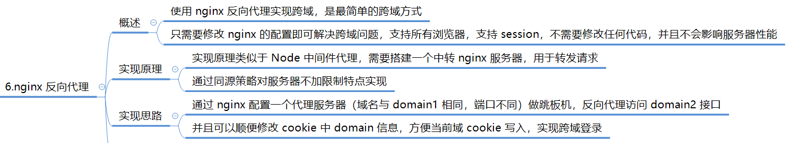

示例：

> 问题：假设前端打包的静态资源服务部署在 `a.com:8080/xxx` 域名下的 端口 8080 中，服务端接口部署在同域名的不同端口 `a.com:9000/xx` 中，由于端口号不同，因此在 `a.com:8080/xxx` 中请求 `a.com:9000/xx` 出现了跨域。
>
> 解决：通过配置 nginx 将 `a.com:9000/xx`请求转发到 `a.com:8080/api` 下，解决跨域问题
>
> 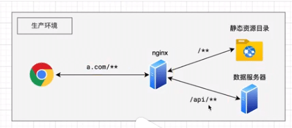
>
> 配置Nginx作为反向代理，将前端静态资源和后端接口服务统一在同一个域名下，从而避免跨域请求。
>
> 以下是一个基本的Nginx配置示例：
>
> 1. 安装Nginx并启动Nginx服务。
> 2. 打开Nginx的配置文件（通常位于 `/etc/nginx/nginx.conf` 或 `/etc/nginx/conf.d/default.conf`）。
> 3. 在`http`模块中添加一个新的`server`块，配置前端静态资源的代理：
>
> ```
> http {
>   # 其他配置项...
> 
>   server {
>     listen 8080; # 前端静态资源的端口号
>     server_name a.com; # 前端静态资源的域名
> 
>     location / {
>       root /path/to/your/frontend/dist; # 前端静态资源的路径
>       index index.html;
>       try_files $uri $uri/ /index.html;
>     }
>   }
> 
>   # 其他配置项...
> }
> ```
>
> 在上述配置中，我们定义了一个Nginx服务器块，监听端口8080并使用域名`a.com`。`location /`指令将匹配所有请求，并将其代理到前端静态资源的路径，这里假设前端静态资源已经通过Webpack等工具打包到`/path/to/your/frontend/dist`目录下。
>
> 4. 继续在`http`模块中添加另一个`server`块，配置后端接口服务的代理：
>
> ```
> http {
>   # 其他配置项...
> 
>   server {
>     listen 9000; # 后端接口服务的端口号
>     server_name a.com; # 后端接口服务的域名
> 
>     location /api/xx {
>       proxy_pass http://a.com:9000; # 后端接口服务的地址
>       proxy_set_header Host $host;
>       proxy_set_header X-Real-IP $remote_addr;
>     }
>   }
> 
>   # 其他配置项...
> }
> ```
>
> 在上述配置中，我们定义了另一个Nginx服务器块，监听端口9000并使用域名`a.com`。`location /xx`指令将匹配以`/xx`开头的请求，并将其代理到后端接口服务的地址`http://a.com:9000`。`proxy_set_header`指令用于设置请求头，确保后端接口服务可以正确获取到请求的Host和真实IP地址。


### **`window.name + iframe`**


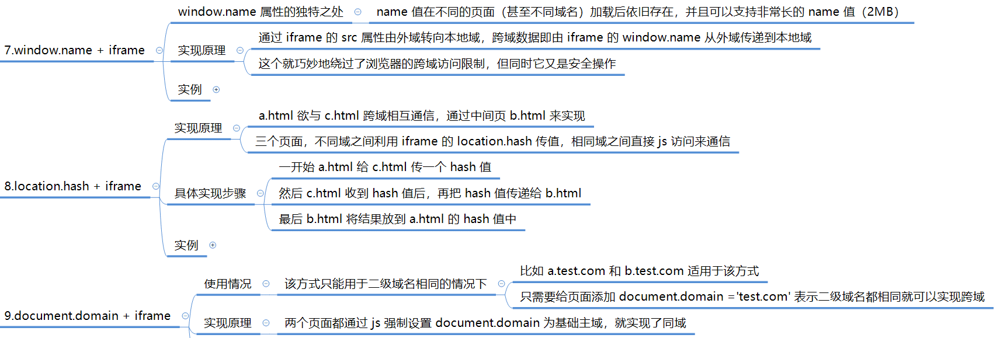


* 参考资料：[浏览器同源政策及其规避方法](https://www.ruanyifeng.com/blog/2016/04/same-origin-policy.html)


## XSS(跨站脚本攻击)

### 概念

XSS跨站脚本攻击（Cross-Site Scripting），也被称为XSS，是一种常见的网络安全漏洞，它允许攻击者将恶意脚本代码注入到正常的网页中。

当用户访问该网页时，恶意脚本代码将在用户的浏览器中执行，从而可能获取用户的敏感信息、篡改网页内容、进行恶意操作等。

### XSS攻击的原理

XSS攻击利用了网站对用户输入的不正确处理，使得恶意用户能够向受害者的网页中注入恶意脚本。这些脚本在用户浏览器中执行，从而导致安全风险。

具体来说，攻击者通过在网站中注入恶意脚本（通常为JavaScript代码），当其他用户访问该网站时，浏览器会解析并执行这些恶意脚本，从而达到攻击目的。

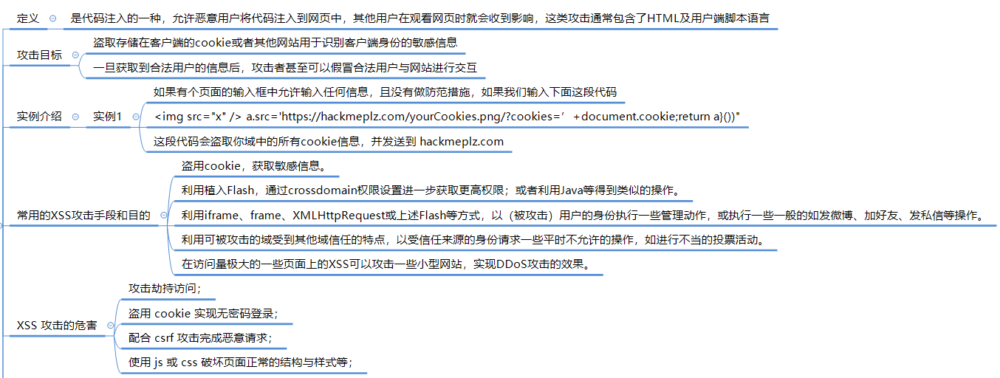


### XSS攻击的类型

XSS攻击可以分为以下三种类型：

1. **反射型XSS（非持久型XSS）**：
   - 攻击者通过特定的方式诱惑受害者访问一个包含恶意代码的URL。
   - 当受害者点击这个恶意链接时，注入脚本被传输到目标服务器上，然后服务器将注入脚本反射回受害者的浏览器，浏览器解析并执行这段恶意脚本。
   - 这类攻击的特点是交互数据不会存储在数据库里，是一次性的。
2. **存储型XSS（持久型XSS）**：
   - 攻击者将恶意代码永久地嵌入到一个页面中，当用户访问这个页面时，恶意脚本会被触发执行。
   - 这种类型的攻击较为危险，因为它可以长期地影响用户，且影响范围较大，可以危及所有访问者。
   - 存储型XSS一般发生在论坛、博客、留言板等允许用户共享内容的网站。
3. **DOM型XSS**：
   - 基于文档对象模型（Document Object Model, DOM）的一种XSS攻击。
   - 攻击者构造恶意URL，当用户点击包含恶意参数的URL时，恶意脚本修改页面的DOM结构，从而导致安全漏洞。
   - 这种类型的攻击不涉及服务器端的数据交互，是基于客户端JavaScript代码的不当处理。

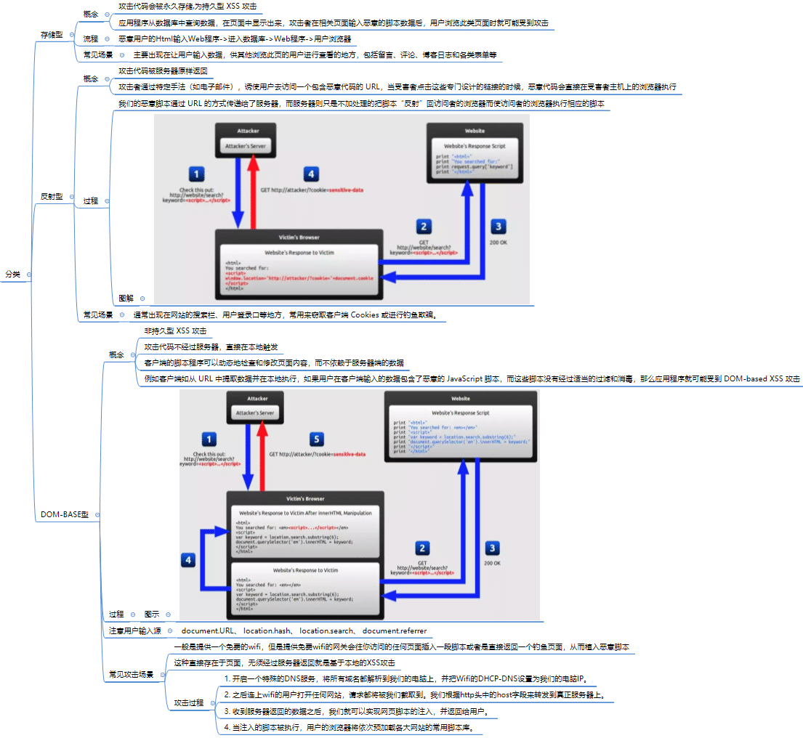


### XSS攻击的危害

XSS攻击的危害包括但不限于：

- 窃取用户信息，如cookies、session IDs等。
- 劫持用户会话，模拟用户的身份执行操作。
- 进行钓鱼攻击，诱导用户输入敏感信息。
- 恶意重定向用户到恶意网站。
- 破坏页面结构，显示虚假信息。


### XSS攻击的防御措施

为了有效防御XSS攻击，可以采取以下措施：

1. **输入验证与过滤**：对所有用户输入进行严格的验证和过滤，以防止恶意脚本的注入。可以使用白名单验证、黑名单验证、HTML实体编码等方式。
2. **输出转义**：在将用户输入显示给用户之前，必须确保对其进行转义，以防止恶意脚本的注入。可以使用HTML实体或JavaScript转义序列将特殊字符转义为它们的实体表示形式。
3. **使用安全的HTTP头部**：如Content-Security-Policy（CSP）来限制网页上可以执行的脚本和加载的资源。使用HttpOnly标记的Cookie，防止JavaScript访问Cookie中的内容。
4. **安全的编程实践**：在处理用户输入和输出时，使用安全的框架和库，如使用React或Vue等现代前端框架自带的XSS防护机制。
5. **Web应用防火墙（WAF）**：引入WAF是一个非常有效的策略，WAF能够自动识别和阻止XSS攻击，并提供灵活的配置选项，允许用户根据自己的网站特性定制安全规则。
6. **定期更新和补丁**：定期更新应用程序及其依赖的库和框架，以修复已知漏洞。


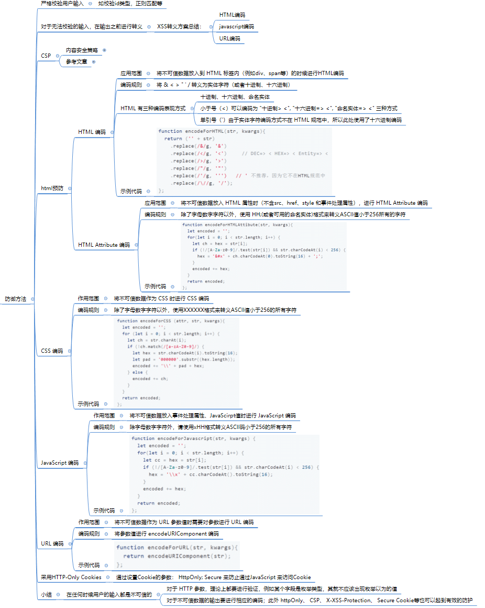


## CSRF(跨站请求伪造)

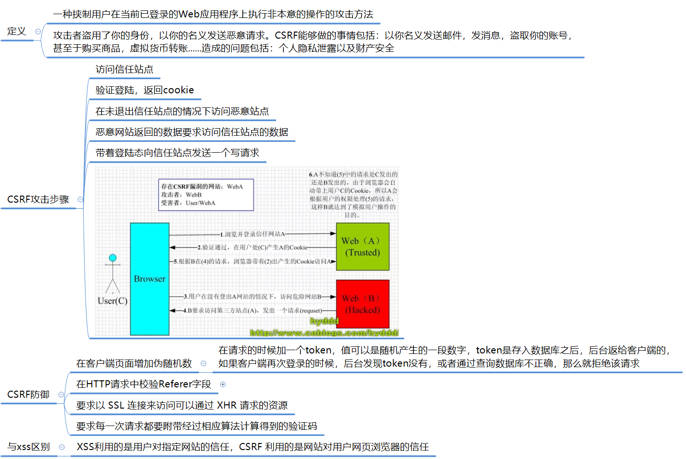

CSRF（Cross-Site Request Forgery，跨站请求伪造）是一种常见的Web安全攻击手段。 

### CSRF的基本原理

CSRF攻击利用的是用户在登录某个网站后，浏览器会存储该**网站的cookie**，并在后续的请求中自动携带这些cookie。攻击者通过构造恶意的请求，诱导用户在不知情的情况下，利用这些有效的cookie向受信任的服务器发送伪造请求，从而达到攻击目的。

### CSRF的攻击过程

1. **用户登录网站A**：用户C打开浏览器，访问受信任网站A，并成功登录。此时，网站A会在用户的浏览器中设置cookie，用于后续的请求认证。
2. **用户访问恶意网站B**：在用户未退出网站A之前，通过点击链接或访问恶意网站B，该网站会构造一个针对网站A的恶意请求。
3. **浏览器发送伪造请求**：由于用户的浏览器中已经存储了网站A的cookie，且浏览器会自动携带cookie发送请求，因此当恶意网站B构造的请求被发送到网站A时，网站A会误认为这是用户C的合法请求，并基于该请求执行相应的操作。

### CSRF的危害

CSRF攻击的危害包括但不限于：

- 窃取用户信息，如cookies、session IDs等。
- 冒充用户身份进行敏感操作，如转账、购买商品、修改密码等。
- 破坏网站的正常运行和数据安全。

### CSRF的防御措施

为了有效防御CSRF攻击，可以采取以下措施：

1. **使用Token机制：**
   - 在用户登录后，服务器生成一个随机的Token值，并将其存储在session或cookie中。
   - 在每次请求时，服务器要求客户端在请求中携带这个Token值。
   - 服务器验证请求中的Token值是否与存储的Token值一致，如果不一致，则拒绝请求。
2. **验证Referer字段：**
   - HTTP请求头中的Referer字段记录了请求的来源地址。
   - 服务器可以检查Referer字段的值，确保请求来自合法的来源页面。
   - 但需要注意的是，Referer字段可以被伪造，因此这种方法并不是绝对安全的。
3. **使用SameSite属性：**
   - SameSite是Cookie的一个属性，用于限制第三方Cookie的发送。
   - 将Cookie的SameSite属性设置为Strict或Lax，可以防止跨站请求携带Cookie。
4. **CSRF Token和Referer检查结合使用：**
   - 将Token机制和Referer检查结合使用，可以提高防御CSRF攻击的效果。
   - 服务器在验证请求时，同时检查Token值和Referer字段的值，确保请求既携带了正确的Token值，又来自合法的来源页面。
5. **其他安全措施：**
   - 确保敏感操作需要用户重新进行身份验证。
   - 限制表单的提交方式，只允许通过POST方式提交敏感信息。
   - 对用户输入进行严格的验证和过滤，防止恶意代码的注入。


## 点击劫持

点击劫持（ClickJacking）是一种网络安全攻击手段，通过诱使用户在不知情的情况下点击或操作被隐藏的页面元素，实现恶意目的。

这种攻击方式属于UI欺诈攻击的一种，其核心在于利用透明层或隐藏的元素覆盖在用户可见的页面上，从而使用户在操作时实际上触发了被隐藏的元素。

### 点击劫持的原理

点击劫持攻击的原理相对简单，主要包括以下几个步骤：

1. **创建恶意网页**：攻击者首先创建一个含有恶意代码的网页。该网页中会包含一个透明的`<iframe>`元素，这个`<iframe>`中加载的是目标网站页面。
2. **添加诱饵**：攻击者在自己的网页上添加诱饵，如看起来正常的按钮或链接，这些诱饵在位置上与`<iframe>`中的元素重叠。
3. **诱导用户点击**：用户在点击诱饵时，认为自己在进行正常操作（如点击“提交”按钮），但实际上点击的是另一个透明`<iframe>`中的元素。这导致攻击者可以捕获点击操作并触发不良动作，如给攻击者的文章点赞、泄露敏感信息等。

### 常见的点击劫持场景

1. **隐藏的关注按钮**：攻击者可能会在页面上放置一个看似无害的按钮，但实际上这个按钮被透明的`<iframe>`覆盖，用户点击时实际上是关注了某个恶意账号。
2. **授权第三方应用访问权限**：在未经用户明确同意的情况下，通过点击劫持诱导用户授权恶意应用访问其敏感信息或执行恶意操作。
3. **Flash点击劫持**：利用Adobe Flash Player中的漏洞实现攻击，通过创建一个透明的Flash对象覆盖在正常页面上，诱导用户点击。
4. **图片覆盖攻击**：利用透明图片覆盖在页面正常元素上，实现点击劫持。
5. **拖拽劫持**：利用用户拖拽操作实现数据窃取的技巧。
6. **触屏劫持**：随着移动设备的普及，触屏劫持成为一种新型点击劫持攻击方式，通过诱导用户在触屏设备上执行特定操作来实现攻击目的。

### 防御点击劫持的措施

为了有效防御点击劫持攻击，可以采取以下措施：

1. **使用X-Frame-Options HTTP头**：在服务器响应中设置X-Frame-Options HTTP头，以阻止或允许页面嵌入`<iframe>`中。例如，设置为`DENY`可以始终禁止在frame中显示此页面；设置为`SAMEORIGIN`则只允许与页面同源的`<iframe>`中显示页面。

2. **内容安全策略（CSP）**：使用CSP的`frame-ancestors`指令来指示是否应允许浏览器在frame或iframe中呈现页面。通过设置CSP，可以限制哪些网站可以嵌入当前网站的内容。

3. **SameSite Cookie属性**：将Cookie的SameSite属性设置为Strict或Lax，可以防止跨站请求伪造（CSRF）和点击劫持攻击中会话cookie的泄露。

4. **框架破坏脚本（Frame-Buster）**：在页面中包含框架破坏脚本，当页面被嵌入到iframe中时，该脚本会尝试跳出iframe并重新加载原始页面。但需要注意的是，某些框架破坏脚本可能会被绕过。

   


## CSP内容安全策略

CSP（内容安全策略，Content Security Policy）是一种Web安全机制，旨在帮助防范和减轻特定类型的攻击，特别是跨站脚本攻击（XSS）和数据注入攻击。

### CSP的基本概念

CSP通过允许网站管理员定义和实施一系列安全策略，限制页面加载和执行的内容来源，以减少潜在的安全风险。这些策略通过HTTP响应头或HTML元素中的`<meta>`标签告知浏览器，哪些内容是允许的，哪些是不允许的。

### CSP的工作原理

CSP通过设置响应头中的`Content-Security-Policy`或`X-Content-Security-Policy`字段，指定一系列可信任的内容源和执行规则。这些规则告诉浏览器只执行来自指定源的脚本、样式表、字体、图像等资源，而禁止运行来自未授权的源的内容。

### CSP的主要指令

CSP包含多个指令，用于定义不同类型的资源加载策略。以下是一些常用的指令：

1. **default-src**：定义默认的内容来源策略，适用于未明确指定的资源类型。
2. **script-src**：指定允许加载和执行JavaScript代码的来源。
3. **style-src**：指定允许加载的样式表（CSS）的来源。
4. **img-src**：指定允许加载的图像来源。
5. **font-src**：指定允许加载的字体文件的来源。
6. **connect-src**：指定允许进行网络请求（如XMLHttpRequest、WebSocket等）的来源。
7. **frame-src**：指定允许嵌入的iframe的来源。

### CSP的指令值

CSP指令的值可以是以下几种之一：

1. **'self'**：表示只允许从同源（相同的协议、域名和端口）加载资源。
2. **具体的URL**：指定允许加载资源的具体域名或路径。
3. **'none'**：表示不允许加载任何外部资源。
4. **'unsafe-inline'**：允许加载内联的资源，如内联的JavaScript代码或CSS样式。
5. **'unsafe-eval'**：允许通过字符串动态创建的脚本执行，如使用`eval()`函数。

### CSP的应用场景

CSP可以应用于各种Web应用中，以提高应用的安全性。特别是在处理用户输入和输出时，CSP可以有效地防止XSS攻击和其他类型的注入攻击。

### CSP的部署方式

CSP可以通过以下两种方式部署：

1. **在HTTP响应头中设置**：这是首选的部署方式，因为它可以确保CSP策略被所有访问该网站的浏览器所遵循。
2. **在HTML的<meta>标签中设置**：虽然这种方法也可以设置CSP策略，但它只适用于当前页面，且可能会被某些浏览器忽略。

### CSP的注意事项

1. **兼容性**：不同浏览器对CSP的支持程度可能有所不同，因此在部署CSP时需要考虑到浏览器的兼容性。
2. **性能影响**：虽然CSP通常不会对网站性能造成显著影响，但过多的限制和复杂的策略可能会增加浏览器的解析负担。
3. **调试**：在部署CSP后，需要仔细监控和调试，以确保它不会意外地阻止合法的资源加载。

