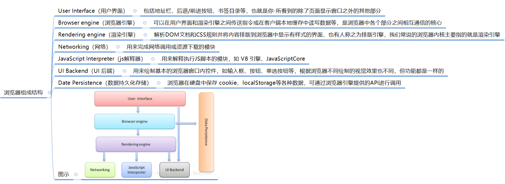
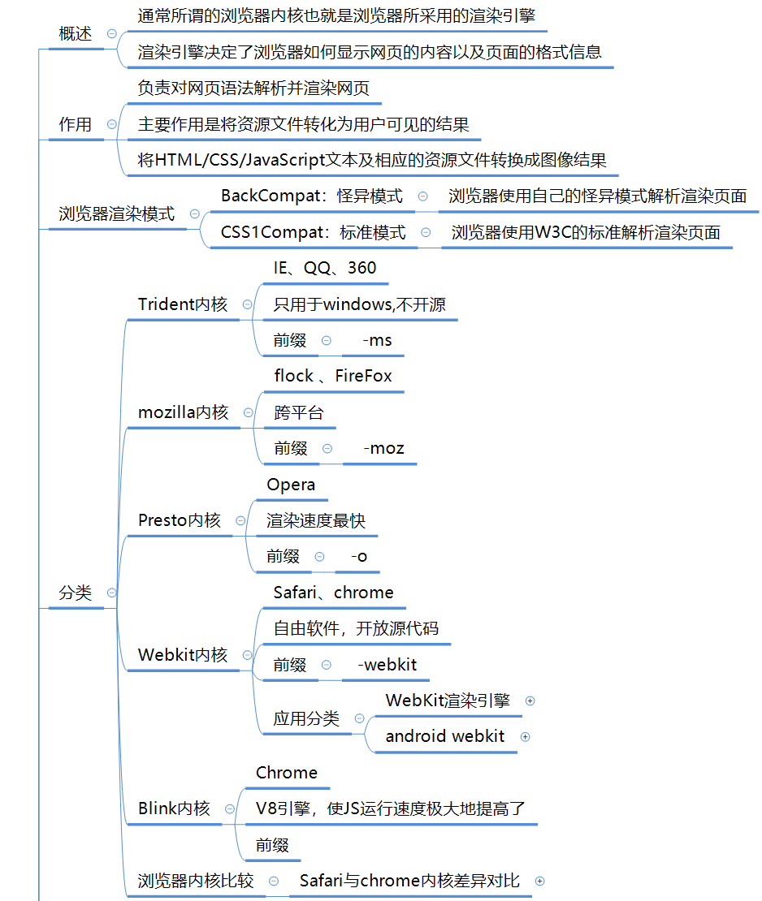
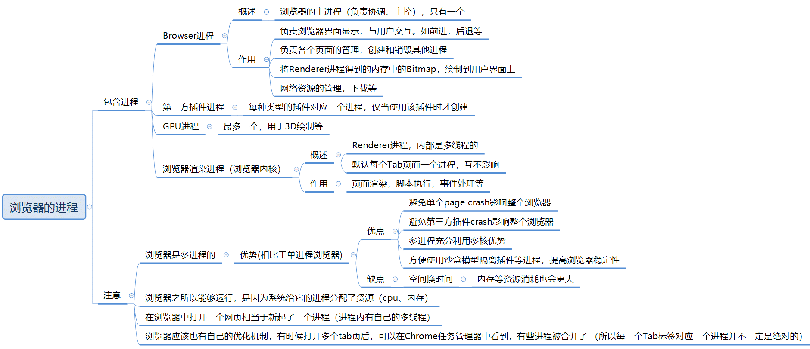
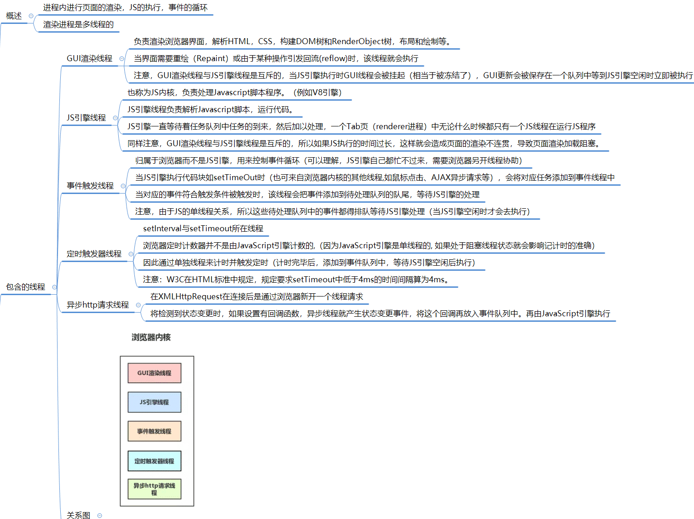
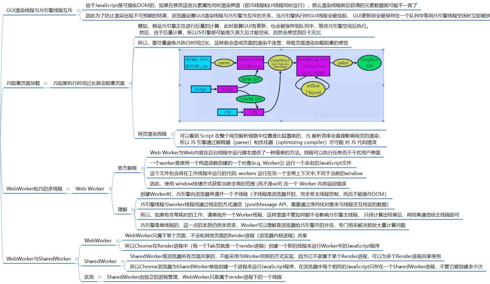
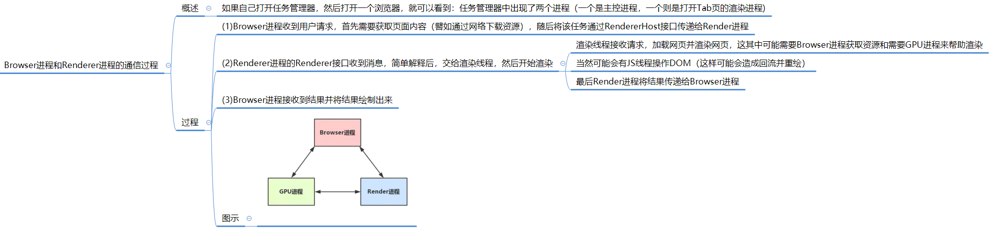
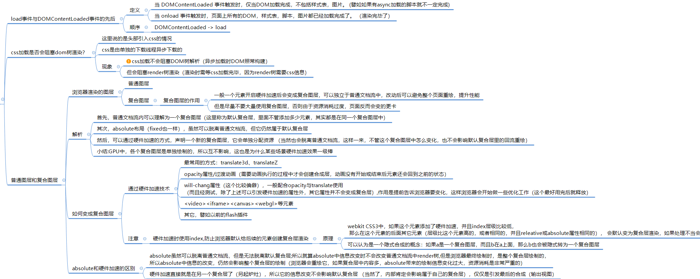
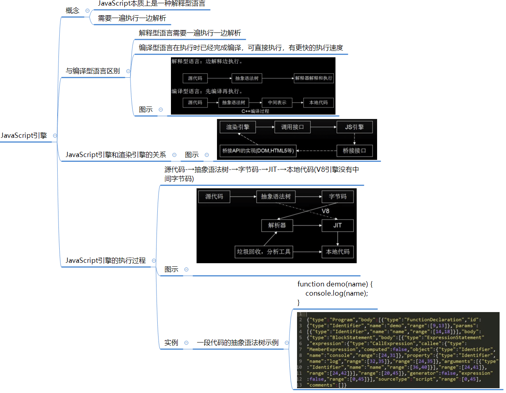
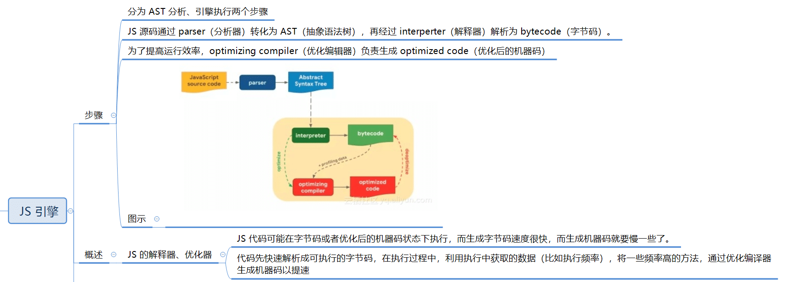

# 浏览器

## 整体架构

浏览器由前端和后端组成。前端主要负责网页在浏览器上的显示方式，而后端则处理请求并作为信息的载体。这两部分协同工作，以提供无缝的网络体验。

## 浏览器组成

浏览器的具体组件包括：

1. **用户界面（User Interface）：**
   - 负责呈现浏览器窗口部件，如地址栏、前进后退按钮、书签、顶部菜单等。
   - 是用户与浏览器进行交互的主要界面。
2. **浏览器引擎（Browser Engine）：**
   - 在用户界面和渲染引擎之间传递指令。
   - 主要用于控制和管理其他组件的工作。
3. **渲染引擎（Rendering Engine）**：
   - 也称为浏览器内核的一部分，负责将HTML、CSS和JavaScript等代码解析并渲染成用户可以看到的网页。
   - 渲染引擎内部包含HTML解析器，能够准确计算页面布局，并使用“回流”算法逐步调整页面元素的位置。
4. **网络（Networking）：**
   - 处理浏览器内的各种网络通信，如发送HTTP请求以获取网页资源。
   - 使用一组通信协议（如HTTP、HTTPS、FTP）来与服务器进行交互。
5. **JavaScript解释器（JavaScript Interpreter）：**
   - 负责解析和执行JavaScript代码。
   - JavaScript是一种脚本语言，允许动态更新Web内容、控制多媒体和动画图像等。
6. **用户界面后端（UI Backend）：**
   - 用来绘制基本的窗口小部件，如下拉列表、文本框、按钮等。
   - 提供不特定于某个平台的通用接口，并调用操作系统的用户界面。
7. **数据持久化（Data Storage）：**
   - 属于持久层，负责在硬盘中保存类似cookie的各种数据。
   - HTML5定义了Web Database技术，这是一种轻量级完整的客户端存储技术。

## 浏览器内核

浏览器内核是浏览器的核心部分，主要负责解析和渲染网页。虽然传统上内核包括渲染引擎和JavaScript引擎，但随着JavaScript引擎的独立性增强，内核更多地指渲染引擎。

- **IE浏览器**：使用Trident内核。
- **Firefox浏览器**：使用Gecko（Geoko可能是笔误）内核，这是Mozilla自主研发的渲染引擎。
- **Safari和旧版Chrome**：曾使用Webkit内核。
- **新版Chrome**：使用Blink内核，这是基于Webkit的分支。

## 浏览器进程

Chrome浏览器的架构模式由多个进程组成，包括：

* 浏览器进程
* 渲染进程
* 插件进程
* GPU进程
* 网络进程

每个进程都有自己核心的职责，并通过IPC（Inter Process Communication）进行通信。这种多进程架构提高了浏览器的稳定性和安全性。

## 渲染进程

**线程之间关系**

**常见问题**

## JS 引擎

