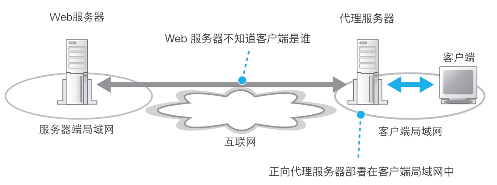
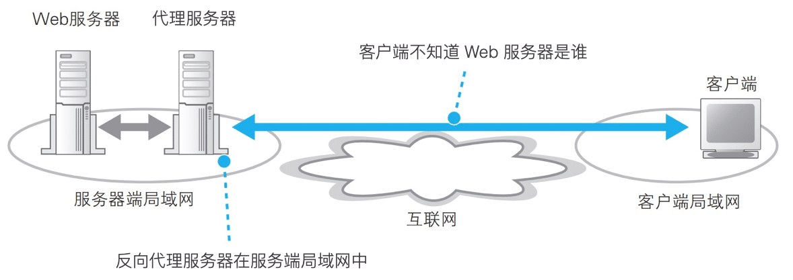

# Nginx 反向代理

## **反向代理**

### **概念**

反向代理是一种网络架构模式，它隐藏了真实的服务器（或服务器集群），使得客户端无法直接访问这些服务器，而是通过代理服务器来间接访问。

### **反向代理过程**

1. 在反向代理的架构中，代理服务器接收来自客户端的请求，并根据配置规则将这些请求转发给后端服务器。
2. 后端服务器处理请求后，将响应返回给代理服务器，代理服务器再将响应转发给客户端。

这种方式可以带来多种好处，如隐藏后端服务器的细节、提高安全性、实现负载均衡、缓存加速等。

### **反向代理 VS 正向代理**

反向代理与正向代理的主要区别在于代理的对象不同。

1. 正向代理代理的是客户端，即客户端通过代理服务器访问外部网络；



2. 反向代理代理的是服务端，即客户端通过代理服务器间接访问后端的真实服务器。




Nginx可以作为一个反向代理服务器，用于转发客户端的请求到后端服务器。这种配置特别适用于前后端分离的开发模式，其中前端应用通过API与后端服务进行通信。通过Nginx作为反向代理，可以实现请求的路由、负载均衡、缓存等功能，提高应用的性能和可扩展性。


## 反向代理配置

| 配置指令/块                  | 说明                                                         |
| ---------------------------- | ------------------------------------------------------------ |
| `server`                     | 定义一个虚拟服务器，可以监听不同的端口和域名。               |
| `listen`                     | 设置服务器监听的端口和IP地址。                               |
| `server_name`                | 定义虚拟服务器的名称，用于处理请求的域名。                   |
| `location`                   | 用于匹配请求的URI，并对匹配到的请求进行特定的处理。          |
| `proxy_pass`                 | 设置后端服务器的地址，Nginx将请求转发到这个地址。            |
| `proxy_set_header`           | 允许重新定义或添加转发到后端服务器的HTTP请求头。             |
| `proxy_connect_timeout`      | 设置与后端服务器建立连接的超时时间。                         |
| `proxy_send_timeout`         | 设置向后端服务器发送请求的超时时间。                         |
| `proxy_read_timeout`         | 设置从后端服务器读取响应的超时时间。                         |
| `upstream`                   | 定义了一个服务器组，用于负载均衡配置，可以包含多个后端服务器。 |
| `server`（在`upstream`块中） | 指定后端服务器的地址和端口，可以添加多个以实现负载均衡。     |
| `least_conn`                 | 在`upstream`块中使用，指定使用最少连接数算法进行负载均衡。   |
| `ip_hash`                    | 在`upstream`块中使用，指定使用IP哈希算法以保持会话一致性。   |
| `proxy_http_version`         | 设置代理到后端服务器时使用的HTTP协议版本，如`1.1`。          |
| `proxy_cache`                | 启用缓存，并指定缓存区域。                                   |
| `proxy_cache_valid`          | 为不同的响应状态码设置缓存的有效期。                         |
| `proxy_cache_key`            | 自定义缓存键的生成方式。                                     |
| `proxy_ignore_client_abort`  | 当客户端关闭连接时，Nginx是否继续向后端服务器发送请求。      |
| `proxy_buffering`            | 控制Nginx是否缓冲来自后端服务器的响应。                      |
| `proxy_buffers`              | 设置用于缓冲后端服务器响应的缓冲区数量和大小。               |


## 配置反向代理

示例：访问`http://mydomain.com`，将该请求代理到 `192.168.1.100`  或 `192.168.1.101` 的 8080 端口服务。

### 1. 环境准备

- **操作系统**：Ubuntu Server
- **Nginx版本**：Nginx 1.x（具体版本根据实际情况而定）
- **后端服务器**：假设有两台后端服务器，IP地址分别为`192.168.1.100`和`192.168.1.101`，均运行在8080端口上。

### 2. 安装Nginx

在Ubuntu上，可以通过apt包管理器安装Nginx：

```bash
sudo apt-get update  
sudo apt-get install nginx
```

安装完成后，Nginx将自动启动。

### 3. 配置Nginx反向代理

编辑Nginx的配置文件，通常位于`/etc/nginx/nginx.conf`，但更常见的做法是在`/etc/nginx/sites-available/`目录下创建一个新的配置文件，并通过`sites-enabled`目录进行链接。

假设我们创建一个名为`my-reverse-proxy`的配置文件：

```bash
sudo nano /etc/nginx/sites-available/my-reverse-proxy
```

在配置文件中，添加以下内容：

```nginx
server {  
    listen 80; # 监听80端口  
    server_name mydomain.com; # 域名，根据实际情况替换  
  
    # 负载均衡配置  
    upstream backend_servers {  
        server 192.168.1.100:8080; # 后端服务器1  
        server 192.168.1.101:8080; # 后端服务器2  
  
        # 可选：配置负载均衡算法  
        # least_conn; # 最少连接数算法  
        # ip_hash; # IP哈希算法，保持会话一致性  
    }  
  
    location / {  
        # 反向代理设置，主要配置 proxy_pass，表示代理的服务器组
        proxy_pass http://backend_servers; # 转发请求到upstream定义的服务器组  
        proxy_set_header Host $host; # 传递原始请求的Host头  
        proxy_set_header X-Real-IP $remote_addr; # 传递真实客户端IP  
        proxy_set_header X-Forwarded-For $proxy_add_x_forwarded_for; # 传递经过代理链的客户端IP列表  
        proxy_set_header X-Forwarded-Proto $scheme; # 传递原始请求的协议（http/https）  
  
        # 可选：设置超时时间  
        proxy_connect_timeout 5s;  
        proxy_send_timeout 60s;  
        proxy_read_timeout 60s;  
  
        # 其他可选配置...  
    }  
  
    # 其他location块...  
}
```

保存并关闭配置文件后，需要将其链接到`sites-enabled`目录以启用它：

```bash
sudo ln -s /etc/nginx/sites-available/my-reverse-proxy /etc/nginx/sites-enabled/
```

### 4. 检查并重启Nginx

在修改配置文件后，使用Nginx的`-t`选项来检查配置文件的语法是否正确：

```bash
sudo nginx -t
```

如果显示语法正确，则重启Nginx以使更改生效：

```bash
sudo systemctl restart nginx
```

或者，在较旧的系统中，可能使用`service`命令：

```bash
sudo service nginx restart
```

### 5. 测试反向代理

现在，通过浏览器或curl命令访问`http://mydomain.com`（替换为你的实际域名），Nginx将作为反向代理服务器，将请求转发到后端服务器组中的一个服务器，并将响应返回给客户端。

### 总结

以上是一个Nginx反向代理配置的详细实例，展示了如何设置Nginx以将客户端请求转发到后端服务器组，并传递必要的HTTP头信息。通过配置负载均衡，可以进一步提高Web应用的性能和可靠性。此外，Nginx还提供了许多其他高级配置选项，如SSL终端代理、缓存、URL重写等，可以根据实际需求进行配置。