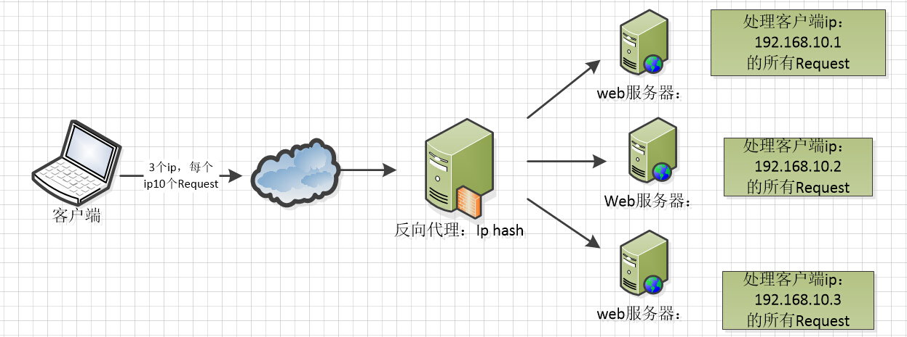

# Nginx 应用

## 配置反向代理

### **反向代理配置**

| 配置指令/块                  | 说明                                                         |
| ---------------------------- | ------------------------------------------------------------ |
| `server`                     | 定义一个虚拟服务器，可以监听不同的端口和域名。               |
| `listen`                     | 设置服务器监听的端口和IP地址。                               |
| `server_name`                | 定义虚拟服务器的名称，用于处理请求的域名。                   |
| `location`                   | 用于匹配请求的URI，并对匹配到的请求进行特定的处理。          |
| `proxy_pass`                 | 设置后端服务器的地址，Nginx将请求转发到这个地址。            |
| `proxy_set_header`           | 允许重新1535725078-8303-20160202133753382-1863657242.jpg定义或添加转发到后端服务器的HTTP请求头。 |
| `proxy_connect_timeout`      | 设置与后端服务器建立连接的超时时间。                         |
| `proxy_send_timeout`         | 设置向后端服务器发送请求的超时时间。                         |
| `proxy_read_timeout`         | 设置从后端服务器读取响应的超时时间。                         |
| `upstream`                   | 定义了一个服务器组，用于负载均衡配置，可以包含多个后端服务器。 |
| `server`（在`upstream`块中） | 指定后端服务器的地址和端口，可以添加多个以实现负载均衡。     |
| `least_conn`                 | 在`upstream`块中使用，指定使用最少连接数算法进行负载均衡。   |
| `ip_hash`                    | 在`upstream`块中使用，指定使用IP哈希算法以保持会话一致性。   |
| `proxy_http_version`         | 设置代理到后端服务器时使用的HTTP协议版本，如`1.1`。          |
| `proxy_cache`                | 启用缓存，并指定缓存区域。                                   |
| `proxy_cache_valid`          | 为不同的响应状态码设置缓存的有效期。                         |
| `proxy_cache_key`            | 自定义缓存键的生成方式。                                     |
| `proxy_ignore_client_abort`  | 当客户端关闭连接时，Nginx是否继续向后端服务器发送请求。      |
| `proxy_buffering`            | 控制Nginx是否缓冲来自后端服务器的响应。                      |
| `proxy_buffers`              | 设置用于缓冲后端服务器响应的缓冲区数量和大小。               |


### **示例**

示例：访问`http://mydomain.com`，将该请求代理到 `192.168.1.100`  或 `192.168.1.101` 的 8080 端口服务。

#### 1. 配置Nginx反向代理

编辑Nginx的配置文件，通常位于`/etc/nginx/nginx.conf`，但更常见的做法是在`/etc/nginx/sites-available/`目录下创建一个新的配置文件，并通过`sites-enabled`目录进行链接。

假设我们创建一个名为`my-reverse-proxy`的配置文件：

```bash
sudo nano /etc/nginx/sites-available/my-reverse-proxy
```

在配置文件中，添加以下内容：

```nginx
server {  
    listen 80; # 监听80端口  
    server_name mydomain.com; # 域名，根据实际情况替换  
  
    # 负载均衡配置  
    upstream backend_servers {  
        server 192.168.1.100:8080; # 后端服务器1  
        server 192.168.1.101:8080; # 后端服务器2  
  
        # 可选：配置负载均衡算法  
        # least_conn; # 最少连接数算法  
        # ip_hash; # IP哈希算法，保持会话一致性  
    }  
  
    location / {  
        # 反向代理设置，主要配置 proxy_pass，表示代理的服务器组
        proxy_pass http://backend_servers; # 转发请求到upstream定义的服务器组  
        proxy_set_header Host $host; # 传递原始请求的Host头  
        proxy_set_header X-Real-IP $remote_addr; # 传递真实客户端IP  
        proxy_set_header X-Forwarded-For $proxy_add_x_forwarded_for; # 传递经过代理链的客户端IP列表  
        proxy_set_header X-Forwarded-Proto $scheme; # 传递原始请求的协议（http/https）  
  
        # 可选：设置超时时间  
        proxy_connect_timeout 5s;  
        proxy_send_timeout 60s;  
        proxy_read_timeout 60s;  
  
        # 其他可选配置...  
    }  
  
    # 其他location块...  
}
```

保存并关闭配置文件后，需要将其链接到`sites-enabled`目录以启用它：

```bash
sudo ln -s /etc/nginx/sites-available/my-reverse-proxy /etc/nginx/sites-enabled/
```

#### 2. 检查并重启Nginx

在修改配置文件后，使用Nginx的`-t`选项来检查配置文件的语法是否正确：

```bash
sudo nginx -t
```

如果显示语法正确，则重启Nginx以使更改生效：

```bash
sudo systemctl restart nginx
```

或者，在较旧的系统中，可能使用`service`命令：

```bash
sudo service nginx restart
```

#### 3. 测试反向代理

现在，通过浏览器或curl命令访问`http://mydomain.com`（替换为你的实际域名），Nginx将作为反向代理服务器，将请求转发到后端服务器组中的一个服务器，并将响应返回给客户端。

#### 总结

以上是一个Nginx反向代理配置的详细实例，展示了如何设置Nginx以将客户端请求转发到后端服务器组，并传递必要的HTTP头信息。通过配置负载均衡，可以进一步提高Web应用的性能和可靠性。此外，Nginx还提供了许多其他高级配置选项，如SSL终端代理、缓存、URL重写等，可以根据实际需求进行配置。


---


## 跨域 CORS 配置

使用Nginx反向代理解决跨域问题是一种常见且有效的方法。

跨域问题通常发生在浏览器安全策略中，它阻止了一个源（协议、域名、端口）的Web页面去请求另一个源的资源。

通过Nginx作为反向代理，你可以将来自前端的请求转发到后端服务，同时修改响应头以允许跨域请求。


### 使用反向代理解决跨域

- 前端应用运行在 `http://frontend.example.com`
- 后端API服务运行在 `http://backend.example.com`
- 我们希望前端应用能够无跨域限制地访问后端API

####  1. 配置Nginx作为反向代理

首先，你需要在Nginx服务器上配置一个server块，该块将监听前端应用的域名（或IP和端口），并将请求转发到后端API服务。

```nginx
server {  
    listen 80;  
    server_name frontend.example.com;  
  
    location /api/ {  
        # 将所有以/api/开头的请求转发到后端服务  
        proxy_pass http://backend.example.com/;  
  
        # 必要的反向代理设置  
        proxy_http_version 1.1;  
        proxy_set_header Upgrade $http_upgrade;  
        proxy_set_header Connection 'upgrade';  
        proxy_set_header Host $host;  
        proxy_cache_bypass $http_upgrade;  
  
        # 添加CORS配置  
        add_header 'Access-Control-Allow-Origin' 'http://frontend.example.com';  
        add_header 'Access-Control-Allow-Methods' 'GET, POST, OPTIONS, PUT, DELETE';  
        add_header 'Access-Control-Allow-Headers' 'DNT,X-CustomHeader,Keep-Alive,User-Agent,X-Requested-With,If-Modified-Since,Cache-Control,Content-Type,Authorization';  
  
        # 对于OPTIONS请求，直接返回204状态码  
        if ($request_method = 'OPTIONS') {  
            add_header 'Access-Control-Max-Age' 1728000;  
            add_header 'Content-Type' 'text/plain charset=UTF-8';  
            add_header 'Content-Length' 0;  
            return 204;  
        }  
    }  
  
    # 其他location块...  
  
    # 如果需要，还可以添加将静态文件直接返回给客户端的配置  
    location / {  
        # 假设前端应用是静态的，并且已经部署在Nginx服务器上  
        root /path/to/frontend/files;  
        try_files $uri $uri/ =404;  
    }  
}
```

####  2. 重启Nginx

保存配置文件后，你需要重启Nginx以使更改生效。

```bash
sudo systemctl restart nginx  
# 或者  
sudo service nginx restart
```

#### 3. 测试配置

现在，你可以通过访问 `http://frontend.example.com/api/some-endpoint` 来测试配置。Nginx将接收这个请求，转发到 `http://backend.example.com/api/some-endpoint`，并将响应返回给前端应用。同时，由于Nginx添加了CORS头部，浏览器将允许跨域请求。

**注意事项**

- 在生产环境中，`Access-Control-Allow-Origin` 应该被设置为确切的源，而不是 `*`，除非你有特定的理由需要这样做。
- 如果你使用的是HTTPS，请确保Nginx配置了SSL/TLS证书，并且前端和后端之间的连接也是安全的。
- Nginx配置中的 `proxy_pass` 指令后面的URL末尾的斜杠（`/`）很重要，它决定了Nginx如何转发URL。在这个例子中，我们假设后端API服务能够正确处理从 `/api/` 开始的路径。如果后端服务的路径结构与前端请求的路径结构不同，你可能需要调整 `proxy_pass` 指令或重写URL。


### 配置 CORS 跨域

#### 1.编辑Nginx配置文件

首先，你需要找到Nginx的配置文件。这通常是`nginx.conf`文件，但你也可以在`sites-available`（对于使用Debian或Ubuntu的系统）或类似的目录下找到针对特定站点的配置文件。

#### 2. 添加CORS配置

在`server`块中，找到或添加一个`location`块来匹配你想要应用CORS策略的URL路径。然后，在该`location`块中添加以下指令来设置CORS头部。

```nginx
server {  
    listen 80;  
    server_name yourdomain.com;  
  
    location /api/ {  
        # 这里是处理你的API请求的配置  
  
        # 添加CORS配置  
        add_header 'Access-Control-Allow-Origin' '*';  
        add_header 'Access-Control-Allow-Methods' 'GET, POST, OPTIONS';  
        # 如果你的API需要接受预检请求，请确保包含OPTIONS方法  
  
        # 如果你的API需要设置允许的头部，则添加以下行  
        # add_header 'Access-Control-Allow-Headers' 'DNT,X-CustomHeader,Keep-Alive,User-Agent,X-Requested-With,If-Modified-Since,Cache-Control,Content-Type,Authorization';  
  
        # 对于OPTIONS请求，Nginx默认返回405或404错误  
        # 以下配置将确保对于OPTIONS请求，Nginx返回204状态码，这是CORS预检请求的期望行为  
        if ($request_method = 'OPTIONS') {  
            add_header 'Access-Control-Max-Age' 1728000;  
            add_header 'Content-Type' 'text/plain charset=UTF-8';  
            add_header 'Content-Length' 0;  
            return 204;  
        }  
  
        # 你的其他配置...  
    }  
  
    # 其他server块...  
}
```

#### 3. 重启Nginx

保存配置文件后，你需要重启Nginx以使更改生效。这可以通过运行以下命令来完成（根据你的操作系统和Nginx安装方式，命令可能略有不同）：

```bash
sudo systemctl restart nginx  
# 或者  
sudo service nginx restart
```

**注意事项**

- 允许`Access-Control-Allow-Origin`为`*`会允许来自任何源的请求，这在生产环境中可能带来安全风险。建议仅允许你信任的来源。
- 根据你的需求，你可能还需要配置其他CORS头部，如`Access-Control-Allow-Headers`和`Access-Control-Expose-Headers`。
- 使用`if`指令在Nginx中通常不是最佳实践，因为它可能会导致处理请求时的性能问题或意外的行为。然而，在这个特定的用例中，它是处理OPTIONS请求的一种有效方式。
- 如果你正在运行HTTPS服务，请确保你的Nginx配置正确地处理了SSL/TLS证书。


---


## 开启 gzip 压缩

### **GZIP压缩概述**

GZIP压缩是GNUzip的缩写，最早用于UNIX系统的文件压缩。

在HTTP协议中，GZIP编码是一种用来改进Web应用程序性能的技术。它通过压缩HTTP响应内容（主要是文本文件，如HTML、CSS、JavaScript等），来减小传输文件的大小，从而减少数据传输的带宽消耗和响应时间，提高网站的性能和速度。

GZIP压缩是无损的，意味着在压缩和解压过程中不会丢失任何信息。


### Nginx Gzip 配置项

在Nginx中，与gzip压缩相关的配置项主要位于`http`、`server`或`location`块中，但大多数gzip相关的指令通常放在`http`块中以全局应用：

| 配置项                | 默认值                          | 说明                                                         |
| --------------------- | ------------------------------- | ------------------------------------------------------------ |
| `gzip`                | `off`                           | 启用或禁用gzip压缩。`on`表示启用。                           |
| `gzip_buffers`        | `32 4k|8k`                      | 设置用于gzip压缩的缓冲区数量和大小。默认值取决于操作系统和Nginx版本。 |
| `gzip_comp_level`     | `1`                             | 设置gzip压缩级别，范围从1（最快，压缩率最低）到9（最慢，压缩率最高）。 |
| `gzip_disable`        | `""`                            | 根据表达式禁用gzip压缩。例如，`"msie6"`会禁用对IE6的gzip压缩。 |
| `gzip_http_version`   | `1.1`                           | 启用gzip压缩所需的HTTP版本。通常设置为`1.1`，因为HTTP/1.0不支持gzip压缩。 |
| `gzip_min_length`     | `20`                            | 设置最小压缩文件大小（以字节为单位）。小于此大小的文件不会被压缩。 |
| `gzip_proxied`        | `off`                           | 定义哪些通过代理的请求应当被压缩。`off`表示不基于`Via`请求头压缩。其他值如`any`、`expired`等提供了更精细的控制。 |
| `gzip_static`         | `off`                           | 启用时，Nginx会查找以`.gz`结尾的预压缩文件，并直接发送这些文件而不是实时压缩。 |
| `gzip_types`          | `text/html`（可能还有其他）     | 设置需要压缩的MIME类型。默认为`text/html`，但通常会添加其他类型如`text/css`、`application/javascript`等。 |
| `gzip_vary`           | `off`                           | 如果启用，Nginx会在响应头中添加`Vary: Accept-Encoding`，以通知客户端内容可能根据`Accept-Encoding`请求头进行了压缩。 |
| `gzip_proxied_any`    | `off`（非直接配置项，但常提及） | 这是一个更具体的`gzip_proxied`设置，表示如果请求通过代理，则始终压缩响应。注意，这不是一个直接的配置项，而是`gzip_proxied`参数的一个常见值。 |
| `gzip_comp_level_var` | N/A                             | （某些Nginx版本支持）允许基于变量动态设置gzip压缩级别。不是所有Nginx版本都支持。 |
| `gzip_disable_msie6`  | `on`（在某些旧版本中）          | 在一些旧版本的Nginx中，有一个特定的指令来禁用对IE6的gzip压缩。但在新版本中，通常使用`gzip_disable`指令。 |

**注意**：

- 并非所有Nginx版本都支持上述所有配置项。例如，`gzip_comp_level_var`是较新版本的Nginx中引入的，可能不是所有系统都可用。
- `gzip_disable_msie6`是一个历史遗留的指令，用于早期版本的Nginx，以禁用对IE6的gzip压缩。在现代Nginx版本中，应使用`gzip_disable`指令。
- `gzip_buffers`的默认值可能因Nginx版本和操作系统而异。在配置时，请根据您的具体需求和环境进行调整。
- 在配置gzip压缩时，建议通过实际测试来确定最佳的`gzip_comp_level`值，以在压缩率和CPU使用率之间找到最佳平衡点。


#### 1. 确认Nginx版本

首先，确保你的Nginx服务器支持GZIP压缩。Nginx默认自带了gzip模块，因此大多数现代Nginx安装都支持这一功能。

使用 gzip 不仅需要 Nginx 配置，浏览器端也需要配合:

1. 需要在请求消息头中包含 `Accept-Encoding: gzip`（IE5 之后所有的浏览器都支持了，是现代浏览器的默认设置）。
2. 一般在请求 html 和 css 等静态资源的时候，支持的浏览器在 request 请求静态资源的时候，会加上 `Accept-Encoding: gzip` 这个 header，表示自己支持 gzip 的压缩方式;
3. Nginx 在拿到这个请求的时候，如果有相应配置，就会返回经过 gzip 压缩过的文件给浏览器，并在 response 相应的时候加上 `content-encoding: gzip` 来告诉浏览器自己采用的压缩方式（因为浏览器在传给服务器的时候一般还告诉服务器自己支持好几种压缩方式）;
4. 浏览器拿到压缩的文件后，根据自己的解压方式进行解析。


#### 2. 编辑Nginx配置文件

找到Nginx的配置文件（通常是`nginx.conf`，也可能位于`/etc/nginx/conf.d/`目录下的某个文件中）。

#### 3. 启用GZIP压缩

在Nginx配置文件的`http`块中，添加或修改以下指令来启用GZIP压缩：

```nginx
http {  
    # ... 其他配置 ...  
  
    # 启用gzip压缩  
    gzip on;  
  
    # 设置gzip压缩级别，1-9，数值越大压缩率越高，但CPU消耗也越大  
    gzip_comp_level 6;  
  
    # 设置最小压缩文件大小，小于此大小的文件不会被压缩  
    gzip_min_length 1000;  
  
    # 设置需要压缩的MIME类型  
    gzip_types text/plain text/css application/json application/javascript text/xml application/xml application/xml+rss text/javascript;  
  
    # 是否在响应头中添加"Vary: Accept-Encoding"字段  
    gzip_vary on;  
  
    # 禁用IE6的gzip压缩（IE6不支持gzip压缩）  
    gzip_disable "msie6";  
  
    # ... 其他gzip配置 ...  
  
    # server块配置  
    server {  
        # ... server配置 ...  
    }  
  
    # ... 其他http配置 ...  
}
```

#### 4. 保存并测试配置

保存Nginx配置文件后，需要测试配置是否正确。可以使用`nginx -t`命令来测试配置文件的语法是否正确。

```bash
bash复制代码

sudo nginx -t
```

如果配置无误，输出应该显示“syntax is ok”和“test is successful”。

#### 5. 重新加载Nginx配置

如果配置测试成功，使用以下命令重新加载Nginx配置以使更改生效：

```bash
bash复制代码

sudo nginx -s reload
```

#### 6. 验证GZIP压缩是否生效

为了验证GZIP压缩是否成功启用，可以使用浏览器的开发者工具（如Chrome的DevTools）来检查网络请求的响应头。如果响应头中包含`Content-Encoding: gzip`，则表示文件已被成功压缩。

另外，也可以使用curl命令行工具来检查：

```bash
bash复制代码

curl -I -H 'Accept-Encoding: gzip' http://your-website.com/some-file.css
```

如果服务器正确返回了gzip压缩的内容，你会在响应头中看到`Content-Encoding: gzip`。

**注意事项**

- GZIP压缩只适用于文本文件，对于已经压缩过的文件（如图片、视频等）再次进行GZIP压缩通常不会有明显效果，甚至可能增加文件大小。
- 启用GZIP压缩会增加服务器的CPU使用率，因为需要额外的计算资源来进行压缩。然而，由于减少了传输的数据量，总体上可以提高网站的加载速度，改善用户体验。
- 确保客户端（如浏览器）支持GZIP压缩，否则无法享受到GZIP压缩带来的好处。现代浏览器大多都支持GZIP压缩。


---


## 配置 HTTPS

使用Nginx配置HTTPS主要涉及以下步骤：确保Nginx已安装并具备SSL模块支持、获取SSL证书、配置Nginx的`nginx.conf`文件以及重启Nginx服务。


### Nginx HTTPS 相关配置

在Nginx中配置HTTPS涉及多个与SSL/TLS相关的指令，这些指令可以在Nginx的配置文件（通常是`nginx.conf`或包含在`sites-available`目录中的单独文件）中设置。以下是 Nginx HTTPS配置中一些常见的SSL/TLS相关指令，并对它们进行了简要说明：

| 指令                                                         | 说明                                                         |
| ------------------------------------------------------------ | ------------------------------------------------------------ |
| `listen 443 ssl;`                                            | 指示Nginx监听443端口（HTTPS的标准端口），并启用SSL/TLS。     |
| `server_name yourdomain.com;`                                | 设置服务器的名称，这通常是网站的域名。对于HTTPS，它用于SSL证书验证。 |
| `ssl_certificate /path/to/certificate.pem;`                  | 指定SSL证书文件的路径。这通常是你的证书颁发机构提供的`.pem`或`.crt`文件。 |
| `ssl_certificate_key /path/to/private.key;`                  | 指定SSL证书私钥文件的路径。这个文件与你的证书文件配对。      |
| `ssl_session_cache shared:SSL:1m;`                           | 配置SSL会话缓存的大小和类型。这有助于提高SSL握手性能。       |
| `ssl_session_timeout 5m;`                                    | 设置SSL会话缓存的超时时间。                                  |
| `ssl_protocols TLSv1.2 TLSv1.3;`                             | 指定启用的SSL/TLS协议版本。出于安全考虑，建议仅启用TLSv1.2和TLSv1.3。 |
| `ssl_ciphers '...';`                                         | 列出启用的SSL/TLS加密算法。应使用强加密算法来保证通信安全。  |
| `ssl_prefer_server_ciphers on;`                              | 指示Nginx优先使用服务器配置的密码套件，而不是客户端支持的密码套件。 |
| `ssl_dhparam /path/to/dhparam.pem;`                          | 指定Diffie-Hellman参数的路径。这是为了加强前向保密（Forward Secrecy）。 |
| `ssl_stapling on;`                                           | 启用SSL证书状态检查（OCSP Stapling），以减少SSL握手延迟。    |
| `ssl_stapling_verify on;`                                    | 验证OCSP响应的签名。与`ssl_stapling`一起使用时提高安全性。   |
| `ssl_trusted_certificate /path/to/trusted_ca_certificates.pem;` | 指定用于验证OCSP响应的受信任CA证书的路径。                   |
| `ssl_session_tickets off;`                                   | 禁用SSL会话票据（如果出于安全考虑需要禁用）。                |
| `add_header Strict-Transport-Security "max-age=31536000; includeSubDomains; preload";` | 通过HTTP响应头添加HSTS策略，强制浏览器仅通过HTTPS与服务器通信。 |


请注意，上述表格中的`ssl_ciphers`指令的值是一个示例，实际配置时应该使用当前推荐的强加密算法列表。此外，并非所有指令都是必需的，具体取决于你的安全需求和Nginx版本。

在配置HTTPS时，建议仔细考虑你的安全需求，并遵循最佳实践来配置SSL/TLS参数。同时，定期更新你的SSL证书和Nginx配置，以应对新的安全威胁和漏洞。


### Nginx 配置 HTTPS 步骤

以下是详细的步骤说明：

#### 1. 确保Nginx已安装并具备SSL模块支持

**检查Nginx是否已安装SSL模块**：

1. 进入Nginx的安装目录，通常是`/usr/local/nginx/sbin`（具体路径可能因安装方式而异）。
2. 执行`./nginx -V`命令（注意是大写的V），查看输出的configure arguments中是否包含`--with-http_ssl_module`。如果包含，则表示Nginx已安装SSL模块。

**如果Nginx未安装SSL模块**：

1. 需要重新编译Nginx并添加SSL模块支持。这通常涉及下载Nginx源码包、解压、配置（指定`--with-http_ssl_module`）、编译和安装。
2. 注意，重新编译Nginx时，建议先停止正在运行的Nginx服务，并备份原有的Nginx文件和配置文件。

#### 2. 获取SSL证书

**证书申请**：

1. 前往证书颁发机构（如阿里云、腾讯云等）申请SSL证书。大多数云服务商都提供免费的SSL证书申请服务。
2. 根据证书颁发机构的指引完成证书申请流程，并下载证书文件。证书文件通常包括一个`.pem`或`.crt`文件（证书文件）和一个`.key`文件（私钥文件）。

#### 3. 配置Nginx的`nginx.conf`文件

**编辑配置文件**：

1. 找到Nginx的配置文件`nginx.conf`，通常位于`/usr/local/nginx/conf`、`/etc/nginx/nginx.conf`或类似路径（具体路径取决于Nginx的安装方式和操作系统）。
2. 使用文本编辑器打开`nginx.conf`文件，并按照以下格式配置HTTPS服务器：

```nginx
server {  
    listen 443 ssl;  # 监听443端口，并启用SSL  
    server_name yourdomain.com;  # 你的域名  
  
    ssl_certificate /path/to/your/certificate.pem;  # 证书文件路径  
    ssl_certificate_key /path/to/your/private.key;  # 私钥文件路径  
  
    # SSL会话缓存  
    ssl_session_cache shared:SSL:1m;  
    ssl_session_timeout 5m;  
  
    # SSL协议和加密算法  
    ssl_protocols TLSv1.2 TLSv1.3;  # 推荐使用TLSv1.2和TLSv1.3  
    ssl_ciphers 'ECDHE-ECDSA-AES128-GCM-SHA256:ECDHE-RSA-AES128-GCM-SHA256:ECDHE-ECDSA-AES256-GCM-SHA384:ECDHE-RSA-AES256-GCM-SHA384:DHE-RSA-AES128-GCM-SHA256:DHE-RSA-AES256-GCM-SHA384:ECDHE-ECDSA-CHACHA20-POLY1305:ECDHE-RSA-CHACHA20-POLY1305:DHE-RSA-CHACHA20-POLY1305';  
    ssl_prefer_server_ciphers on;  
  
    # 其他配置...  
  
    location / {  
        # 转发规则等...  
    }  
}
```

**配置HTTP到HTTPS的重定向**（可选）：

为了将所有HTTP请求重定向到HTTPS，可以添加另一个server块来监听80端口，并使用`rewrite`或`return`指令进行重定向：

```nginx
server {  
    listen 80;  
    server_name yourdomain.com;  
  
    return 301 https://$server_name$request_uri;  # 将HTTP请求重定向到HTTPS  
}
```

#### 4. 重启Nginx服务

配置完成后，需要重启Nginx服务以使更改生效。

**重启Nginx**：

1. 停止Nginx服务（可选，但建议）。

   ```bash
   sudo systemctl stop nginx  # 使用systemd的系统  
   # 或者  
   /usr/local/nginx/sbin/nginx -s stop  # 直接使用Nginx命令
   ```

2. 启动Nginx服务。

   ```bash
   sudo systemctl start nginx  # 使用systemd的系统  
   # 或者  
   /usr/local/nginx/sbin/nginx  # 直接使用Nginx命令
   ```

3. 验证配置。

   使用浏览器访问你的网站（通过HTTPS），检查是否已正确配置HTTPS。同时，你也可以使用`netstat -lntp | grep

----


## 配置负载均衡

### 什么是负载均衡？

负载均衡（Load Balancing）是一种将工作负载（如网络流量、数据请求、计算任务等）分配到多个计算资源（如服务器、虚拟机、容器等）上的技术，旨在优化性能、提高可靠性和增加可扩展性。

负载均衡器通常位于应用程序前端，接受并分配传入的请求。

通过使用特定的算法来确定分配请求的最佳方式，负载均衡器可以防止任何一个资源过载或失效而导致应用程序的性能下降或停止响应。

### 实现方案

负载均衡可以通过多种方式实现，包括

- 基于轮询
- 基于最少连接数
- 基于IP散列等算法
- 采用硬件设备、软件或混合

### Nginx 如何配置负载均衡？

Nginx 是一个高性能的HTTP和反向代理服务器，也是一个IMAP/POP3/SMTP代理服务器。它以其稳定性、丰富的功能集、简单的配置和低资源消耗而闻名。Nginx 支持多种负载均衡算法，如轮询、权重、IP哈希等，并且配置相对简单。

#### 负载均衡配置步骤（以轮询算法为例）：


1. **准备后端服务器**：
   确保你有多台服务器可以作为后端服务器来处理请求。这些服务器应该已经配置好相应的Web服务（如Apache、Nginx等），并且能够正常响应HTTP请求。

2. **修改Nginx配置文件**：
   找到Nginx的配置文件（通常是`nginx.conf`，或者位于`/etc/nginx/conf.d/`目录下的某个文件），并添加或修改负载均衡相关的配置。

   ```nginx
   http {  
       upstream myapp1 {  
           server backend1.example.com;  # 后端服务器1的地址  
           server backend2.example.com;  # 后端服务器2的地址  
           # 可以继续添加更多的后端服务器  
    
           # 使用轮询算法，这是默认算法  
           # 如果需要其他算法，可以添加相应的指令，如weight（权重）、ip_hash等  
       }  
    
       server {  
           listen 80;  
    
           location / {  
               proxy_pass http://myapp1;  # 将请求转发到upstream定义的服务器组  
               proxy_set_header Host $host;  
               proxy_set_header X-Real-IP $remote_addr;  
               proxy_set_header X-Forwarded-For $proxy_add_x_forwarded_for;  
               # 其他必要的proxy_set_header指令  
           }  
       }  
   }
   ```

   在上述配置中，`upstream`块定义了一个名为`myapp1`的服务器组，其中包含了两个后端服务器的地址。在`server`块中，通过`proxy_pass`指令将请求转发到这个服务器组。Nginx会按照轮询算法将请求逐一分配到这些后端服务器上。

3. **测试配置**：
   在修改完配置文件后，使用`nginx -t`命令来测试配置文件的语法是否正确。如果测试通过，使用`nginx -s reload`命令来重新加载Nginx配置，使更改生效。

4. **验证负载均衡**：
   通过访问Nginx服务器的地址（如`http://your-nginx-server.com`），并多次刷新页面或使用工具进行压力测试，来验证负载均衡是否按预期工作。你可以查看后端服务器的访问日志或使用其他监控工具来确认请求是否被均匀分配到各个后端服务器上。

#### 其他负载均衡算法示例：

**权重（Weight）**：
如果后端服务器的性能不同，你可以通过为它们分配不同的权重来优化负载均衡。权重高的服务器将接收更多的请求。

```nginx
upstream myapp1 {  
    server backend1.example.com weight=3;  
    server backend2.example.com weight=1;  
}
```

**IP哈希（IP Hash）**：



* Ip hash算法，对客户端请求的ip进行hash操作，然后根据hash结果将同一个客户端ip的请求分发给同一台服务器进行处理，可以解决session不共享的问题。

- IP哈希算法可以确保来自同一IP地址的请求始终被转发到同一台后端服务器上，这对于需要保持会话一致性的应用程序非常有用。

  ```nginx
  upstream myapp1 {  
      ip_hash;  
      server backend1.example.com;  
      server backend2.example.com;  
  }
  ```


----


## 配置动静分离

### 动态资源和静态资源分离概述

动态资源和静态资源分离（动静分离）是一种网站架构优化策略，其核心思想是将动态网站中的动态网页与静态资源（如图片、CSS样式表、JavaScript文件等）根据一定规则进行区分，并分别进行处理和存储。

这种分离有助于提升网站的性能，通过缓存静态资源来减少服务器的负载，同时提高用户访问静态资源的速度，降低对后台应用服务器的访问压力。

**静态资源**：指当用户多次访问时，资源的源代码不会发生改变的资源，如图片、CSS、JavaScript文件等。

**动态资源**：指当用户多次访问时，资源的源代码可能会发生变化的资源，如JSP、PHP等服务器端动态生成的页面。

### 使用Nginx配置动态资源和静态资源分离

Nginx是一个高性能的HTTP和反向代理服务器，也是IMAP/POP3/SMTP代理服务器。它以其高并发处理能力和低资源消耗而闻名，非常适合用于动静分离的场景。

### 配置步骤

1. **准备静态资源**：

   - 将网站的静态资源（如图片、CSS、JavaScript文件等）整理并放置在一个或多个专门的目录中。

2. **准备动态资源**：

   - 确保动态资源（如JSP、PHP页面）已经部署在相应的应用服务器上（如Tomcat、Apache等）。

3. **修改Nginx配置文件**：

   - 打开Nginx的配置文件（通常位于`/etc/nginx/nginx.conf`或`/etc/nginx/sites-available/`目录下的某个文件）。
   - 在配置文件中，通过`server`块定义网站的基本配置，并在其中使用`location`指令来区分静态资源和动态资源的请求。

   **示例配置**：

   ```nginx
   server {  
       listen 80;  
       server_name yourdomain.com;  
    
       # 静态资源处理  
       location ~* \.(png|jpg|jpeg|gif|css|js|ico)$ {  
           root /path/to/your/static/files;  
           try_files $uri $uri/ =404;  
           expires 30d; # 设置缓存过期时间  
       }  
    
       # 动态资源请求转发  
       location / {  
           proxy_pass http://your_backend_server; # 动态资源服务器的地址  
           proxy_set_header Host $host;  
           proxy_set_header X-Real-IP $remote_addr;  
           proxy_set_header X-Forwarded-For $proxy_add_x_forwarded_for;  
       }  
   }
   ```

   - 在上述配置中，`location ~* \.(png|jpg|jpeg|gif|css|js|ico)$`用于匹配所有静态资源请求，并将这些请求直接映射到静态文件所在的目录。`expires 30d;`指令设置了这些资源的缓存过期时间为30天，以减少对服务器的请求。
   - `location /`块则用于处理所有其他请求，这些请求被视为动态资源请求，并通过`proxy_pass`指令转发到后端服务器（如Tomcat）进行处理。

4. **重载Nginx配置**：

   - 修改完Nginx配置文件后，需要重载Nginx以使配置生效。可以使用`sudo systemctl reload nginx`（对于使用systemd的系统）或`/usr/sbin/nginx -s reload`（对于直接使用Nginx命令的系统）来重载配置。

5. **验证配置**：

   - 访问网站，检查静态资源和动态资源是否能正确加载。可以使用浏览器的开发者工具来查看网络请求，确认静态资源是否直接从Nginx服务器加载，而动态资源请求是否被正确转发到后端服务器。

通过以上步骤，可以实现Nginx对动态资源和静态资源的分离处理，从而提升网站的性能和用户体验。


----


## 设置二级域名虚拟主机

使用Nginx设置二级域名虚拟主机主要涉及几个步骤，包括在域名服务商处设置域名、编辑Nginx配置文件、以及重启Nginx服务。以下是详细的操作步骤：

### 1. 在域名服务商处设置域名

- **添加二级域名记录**：首先，在域名服务商的网站上，为你的主域名添加一条二级域名的记录。这通常是通过DNS管理界面来完成的，你需要将二级域名（如`blog.example.com`）指向你的服务器IP地址。

### 2. 编辑Nginx配置文件

- **定位配置文件**：Nginx的主配置文件通常是`nginx.conf`，它可能位于`/etc/nginx/`目录下。此外，Nginx还允许你在其他目录下（如`/etc/nginx/conf.d/`或`/etc/nginx/sites-available/`）放置特定的配置文件，并通过`include`指令在`nginx.conf`中引入。
- **创建或编辑配置文件**：根据你的Nginx安装和配置方式，你可能需要在指定的目录下创建一个新的配置文件（以`.conf`为后缀），或者在现有的配置文件中添加一个新的`server`块。这个`server`块将用于配置你的二级域名虚拟主机。
- **配置二级域名**：在`server`块中，你需要设置`server_name`指令为你的二级域名（如`server_name blog.example.com;`）。同时，你还需要设置其他指令来指定网站的根目录、日志文件的位置、默认页面等。

以下是一个简单的示例配置：

```nginx
server {  
    listen 80;  
    server_name blog.example.com;  
  
    root /var/www/blog;  
    index index.html index.htm;  
  
    access_log /var/log/nginx/blog.access.log;  
    error_log /var/log/nginx/blog.error.log;  
  
    location / {  
        try_files $uri $uri/ =404;  
    }  
}
```

在这个示例中，我们设置了一个监听80端口的`server`块，它将处理所有发往`blog.example.com`的请求。网站的根目录被设置为`/var/www/blog`，默认页面是`index.html`或`index.htm`。同时，我们还指定了访问日志和错误日志的位置。

### 3. 重启Nginx服务

- **检查配置文件**：在重启Nginx之前，使用`nginx -t`命令来检查配置文件的语法是否正确。这个命令会返回`syntax is ok`和`test is successful`（如果配置正确的话）。
- **重启Nginx**：如果配置文件没有问题，你可以使用`sudo systemctl restart nginx`（对于使用systemd的系统）或`sudo service nginx restart`（对于较旧的系统）命令来重启Nginx服务。这样，你的二级域名虚拟主机就会开始工作了。

### 注意事项

- **备份原配置文件**：在编辑Nginx配置文件之前，请务必备份原配置文件，以防万一出现错误导致Nginx无法启动。
- **权限问题**：确保Nginx有权限读取你设置的网站根目录和日志文件。
- **安全性**：在配置Nginx时，请考虑使用HTTPS（通过SSL/TLS证书）来加密你的网站数据，以提高安全性。

通过以上步骤，你应该能够成功使用Nginx设置二级域名虚拟主机。如果你遇到任何问题，请检查Nginx的错误日志文件以获取更多信息，或者参考Nginx的官方文档和社区论坛。

----


## 适配 PC 或移动设备

### 为什么要适配 PC 和移动设备？

通常需要 PC  和 移动端 的站点，需要根据用户设备不同返回不同的站点。

常使用的是纯前端的自适应布局，但无论是复杂性和易用性上面还是不如分开编写的好，既将 PC 端和 移动端分开开发，根据用户请求的 `user-agent` 来判断是返回 PC 还是 H5 站点。

使用Nginx适配PC或移动设备，主要依赖于Nginx通过内置变量`$http_user_agent`获取请求客户端的User-Agent信息，进而判断用户目前处于移动端还是PC端，并据此展示不同的页面给用户。以下是详细的步骤和配置方法：

### 1. 准备静态资源

- 在Nginx的根目录（或指定目录）下，为PC和移动设备分别准备两套不同的静态资源。例如，可以创建两个文件夹`pc`和`mobile`，分别存放PC端和手机端的HTML、CSS、JavaScript等文件。

### 2. 编写Nginx配置

- 编辑Nginx的配置文件（通常是`nginx.conf`，或者在`conf.d`目录下的某个`.conf`文件）。
- 在配置文件中，为需要适配的域名或URL路径设置`server`块，并在其中使用`location`块来指定不同的根目录。
- 利用`if`语句结合`$http_user_agent`变量来判断用户设备类型，并据此设置不同的根目录。

### 示例配置

以下是一个简单的示例配置，展示了如何为PC和移动设备设置不同的根目录：

```nginx
server {  
    listen 80;  
    server_name yourdomain.com; # 替换为你的域名  
  
    location / {  
        # 默认设置为PC端的根目录  
        root /usr/share/nginx/pc;  
        index index.html;  
  
        # 根据User-Agent判断设备类型，并切换到移动端的根目录  
        if ($http_user_agent ~* '(Android|webOS|iPhone|iPod|BlackBerry)') {  
            set $mobile_rewrite_done 1;  
        }  
  
        if ($mobile_rewrite_done) {  
            rewrite ^(.*)$ /mobile/$1 last;  
        }  
  
        # 或者，更直接地在if语句中更改root目录（注意：直接更改root在if中可能不被所有Nginx版本支持）  
        # if ($http_user_agent ~* '(Android|webOS|iPhone|iPod|BlackBerry)') {  
        #     root /usr/share/nginx/mobile;  
        # }  
    }  
  
    # 如果选择使用rewrite，则需要为移动端单独设置一个location块  
    location /mobile/ {  
        root /usr/share/nginx; # 注意这里的路径调整，确保能正确找到mobile目录  
        try_files $uri $uri/ /mobile/index.html; # 确保能正确返回mobile目录下的index.html  
    }  
}  
  
# 注意：上面的rewrite示例可能需要根据实际情况调整，因为直接在location块中使用if进行URL重写可能不是最佳实践。  
# 更推荐的做法是使用map指令结合try_files来实现，但这需要更复杂的配置。
```

**注意**：

- 直接在`location`块中使用`if`进行复杂的逻辑判断（如更改`root`或`rewrite`）可能不是Nginx的最佳实践，因为这样做可能会影响Nginx的性能和可读性。
- 在某些Nginx版本中，直接在`if`语句中更改`root`或`set`变量可能不被支持或表现不一致。
- 更推荐的做法是使用`map`指令来预处理`$http_user_agent`，并根据结果设置变量，然后在`location`块中使用这个变量来决定如何处理请求。
- 另外，还可以考虑使用Nginx的第三方模块（如`ngx_http_device_detect_module`）来更方便地检测设备类型。

### 3. 重启Nginx服务

- 修改完Nginx配置文件后，需要重启Nginx服务以使更改生效。
- 可以使用`nginx -s reload`命令来平滑重启Nginx，无需中断正在处理的请求。

通过以上步骤，Nginx就可以根据用户的设备类型来适配并展示不同的页面了。


-----

