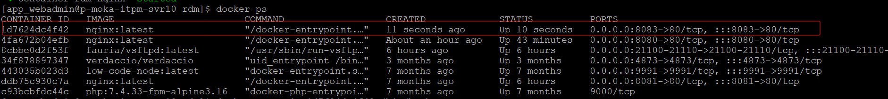

# Nginx 搭建静态资源服务

## Nginx静态文件服务概述

Nginx可以直接从文件系统中读取静态文件（如HTML、CSS、JavaScript、图片等）并返回给客户端，而不需要经过复杂的处理流程。这使得Nginx在处理静态文件时非常高效，适用于需要快速响应的Web应用。

## 环境准备

| 工具           | 软件    | 作用             |
| -------------- | ------- | ---------------- |
| linux 操作系统 | centeos | 操作系统环境     |
| 容器           | Docker  | 环境隔离         |
| 代理服务器     | Nginx   | 反向代理         |
| FTP            | vsftpd  | 静态资源文件上传 |


## 搭建步骤

使用 Docker 搭配 Nginx 和 vsftpd 来搭建静态资源服务，主要包括以下几个步骤：

1. 安装 Docker
2. 拉取 Nginx 和 vsftpd 镜像
3. 配置 Nginx 和 vsftpd
4. 启动容器并挂载相应的配置文件和目录


### 1. 安装 Docker

首先，确保你的系统上安装了 Docker。安装 Docker 的方法因操作系统而异，以下以 CentOS 系统为例（适用于大多数 Linux 发行版）：

1. **添加 Docker 仓库**：

   ```bash
   yum-config-manager --add-repo http://mirrors.aliyun.com/docker-ce/linux/centos/docker-ce.repo
   ```

2. **安装 Docker CE**：

   ```bash
   yum -y install docker-ce
   ```

3. **启动 Docker 服务**：

   ```bash
   systemctl start docker
   ```

4. **验证 Docker 安装**：

   ```bash
   docker --version
   ```

   以及通过运行 `hello-world` 镜像来检查 Docker 是否能正确运行：

   ```bash
   docker run hello-world
   ```

### 2. 拉取 Nginx 和 vsftpd 镜像

```bash
docker pull nginx:latest  
docker pull fauria/vsftpd
```

这里，`nginx:latest` 是 Nginx 的最新镜像，而 `fauria/vsftpd` 是一个常用的 vsftpd FTP 服务器镜像。

### 3. 创建挂载目录

在宿主机上创建 Nginx 和 vsftpd 需要的挂载目录，将宿主机 Nginx 配置文件和静态资源文件目录和 vsftpd 配置文件 映射到 Docker  容器中： 

```bash
mkdir -p /server/nginx/conf  
mkdir -p /server/nginx/log  
mkdir -p /server/nginx/html  
mkdir -p /server/vsftpd/quick
```

这里，`/server/nginx/conf` 用于存放 Nginx 的配置文件，`/server/nginx/log` 用于存放 Nginx 的日志文件，`/server/nginx/html` 用于存放静态资源文件，`/server/vsftpd/quick` 作为 FTP 服务器的根目录。

### 4. 获取 Nginx 配置文件

首先，运行一个临时的 Nginx 容器来获取其配置文件，运行一个 nginx 容器，并将宿主机的 8080 端口映射到容器的 80 端口：

```bash
docker run --name temp-nginx -p 8080:80 -d nginx  
docker cp temp-nginx:/etc/nginx/nginx.conf /server/nginx/conf/nginx.conf  
docker cp temp-nginx:/etc/nginx/conf.d /server/nginx/conf/  
docker rm -f temp-nginx
```

### 5. 配置 Nginx 和 vsftpd

**Nginx 配置**：

编辑 `/server/nginx/conf/nginx.conf`，根据需要配置静态资源的访问路径。

例如，你可能需要设置 `server` 块中的 `root` 指令指向你的静态资源目录（这里假设是 `/server/nginx/html`）：

```nginx
server {  
    listen 80;  
    server_name localhost;  
  
    location / {  
        root /server/nginx/html;  # 注意这里是映射到宿主机的静态资源目录 
        index index.html index.htm;  
        try_files $uri $uri/ =404;  
    }  
  
    # 其他配置...  
}
```

注意：由于 Docker 容器中的路径可能与宿主机不同，因此需要通过 `-v` 参数在启动 Nginx 容器时挂载正确的目录。

**vsftpd 配置**：

vsftpd 的配置通常通过其配置文件 `/etc/vsftpd/vsftpd.conf` 进行，但因为你使用的是 Docker 镜像，可能需要查看该镜像的文档来了解如何配置。通常，你可以在启动容器时通过环境变量或挂载配置文件来配置 vsftpd。

### 6. 启动 Nginx 和 vsftpd 容器

**启动 Nginx 容器**：

```bash
docker run -d -p 80:80 --name nginx \  
    -v /server/nginx/conf/nginx.conf:/etc/nginx/nginx.conf \  
    -v /server/nginx/conf.d:/etc/nginx/conf.d \  
    -v /server/nginx/log:/var/log/nginx \  
    -v /server/nginx/html:/usr/share/nginx/html \  
    nginx:latest
```

**启动 vsftpd 容器**（注意：具体命令可能因镜像而异）：

```bash
docker run -d -p 21:21 --name vsftpd \  
    -v /server/vsftpd/quick:/home/vsftpd/quick \  
    -e FTP_USER=username -e FTP_PASS=password \  
    fauria/vsftpd
```


## 使用 docker-compose 创建 Nginx 容器

以创建 rdm 系统 nginx 静态资源服务为例，讲解 使用 docker-compose 创建 Nginx 容器 过程：

### 1.拉取 Nginx 镜像

```
docker pull nginx:latest  
```


### 2.创建 docker-compose 文件

1. 创建 rdm 系统目录: （我在此处是将 rdm 放入操作系统的 /data/rdm 目录下管理）

   ```shell
   #进入data 目录
   cd data
   # 创建 rdm 目录
   sudo mkdir rdm
   ```

   

2. 创建 docker-compose 文件

   ```
   sudo touch  docker-compose.yml
   ```

3. 添加内容：首先使用 `sudo vim docker-compose.yml ` 编辑文件，然后在文件中写入一下内容

```shell
# 定义版本
 version: '3'
 services:
   nginx: # 定义 nginx 服务
     image: nginx:latest # 指定镜像
     container_name: rdm-nginx # 指定容器名称
     restart: always
     ports:
       - "8083:80"  # 指定操作系统 8083 端口映射到容器 80 端口
     volumes: # 指定映射文件
       - /data/rdm:/data/rdm # 将nginx 容器 /data/rdm 目录挂载到 容器主机 /data/rdm 目录
       - /data/rdm-new:/data/rdm-new
       - /data/rdm-old:/data/rdm-old
       - /data/nginx/logs:/var/log/nginx
       - /data/nginx/conf/conf.d/rdm.conf:/etc/nginx/conf.d/default.conf # 将nginx 配置表 /etc/nginx/conf.d/default.conf 映射到主机: /data/nginx/conf/conf.d/rdm.conf 文件
```

4. 使用 docker-compose.yml 文件 创建 nginx 容器：（在 /data/rdm 目录下执行以下命令）

   ```
   # 使用 Compose 命令构建和运行rdm nginx应用
   docker-compose up -d
   ```

5. 查看 docker 容器：

   ```
   docker ps 
   ```

   如下图所示：显示有本地 8083 -> 容器80 端口的 nginx 容器，表示创建成功。

   


### 3.创建 vsftpd 容器

1. 拉取 vsftpd 镜像：

   ```
   docker pull fauria/vsftpd
   ```

2. 创建 vsftpd  目录:  在 系统 /data 目录下创建 vsftpd 目录，用于保存 vsftpd 的 docker-compose 文件和账号等资源 

   ```
   cd /data
   # 创建 vsftpd 目录
   sudo mkdir vsftpd
   ```

3. 创建 docker-compose.yml 文件，并创建容器：

   ```
   # 进入目录
   cd /data/vsftpd
   # 创建  docker-compose.yml  文件
   sudo mkdir docker-compose.yml
   # 编辑文件内容
   sudo vim  docker-compose.yml
   ```

4. 在  docker-compose.yml 文件中写入以下内容：

   ```shell
   
   version: '3'
   
   services:
     vsftpd: # vsftpd 服务
       image: fauria/vsftpd:latest # 指定容器使用的镜像
       container_name: vsftpd # 容器名称
       restart: always
       ports:
         - "2020:20" #宿主机 2020 端口映射到 容器 20 端口
         - "2021:21" #宿主机 2021 端口映射到 容器 21 端口
         - "21100-21110:21100-21110"  #宿主机 21100-21110 端口映射到 容器 21100-21110 端口
       environment:
         - PASV_MIN_PORT=21100
         - PASV_MAX_PORT=21110
         - PASV_ADDRESS=10.126.16.116
         - LOCAL_UMASK=022
       volumes: # 指定挂载目录和映射文件
         - /data/vsftpd/virtual_users.txt:/etc/vsftpd/virtual_users.txt # 宿主机 ftp 账号密码文件映射到 vsftpd 容器中的账号密码
         - /data/vsftpd/logs:/var/log/vsftpd
         - /data/lowcode:/home/vsftpd/wen6.xu/lowcode
         - /data/lowcode-node:/home/vsftpd/wen6.xu/lowcode-node
         - /data/lowcode:/home/vsftpd/chongwang.chen/lowcode
         - /data/xwui:/home/vsftpd/wen6.xu/xwui
         - /data/rdm:/home/vsftpd/wen6.xu/rdm # 指定本地/data/rdm目录映射到容器 /home/vsftpd/wen6.xu/rdm
   
   ```

   

**修改  docker-compose.yml  文件的映射目录配置后，如何启动容器？**

> 当修改  docker-compose.yml 文件的映射目录配置后，需要重新删除原来的 vsftpd 容器，然后使用新的   docker-compose.yml 文件重新构建容器。
>
> 1. 使用 `docker ps` 查看运行容器，复制 vsftpd 容器 id;
> 2. 使用 `docker re 容器id ` 删除容器
> 3. 在 ` /data/vsftpd` 目录下 使用 `docker-compose up -d` 重新运行新的容器
>
> 注意：运行新的容器后， vsftpd 容器中的 ftp 账号密码会被清空，需要重新修改本地的  virtual_users.txt 文件（在 docker-compose.yml 文件中已经映射宿主机 ftp 账号密码文件映射到 vsftpd 容器中的账号密码 文件）
>
> ```
> # 进入目录编辑本地 ftp 账号密码文件
> cd /data/vsftpd
> sudo vim virtual_users.txt
> ```
>
> 完成以上文件修改后，进入 vsftpd 容器:
>
> ```
> # 查看 vsftpd 容器 id
> docker ps
> # 进入 vsftpd 容器
> docker exec -it vsftpd容器id /bin/bash
> ```
>
> 进入 vsftpd容器 后执行以下命令：
>
> ```
> /usr/bin/db_load -T -t hash -f /etc/vsftpd/virtual_users.txt /etc/vsftpd/virtual_users.db
> ```


### 4.使用 ftp 上传文件

完成以上操作后，使用 ftp 工具登录你的账号和密码，上传文件到 rdm 目录中


Nginx作为一款开源的高性能HTTP和反向代理服务器，具有轻量级设计、高并发能力、内存占用低以及配置简单等特点，非常适合用于提供静态文件服务。以下是对Nginx静态文件服务的详细说明：


## Nginx静态文件服务配置

###  基本配置

在Nginx的配置文件中（通常是`nginx.conf`或包含在`sites-available`目录下的配置文件），可以通过`server`块来配置静态文件服务。以下是一个基本的配置示例：

```nginx
server {  
    listen 80;             # 监听80端口  
    server_name example.com; # 服务器名称  
    root /usr/share/nginx/html; # 指定站点的根目录  
    index index.html index.htm; # 定义默认的首页文件  
  
    location / {  
        try_files $uri $uri/ =404; # 尝试按顺序匹配文件路径，找不到则返回404错误  
    }  
}
```

在这个配置中，Nginx会监听80端口，并将所有请求转发到`/usr/share/nginx/html`目录下查找相应的文件。如果请求的是目录，Nginx会尝试在该目录下查找`index.html`或`index.htm`作为默认页面。

### 特定文件类型的配置

可以为特定的文件类型配置不同的处理方式。例如，为图像文件设置单独的目录或启用Gzip压缩以减少传输数据量：

```nginx
location /images/ {  
    root /data; # 将/images/路径映射到/data目录  
}  
  
http {  
    gzip on;  
    gzip_types text/plain text/css application/json application/javascript text/xml application/xml application/xml+rss text/javascript;  
    gzip_min_length 256;  
    gzip_comp_level 5;  
    # ... 其他gzip配置  
}
```

### 缓存设置

为静态文件设置缓存头可以减少重复请求，提高性能。例如，为常见的静态文件类型设置30天的缓存时间：

```nginx
location ~* \.(jpg|jpeg|png|gif|ico|css|js)$ {  
    expires 30d;  
    add_header Cache-Control "public, no-transform";  
}
```

### 高效文件传输

Nginx提供了`sendfile`指令，可以直接从文件系统读取文件并发送给客户端，提高文件传输效率：

```nginx
http {  
    sendfile on;  
    tcp_nopush on;  
    tcp_nodelay on;  
    # ... 其他http配置  
}
```


