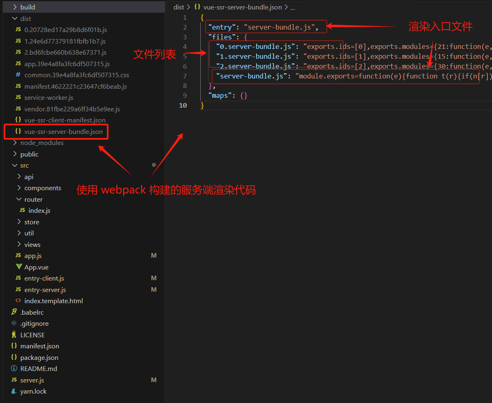
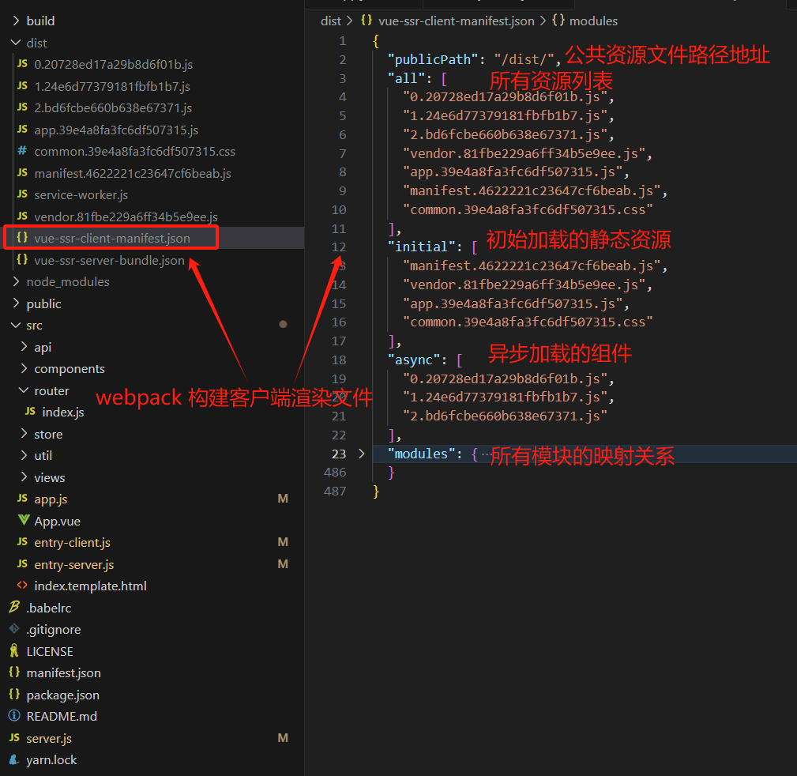
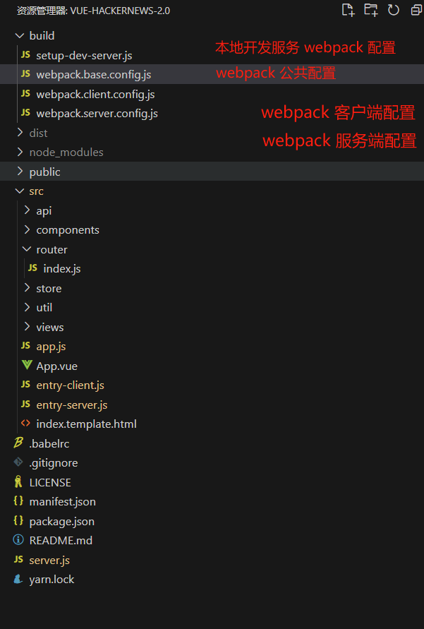
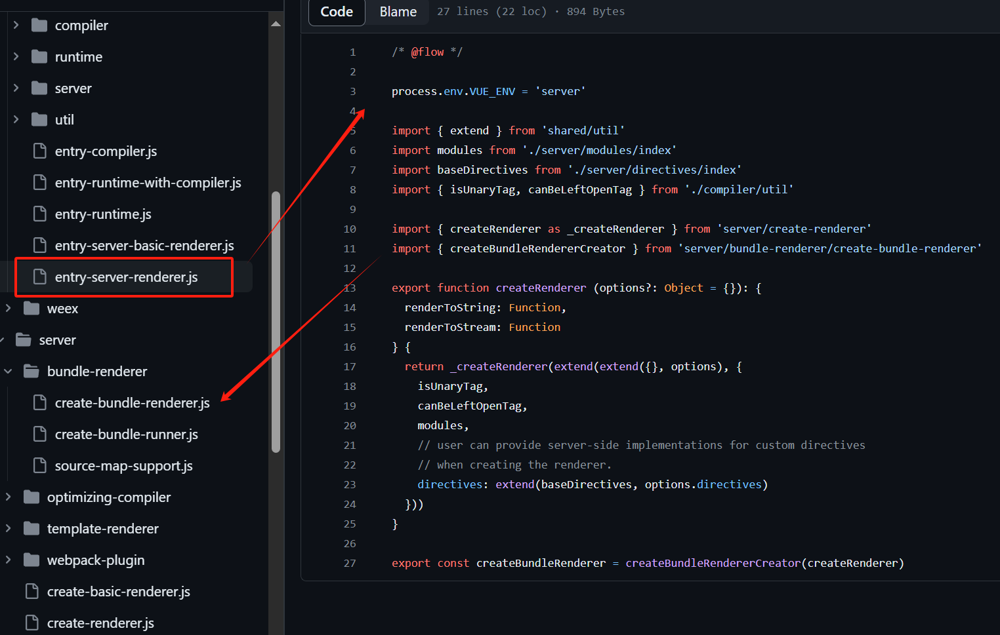
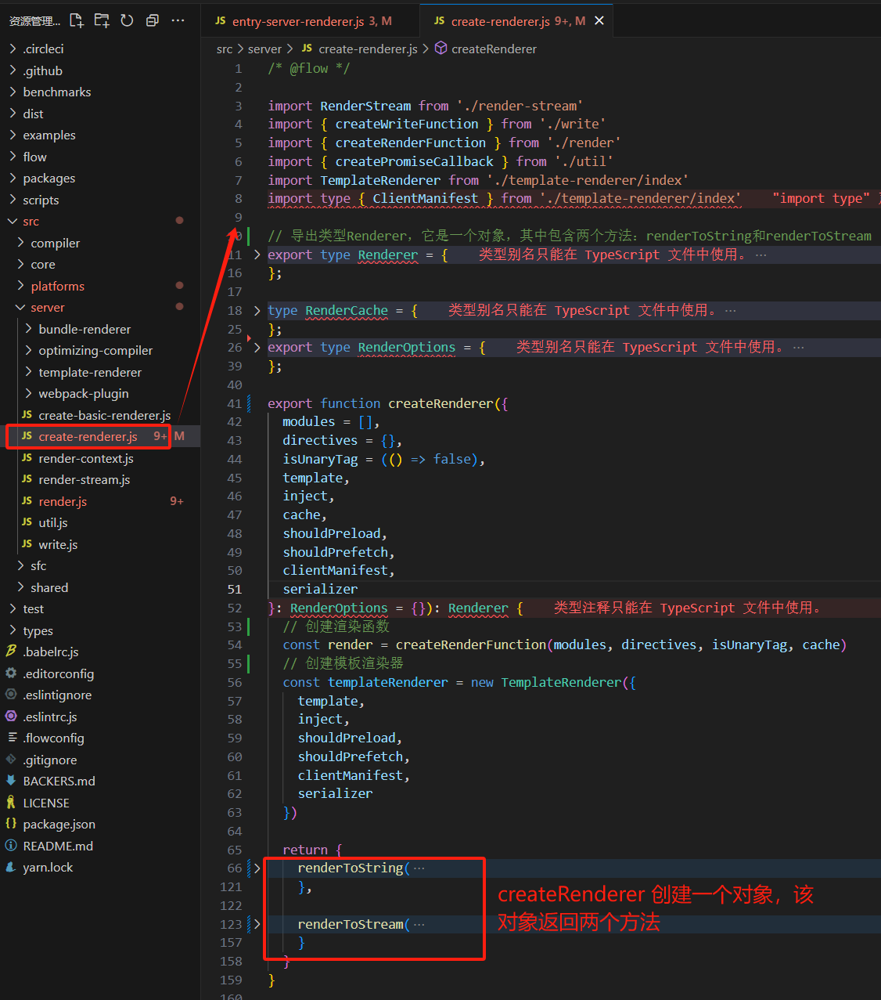

# VueSSR原理分析


## **SSR是什么？**

Vue.js 是一个用于构建客户端应用的框架。

默认情况下，Vue 组件的职责是在浏览器中生成和操作 DOM。

然而，Vue 也支持将组件在服务端直接渲染成 HTML 字符串，作为服务端响应返回给浏览器，最后在浏览器端将静态的 HTML“激活”(hydrate) 为能够交互的客户端应用。

一个由服务端渲染的 Vue.js 应用也可以被认为是“同构的”(Isomorphic) 或“通用的”(Universal)，因为应用的大部分代码同时运行在服务端和客户端。

> 基础知识参考官方文档[Vue SSR](https://cn.vuejs.org/guide/scaling-up/ssr.html)


## 为什么要用 SSR？

* **更好的 SEO**：搜索引擎爬虫可以直接看到完全渲染的页面。
  * 搜索引擎爬虫是不会等待异步请求数据结束后再抓取信息，SSR 技术在服务器端直接生成 HTML，这意味着爬虫可以直接获取完整的 HTML 页面，而无需等待 JavaScript 代码的执行。

* **更快的首屏加载**：
  * 服务端渲染的 HTML 无需等到所有的 JavaScript 都下载并执行完成之后才显示，所以你的用户将会更快地看到完整渲染的页面。
  * 数据获取过程在首次访问时在服务端完成，相比于从客户端获取，可能有更快的数据库连接。
  * 这通常可以带来更高的[核心 Web 指标](https://web.dev/vitals/)评分、更好的用户体验，而对于那些“首屏加载速度与转化率直接相关”的应用来说，这点可能至关重要。


## **前端渲染架构类型**

前端架构演进方向： **CSR 一> SSR 一> NSR 一> ESR**

具体参考博客：[前端渲染架构 | Sewen 博客 (sewar-x.github.io)](https://sewar-x.github.io/Front-end-Engineering/前端渲染架构/#多页面应用)


## **同构应用原理**

### **组件基于 VNode 渲染**

VNode 本身是 js 对象，**兼容性极强**，不依赖当前的执行的环境，从而可以在服务端渲染及原生渲染。虚拟 DOM 频繁修改，最后比较出真实 DOM 需要更改的地方，可以达到**局部渲染**的目的，**减少性能损耗**。


### **VNode**

VNode是一个虚拟节点，是Virtual Node的缩写。在计算机科学中，VNode是用来描述DOM节点的一种数据结构。

每个VNode对象代表了一个DOM节点，包含了节点的类型、属性、子节点等信息。

在虚拟DOM（Virtual DOM）的概念中，VNode被用作在内存中表示真实DOM的一种方式。例如，当你在浏览器中创建一个新的HTML元素（如`<div>`）时，Vue.js实际上会为这个元素创建一个VNode对象。这个VNode对象就像是一个镜像，它包含了真实DOM元素的所有属性和方法。

**示例**

假设你有一个简单的HTML页面，其中包含一个`<ul>`元素和一个`<li>`元素：

```html
<ul id="app">  
  <li>Item 1</li>  
  <li>Item 2</li>  
</ul>
```

在Vue.js中，当你将这个页面绑定到一个Vue实例时，Vue.js实际上会为每个`<li>`元素创建一个VNode对象。这些VNode对象将用作构建虚拟DOM的基础。当你想在列表中插入一个新的`<li>`元素时，Vue.js会在虚拟DOM中创建一个新的VNode对象，并将其插入到虚拟DOM树中。然后，Vue.js会将这个虚拟DOM树与真实DOM进行同步，从而更新页面上的元素。


## **SSR架构**

> 项目基于 Vue2 SSR 官文 demo 项目 [HackerNews](https://github.com/vuejs/vue-hackernews-2.0/)  进行分析，在阅读之前建议先阅读 [Vue.js 服务器端渲染指南 | Vue SSR 指南 (vuejs.org)](https://v2.ssr.vuejs.org/zh/#什么是服务器端渲染-ssr)


Vue SSR 框架为同构框架，应用代码编译过程 Vue SSR 提供了两个编译入口，服务端应用和客户端应用，作为抹平由于环境不同的代码差异；

由于用例和平台 API 的差异，当运行在不同环境中时，代码将不会完全相同。

对于客户端应用程序和服务器应用程序，我们都要使用 webpack 打包 - 服务器需要「服务器 bundle」然后用于服务器端渲染(SSR)，而「客户端 bundle」会发送给浏览器，用于混合静态标记。


## SSR **渲染流程**

Vue SSR（Server-Side Rendering，服务器端渲染）的渲染流程主要涉及到服务器端和客户端的交互，以及Vue组件的渲染和激活过程。

### **1. 通用代码和 Webpack 配置**

#### **SSR 应用包含主要源码**

- 通用代码 `app.js`: 用于服务端渲染和客户端渲染的公共代码。包含应用通用代码、组件、Vuex、路由和页面等。
  - 通用代码不可接受特定平台的 API（因此如果你的代码中，直接使用了像 `window` 或 `document`，这种仅浏览器可用的全局变量，则会在 Node.js 中执行时抛出错误，反之也是如此）
- 服务端渲染 `Server entry`: 创建返回应用实例，同时还会进行路由匹配和数据的预处理，仅运行于服务器。
- 客户端渲染 `Client entry`: 负责创建应用程序，挂载实例 DOM ，仅运行于浏览器。
- HTTP 服务 `Server.js`: Node Server，用于接受请求编译服务端渲染的 HTTP 服务。


#### **通用代码特性**

* 通用代码不可接受特定平台的 API（因此如果你的代码中，直接使用了像 `window` 或 `document`，这种仅浏览器可用的全局变量，则会在 Node.js 中执行时抛出错误，反之也是如此）


#### **配置Webpack**

为服务器和客户端分别配置Webpack，生成相应的bundle。

- 服务器bundle用于服务器端渲染；
- 客户端bundle用于在浏览器中激活静态内容。

### **2.启动 HTTP 服务**

使用 Node Express 启动一个 HTTP 服务，响应 HTTP 请求。

### **3. 服务器端渲染**

#### **渲染过程**

**Node Express 接收到 HTTP 请求以后，执行服务端渲染：**

1. **创建Vue实例**：在服务器端，根据路由请求创建对应的Vue实例。这个实例包含了要渲染的组件及其数据。
2. **渲染Vue实例为HTML字符串**：**使用 `vue-server-renderer` 的 `renderToString `方法将Vue实例渲染成HTML字符串**。这个过程中，Vue会遍历组件树，生成对应的HTML结构。
   * 渲染器有 `renderToString`或`renderToStream`方法，将Vue实例渲染为HTML字符串。
   * `renderToString`会立即返回渲染好的HTML
   * `renderToStream`会返回一个流，允许将HTML逐步发送给客户端，适用于较大的应用或需要优化性能的场景。
3. **将HTML字符串注入到模板中**：将渲染出的HTML字符串注入到HTML模板中。这个模板通常包含了一些静态的HTML结构和一些占位符（如`<!--vue-ssr-outlet-->`），用于插入Vue渲染的内容。
4. **将 HTML 数据注入全局变量**： 服务端通过将客户端数据注入到 `window.__INITIAL_STATE__` 变量中；
5. **发送渲染后的HTML到客户端**：将包含Vue渲染内容的完整HTML页面发送给客户端浏览器。


> **服务端渲染特性**
>
> * 服务器端渲染中**为每个请求创建一个新的根 Vue 实例**，每个请求都是全新的、独立的应用程序实例，以便不会有交叉请求造成的状态污染；
> * 将数据进行响应式的过程在服务器上是多余的，所以默认情况下禁用；
> * 所有的生命周期钩子函数中，只有 `beforeCreate` 和 `created` 会在服务器端渲染 (SSR) 过程中被调用；
>   * 应该避免在 `beforeCreate` 和 `created` 生命周期时产生全局副作用的代码，例如在其中使用 `setInterval` 设置 timer。由于服务端渲染代码在 SSR 期间并不会调用销毁钩子函数，所以 timer 将永远保留下来。
>   * 为了避免这种情况，请将副作用代码移动到 `beforeMount` 或 `mounted` 生命周期中。


### 4. 客户端激活

#### **激活过程**

1. **客户端接收HTML**：
   * 客户端浏览器接收到服务器发送的HTML页面，并开始解析。
   * 当浏览器接收到服务器返回的HTML后，会立即显示内容，该 HTML  页面包含爬虫需要的内容。
2. **加载客户端bundle**：在HTML页面中，会包含对客户端bundle的引用（通常是通过`<script>`标签）。浏览器会加载并执行这个bundle。
3. **激活静态内容**：
   * 客户端bundle中的代码会查找并激活HTML页面中的静态Vue内容。
   * 这个过程通常涉及到将Vue组件挂载到DOM上，并使其变为可交互的。
4. **获取 `window.__INITIAL_STATE__` 状态，注入到store 中**；（`window.__INITIAL_STATE__` 是通过服务端渲染预先获取的数据，并注入在 HTML 页面中的 `window.__INITIAL_STATE__`  变量中）；
5. **后续路由和组件渲染**：
   * hydration完成后，Vue应用进入客户端接管模式，后续的任何状态变化都将在客户端进行局部更新，而不是重新从服务器获取整个页面。
   * 一旦Vue实例被激活，后续的路由和组件渲染就可以像传统的SPA（单页应用程序）一样在客户端进行。


> **客户端渲染特性**
>
> * 任何生命周期钩子函数中的代码（例如 `beforeMount` 或 `mounted`），都会在客户端执行。
> * 对于仅浏览器可用的 API，通常方式是，在「纯客户端 (client-only)」的生命周期钩子函数中惰性访问 (lazily access) 它们。


## **项目源码**

SSR 应用包含主要源码：

* 通用代码 `app.js`: 用于服务端渲染和客户端渲染的公共代码。包含应用通用代码、组件、Vuex、路由和页面等。
* 服务端渲染 `Server entry`: 创建返回应用实例，同时还会进行路由匹配和数据的预处理，仅运行于服务器。
* 客户端渲染 `Client entry`:  负责创建应用程序，挂载实例 DOM ，仅运行于浏览器。
* HTTP 服务 `Server.js`:  Node Server，用于接受请求编译服务端渲染的 HTTP 服务。


## **源码分析**

> 项目基于 Vue2 SSR 官文 demo 项目 [HackerNews](https://github.com/vuejs/vue-hackernews-2.0/)  进行分析

### **项目目录**


### `app.js`

`app.js` 是我们应用程序的「通用 entry」。

在纯客户端应用程序中，我们将在此文件中创建根 Vue 实例，并直接挂载到 DOM。

在服务器端渲染(SSR)，为每个请求创建一个新的根 Vue 实例，避免请求状态交叉污染。

`app.js` 简单地使用 export 导出一个 `createApp` 函数,该函数在每次调用时创建一个新的 store, router, app实例：

```js
import Vue from 'vue'
import App from './App.vue'
import { createStore } from './store'
import { createRouter } from './router'
import { sync } from 'vuex-router-sync'
import titleMixin from './util/title'
import * as filters from './util/filters'

// 标题 mixin
Vue.mixin(titleMixin)

// 注册全局 utility 过滤器
Object.keys(filters).forEach(key => {
  Vue.filter(key, filters[key])
})
// Node.js 服务器是一个长期运行的进程。当我们的代码进入该进程时，它将进行一次取值并留存在内存中。这意味着如果创建一个单例对象，它将在每个传入的请求之间共享
// 为每个请求创建一个新的根 Vue 实例,避免请求状态交叉污染。暴露一个工厂函数，该函数在每次调用时创建一个新的 store, router, app实例
export function createApp() {
  const store = createStore()
  const router = createRouter()

  // 同步路由和 Vuex 状态，注册 store.state.route
  sync(store, router)

  // create the app instance.
  // here we inject the router, store and ssr context to all child components,
  // making them available everywhere as `this.$router` and `this.$store`.
  // 创建 app 实例,此处注入 router 和 store 和 ssr 上下文到所有子组件,在 vue 实例任何地方可以通过 this.$router 和 this.$store 获取路由和状态对象
  const app = new Vue({
    router,
    store,
    render: h => h(App)
  })
  
  //对外暴露 app,  router 和  store
  // 请注意，我们不在这里挂载应用程序，在浏览器还是在服务器上初始化流程不同
  return { app, router, store }
}

```

### `entry-client.js`

客户端 entry 只需创建应用程序，并且将其挂载到 DOM 中 ，仅运行于浏览器

使用 WebPack 构建后的「客户端 bundle」会发送给浏览器，用于混合静态标记。

客户端 entry 核心代码：

```js
import { createApp } from './app'

// 客户端特定引导逻辑……

const { app } = createApp()

// 这里假定 App.vue 模板中根元素具有 `id="app"`
app.$mount('#app')
```

完整代码：

```js
import Vue from 'vue'
import 'es6-promise/auto'
import { createApp } from './app'
import ProgressBar from './components/ProgressBar.vue'

// 全局进度条
const bar = Vue.prototype.$bar = new Vue(ProgressBar).$mount()
document.body.appendChild(bar.$el)

// 全局 mixin：当组件参数发生变化时，调用组件内的 asyncData，用于预获取路由页面客户端渲染数据 
// 此函数会在组件实例化之前调用，所以它无法访问 this
Vue.mixin({
  beforeRouteUpdate (to, from, next) {
    const { asyncData } = this.$options
    if (asyncData) {
      asyncData({
        store: this.$store,
        route: to
      }).then(next).catch(next)
    } else {
      next()
    }
  }
})

//匹配要渲染的视图后，再获取数据,当路由导航被触发时，可以立即切换视图，因此应用程序具有更快的响应速度
// Vue.mixin({
//   beforeMount () {
//     const { asyncData } = this.$options
//     if (asyncData) {
//       // 将获取数据操作分配给 promise
//       // 以便在组件中，我们可以在数据准备就绪后
//       // 通过运行 `this.dataPromise.then(...)` 来执行其他任务
//       this.dataPromise = asyncData({
//         store: this.$store,
//         route: this.$route
//       })
//     }
//   }
// })

// 获取 app、router 和 store 实例
const { app, router, store } = createApp()

// 当使用 template 时，context.state 将作为 window.__INITIAL_STATE__ 状态，自动嵌入到最终的 HTML 中
if (window.__INITIAL_STATE__) {
  store.replaceState(window.__INITIAL_STATE__)
}

// 等到路由器在钩子和异步组件之前解析了所有的异步
router.onReady(() => {
  // 添加路由钩子函数，用于处理 asyncData.
  // 在初始路由 resolve 后执行，以便我们不会二次预取(double-fetch)已有的数据。
  // 使用 `router.beforeResolve()`，以便确保所有异步组件都 resolve。
  router.beforeResolve((to, from, next) => {
    // 获取路由匹配的进入和离开的异步组件
    const matched = router.getMatchedComponents(to)
    const prevMatched = router.getMatchedComponents(from)
    // 我们只关心非预渲染的组件， 所以我们对比它们，找出两个匹配列表的差异组件
    let diffed = false
    // 比较进入和离开组件是否相同
    const activated = matched.filter((c, i) => {
      return diffed || (diffed = (prevMatched[i] !== c))
    })
    // 过滤获取激活组件异步获取数据钩子
    const asyncDataHooks = activated.map(c => c.asyncData).filter(_ => _)
    // 不存在获取数据钩子，直接进入导航页面
    if (!asyncDataHooks.length) {
      return next()
    }

    bar.start()
    //根据 asyncData 获取数据
    Promise.all(asyncDataHooks.map(hook => hook({ store, route: to })))
      .then(() => {
        bar.finish()
        next()
      })
      .catch(next)
  })

  //挂载 dom 
  app.$mount('#app')
})

// service worker
if ('https:' === location.protocol && navigator.serviceWorker) {
  navigator.serviceWorker.register('/service-worker.js')
}

```

> 客户端渲染主要逻辑：
>
> 1.  获取 app、router 和 store 实例；
> 2. 获取 `window.__INITIAL_STATE__` 状态，注入到store 中；（`window.__INITIAL_STATE__` 是通过服务端渲染预先获取的数据，并注入在 HTML 页面中的 `window.__INITIAL_STATE__`  变量中）；
> 3. 全局 mixin：在客户端激活后，当组件参数发生变化时，调用组件内的 asyncData 钩子，用于预获取路由页面客户端渲染的数据；
> 4. 挂载 dom ；
> 5. 监听路由变化，当路由变化时：
>    * 获取路由匹配的进入和离开的异步组件；
>    * 比较进入和离开组件是否相同；
>    * 过滤获取激活组件获取数据 asyncData  钩子；
>    * 根据 asyncData 获取数据；
> 6. 进入路由页面，客户端渲染页面。


### `entry-server.js`

创建返回应用实例，同时还会进行路由匹配和数据的预处理，仅运行于服务器。

服务端 entry 核心代码：

```js
import { createApp } from './app'

export default context => {
  const { app } = createApp()
  return app
}
```

完整代码：

```js
import { createApp } from './app'

const isDev = process.env.NODE_ENV !== 'production'

// 暴露一个方法用于 bundleRenderer 调用。在服务端渲染时主要执行数据预取，定义应用状态。
// 一旦数据完成同步，该方法将返回一个 Promise app 实例。
export default context => {
  return new Promise((resolve, reject) => {
    const s = isDev && Date.now() // 记录请求时间
    const { app, router, store } = createApp() // 每次请求获取新的 app 、 router、 store  对象
    const { url } = context // 请求 url
    const { fullPath } = router.resolve(url).route // 解析 url 获取路由路径

    if (fullPath !== url) {
      return reject({ url: fullPath })
    }

    // 设置服务器端 router 的位置
    router.push(url)

    // 等到 router 将可能的异步组件和钩子函数解析完
    router.onReady(() => {
      // 获取路由匹配的组件
      const matchedComponents = router.getMatchedComponents()
      // 没有匹配的组件，返回 404
      if (!matchedComponents.length) {
        return reject({ code: 404 })
      }
 
      // 调用路由匹配到的组件的 asyncData 钩子，asyncData 钩子分发 store action，当异步动作完成并 store 同步状态完成则返回 Promise。
      Promise.all(matchedComponents.map(({ asyncData }) => asyncData && asyncData({
        store,
        route: router.currentRoute
      }))).then(() => {
        // 开发环境下控制台输出获取数据时间
        isDev && console.log(`data pre-fetch: ${Date.now() - s}ms`)
        // 在所有预取钩子(preFetch hook) resolve 后，我们的 store 现在已经填充入渲染应用程序所需的状态。
        // 当我们将状态附加到上下文， 并且 `template` 选项用于 renderer 时，
        // 状态将自动序列化为 `window.__INITIAL_STATE__`，并注入 HTML。
        context.state = store.state
        resolve(app)
      }).catch(reject)
    }, reject)
  })
}

```

> 服务端渲染过程主要执行逻辑：
>
> 1. 解析 url 获取路由路径；
> 2. 获取路由匹配的组件；
> 3. 调用路由匹配到的组件的 asyncData 钩子预先获取组件数据；
> 4. 获取异步数据后，将数据填入 store，并自动序列化为 `window.__INITIAL_STATE__`，注入到 HTML。


### `server.js`

 Node Server，用于接受请求进行服务端渲染的 HTTP 服务。

该服务接受 HTTP 请求，并根据请求 URL  匹配路由组件，获取数据并使用 `vue-server-renderer` 创建一个服务器端Vue组件渲染器，渲染静态 HTML 页面返回客户端。

完整代码：

```js
const fs = require('fs')//文件操作
const path = require('path')//处理文件路径
const LRU = require('lru-cache')//缓存机制
const express = require('express')
const favicon = require('serve-favicon')
const compression = require('compression')
const microcache = require('route-cache')//缓存路由响应
const resolve = file => path.resolve(__dirname, file)
const { createBundleRenderer } = require('vue-server-renderer')//创建一个服务器端Vue组件渲染器

const isProd = process.env.NODE_ENV === 'production'
const useMicroCache = process.env.MICRO_CACHE !== 'false'
const serverInfo =
  `express/${require('express/package.json').version} ` +
  `vue-server-renderer/${require('vue-server-renderer/package.json').version}`

const app = express()
/**
 * 创建一个服务器端渲染器（server-side rendering
 * @param {*} bundle 一个已经预先编译好的服务器端 Vue.js 应用程序,这个应用程序已经被打包成一系列的模块，并且可能已经过优化。
 * @param {*} options 
 * @returns 
 */
function createRenderer (bundle, options) {
  // https://github.com/vuejs/vue/blob/dev/packages/vue-server-renderer/README.md#why-use-bundlerenderer
  //通过使用 webpack 的自定义插件，server bundle 将生成为可传递到 bundle renderer 的特殊 JSON 文件
  return createBundleRenderer(bundle, Object.assign(options, {
    // LRU 为最近最近未使用缓存，用于组件缓存
    cache: LRU({
      max: 1000,
      maxAge: 1000 * 60 * 15
    }),
    //只有当 vue-server-renderer 与 npm 链接时才需要这样做
    basedir: resolve('./dist'),
    /**recommended for performance
     * true: 新上下文模式。创建新上下文并重新评估捆绑包在每个渲染上。确保每个应用程序的整个应用程序状态都是新的渲染，但会产生额外的评估成本。
     * false:直接模式。每次渲染时，它只调用导出的函数。而不是在上重新评估整个捆绑包模块评估成本较高，但需要结构化源代码
     * once: 初始上下文模式。 仅用于收集可能的非组件vue样式加载程序注入的样式。
    */
    runInNewContext: false,
    clientManifest // （可选）客户端构建 manifest
  }))
}

let renderer
let readyPromise
// 渲染模板
const templatePath = resolve('./src/index.template.html')
if (isProd) {
  // In production: create server renderer using template and built server bundle.
  // The server bundle is generated by vue-ssr-webpack-plugin.
  const template = fs.readFileSync(templatePath, 'utf-8')
  // 一个已经预先编译好的服务器端 Vue.js 应用程序,这个应用程序已经被打包成一系列的模块，并且可能已经过优化。
  const bundle = require('./dist/vue-ssr-server-bundle.json')
  // 客户端清单,可选。它允许呈现程序自动推断预加载/预取链接，并直接为渲染期间使用的任何异步块添加 < script > 标记，从而避免了瀑布式请求。
  const clientManifest = require('./dist/vue-ssr-client-manifest.json')
  renderer = createRenderer(bundle, {
    template,
    clientManifest
  })
} else {
  // 在开发中: 使用 watch 和 hot-reload 设置 dev 服务器，并在 bundle 索引模板更新上创建一个新的渲染服务。
  readyPromise = require('./build/setup-dev-server')(
    app,
    templatePath,
    (bundle, options) => {
      renderer = createRenderer(bundle, options)
    }
  )
}
// 设置Express服务器静态文件缓存的函数
const serve = (path, cache) => express.static(resolve(path), {
  maxAge: cache && isProd ? 1000 * 60 * 60 * 24 * 30 : 0
})

app.use(compression({ threshold: 0 }))//使用compression中间件：这个中间件用于压缩响应数据，以便在网络传输中减少传输大小。通过这个中间件，客户端可以更快地接收和加载应用程序的内容。
app.use(favicon('./public/logo-48.png'))//使用favicon中间件：这个中间件用于设置网页图标，即在浏览器地址栏中的那个小图标
app.use('/dist', serve('./dist', true))//使用serve中间件,提供静态资源
app.use('/public', serve('./public', true))
app.use('/manifest.json', serve('./manifest.json', true))
app.use('/service-worker.js', serve('./dist/service-worker.js'))
// https://www.nginx.com/blog/benefits-of-microcaching-nginx/
// 实现逻辑为，检查请求是否是用户特定(user-specific)。 只有非用户特定 (non-user-specific) 页面才会缓存。1秒微缓存
app.use(microcache.cacheSeconds(1, req => useMicroCache && req.originalUrl))

function render (req, res) {
  const s = Date.now()//记录请求开始时间
  res.setHeader("Content-Type", "text/html")
  res.setHeader("Server", serverInfo)
  // 错误处理对象
  const handleError = err => {
    if (err.url) {
      res.redirect(err.url)
    } else if(err.code === 404) {
      res.status(404).send('404 | Page Not Found')
    } else {
      // Render Error Page or Redirect
      res.status(500).send('500 | Internal Server Error')
      console.error(`error during render : ${req.url}`)
      console.error(err.stack)
    }
  }
  // 渲染上下文对象,提供插值数据
  const context = {
    title: 'Vue HN 2.0', // default title
    url: req.url
  }
  renderer.renderToString(context, (err, html) => {
    if (err) {
      return handleError(err)
    }
    res.send(html)
    if (!isProd) {
      console.log(`whole request: ${Date.now() - s}ms`)
    }
  })
}

app.get('*', isProd ? render : (req, res) => {
  readyPromise.then(() => render(req, res))
})

const port = process.env.PORT || 8080
app.listen(port, () => {
  console.log(`server started at localhost:${port}`)
})

```

> Node HTTP 服务主要逻辑：
>
> 1. 实例化 HTTP 服务，初始化服务中间件；
> 2. 根据运行环境（开发或生产），使用`vue-server-renderer`创建一个服务器端渲染器：
>    * 在生产环境中：通过 webpack 预先构建以上服务端渲染代码生成名称为 `vue-ssr-server-bundle.json` 的服务端渲染 Bundle，通过 webpack 预先构建以上客户端代码生成名为 `vue-ssr-client-manifest.json` 的客户端清单代码，再获取 HTML 渲染模板，将以上三个参数通过 `vue-server-renderer` 创建一个服务器端渲染器。
>    * 在开发环境中：使用 `setup-dev-server` 启动一个本地开发服务，使用 watch 和 hot-reload 设置 dev 服务器，并在 bundle 索引模板更新上创建一个新的渲染服务。
> 3. 并启动 HTTP 服务，监听请求；
> 4. 当请求到达服务后，通过渲染器的 `renderer.renderToString` 方法，将匹配到的组件渲染成 HTML 页面返回客户端。


## **编译流程**

参考SSR 架构一节的架构图，**SSR 渲染流程如下**：

1. 使用 Webpack 构建服务端渲染和客户端渲染代码，生成 `Server Bundle ` 、 `Client Bundle` 和 HTML 页面；
2. 启动一个 Node HTTP  服务，监听请求；
3. 服务端 `Server Bundle `  运行在 Node HTTP  服务中；
4. 首次请求，将客户端 `Client Bundle` 和 HTML 页面发送到客户端；
5. 二次请求， Node HTTP  服务解析 URL 匹配组件，获取异步数据，注入到 Store 和 HTML 页面中的 `window.__INITIAL_STATE__` 变量中，渲染 HTML 页面；
6. 将渲染的 HTML 页面返回客户端；
7. 客户端接受到 HTML 页面后，进行客户端激活，客户端监听路由，异步获取数据，并解析 `window.__INITIAL_STATE__` 变量，再次渲染 HTML 页面；


> 渲染流程：服务端渲染的主要流程是在服务器端生成完整的HTML页面，并将其发送给浏览器展示。
>
> 1. 客户端请求：用户在浏览器中输入网址或点击链接，发送请求到服务器。
> 2. 服务器接收请求：服务器接收到客户端的请求，并进行处理。
> 3. 数据获取：服务器根据请求的内容，可能需要从数据库、API接口或其他数据源获取所需的数据。
> 4. 模板渲染：服务器使用事先定义好的模板引擎或渲染框架，将数据注入到模板中，生成完整的HTML页面。
>    - 在不同页面之间导航需要下载新的HTML，首页会从缓存中获取已渲染页面，为查找到则服务端重新渲染。
> 5. 生成响应：服务器将渲染好的HTML页面作为响应的一部分，包括设置相应的HTTP状态码和头部信息。
> 6. 响应发送：服务器将生成的响应发送回客户端，通过网络传输到浏览器。
> 7. 客户端激活：浏览器接收到服务器发送的响应后，解析HTML并呈现页面内容。
>    - 客户端所需要做的仅仅是html页面的展现和之后的DOM事件处理。
> 8. 客户端交互：浏览器加载完初始页面后，可以执行JavaScript代码，处理用户交互、数据请求和动态更新等操作。


## **Webpack 构建**

以上渲染流程中，设计客户端和服务端代码的 Webpack 编译过程:

### **服务端构建流程**

* 通过 Wepack 构建 通用代码 `app.js` + 服务端渲染代码 `server-entry.js` + 渲染模板 = `Server Bundle`;

* `Server Bundle` 运行在 `Node Server`。
* 服务端启动一个 Node HTTP 服务监听请求，请求将客户端 `Client Bundle` 和 HTML 页面发送到客户端。

**渲染时机：** 

* 通过 Express 服务渲染：浏览器输入 url 直接定向到某个页面，Express  执行 `entry-server.js` 动态渲染 HTML；

**总体流程：**

* 浏览器输入 `url -> Express 服务接受请求 -> 服务端获取数据 -> 数据注入 store -> SSR Renderer 渲染HTML页面 -> 返回浏览器`

### **客户端构建流程**

* 通过 Wepack 构建 通用代码 `app.js` + 客户端端渲染代码 `client-entry.js` + 渲染模板 = `Client Bundle`;
* 客户端激活：浏览器中 `Client Bundle` + 服务端数据`window.__INITIAL_STATE__` 变量 + HTML 静态页面。

**总体流程：**

* 首次渲染：由服务端渲染输出 HTML 页面发送到浏览器，客户端激活后通过路由导航的页面再次通过客户端渲染。（客户端激活：指的是 Vue 在浏览器端接管由服务端发送的静态 HTML，使其变为由 Vue 管理的动态 DOM 的过程。）
* 二次渲染（客户端渲染）：页面内点击链接 -> 客户端获取数据 -> 浏览器渲染页面。


### **编译产物分析**

经过 webpack 打包之后会有两个 bundle 产物：`Server Bundle` 和 `Client Bundle`。

1. `Server Bundle` 用于生成 `vue-ssr-server-bundle.json`， sourceMap 和需要在服务端运行的代码列表都在这个产物中。

`vue-ssr-server-bundle.json` 简化代码如下：

```js
{ 
  "entry": , 
  "files": {
    A：包含了所有要在服务端运行的代码列表
    B：入口文件
  } 
}
```



2. `Client Bundle` 用于生成`vue-SSR-client-manifest.json`:包含所有的静态资源，首次渲染需要加载的 script 标签，以及需要在客户端运行的代码。

`vue-SSR-client-manifest.json`简化代码如下：

```javascript

{ 
  "publicPath": 公共资源路径文件地址, 
  "all": 资源列表
  "initial":输出 html 字符串
  "async": 异步加载组件集合
  "modules": moduleIdentifier 和 all 数组中文件的映射关系
}
```




## **Webpack 配置**

通过以上 Webpack 构建分析可知，webpack 需要构建两部分代码：客户端渲染和服务端渲染代码，并且在服务端中，分为开发环境和生产环境，开发环境下使用 `webpack-hot-middleware` 启动一个本地 HTTP 服务。

Webpack 构建配置目录如下：




### **`webpack.base.config`**

`webpack.base.config` 配置为服务端渲染和客户端渲染的基本配置，基本配置 (base config) 包含在两个环境共享的配置，例如，输出路径 (output path)，别名 (alias) 和 loader

```js
const path = require('path')
const webpack = require('webpack')
const ExtractTextPlugin = require('extract-text-webpack-plugin')
const FriendlyErrorsPlugin = require('friendly-errors-webpack-plugin')
const { VueLoaderPlugin } = require('vue-loader')

const isProd = process.env.NODE_ENV === 'production'

module.exports = {
  // 是否开启source map，开发模式下开启，生产模式下关闭
  devtool: isProd
    ? false
    : '#cheap-module-source-map',
  // 输出文件的位置
  output: {
    path: path.resolve(__dirname, '../dist'),
    publicPath: '/dist/',
    filename: '[name].[chunkhash].js'
  },
  // 解析模块的别名
  resolve: {
    alias: {
      'public': path.resolve(__dirname, '../public')
    }
  },
  module: {
    // 是否解析es6-promise.js，避免使用webpack的shimming process
    noParse: /es6-promise\.js$/, // avoid webpack shimming process
    rules: [
      {
        test: /\.vue$/,
        loader: 'vue-loader',
        options: {
          compilerOptions: {
            preserveWhitespace: false
          }
        }
      },
      {
        test: /\.js$/,
        loader: 'babel-loader',
        exclude: /node_modules/
      },
      {
        test: /\.(png|jpg|gif|svg)$/,
        loader: 'url-loader',
        options: {
          limit: 10000,
          name: '[name].[ext]?[hash]'
        }
      },
      {
        test: /\.styl(us)?$/,
        use: isProd
          ? ExtractTextPlugin.extract({
              use: [
                {
                  loader: 'css-loader',
                  options: { minimize: true }
                },
                'stylus-loader'
              ],
              fallback: 'vue-style-loader'
            })
          : ['vue-style-loader', 'css-loader', 'stylus-loader']
      },
    ]
  },
  // 是否显示性能提示
  performance: {
    hints: false
  },
  plugins: isProd
    ? [
        new VueLoaderPlugin(), // vue-loader 插件
        new webpack.optimize.UglifyJsPlugin({ // JS 代码压缩插件
          compress: { warnings: false }
        }),
        new webpack.optimize.ModuleConcatenationPlugin(), // 代码优化插件
        new ExtractTextPlugin({ // 提取 CSS 代码插件
          filename: 'common.[chunkhash].css'
        })
      ]
    : [
        new VueLoaderPlugin(),
        new FriendlyErrorsPlugin() // 错误处理插件
      ]
}
```


### **`webpack.server.config`**

```js
const webpack = require('webpack')
const merge = require('webpack-merge')
const base = require('./webpack.base.config')
const nodeExternals = require('webpack-node-externals')
const VueSSRServerPlugin = require('vue-server-renderer/server-plugin')

module.exports = merge(base, {
  // 这允许 webpack 以 Node 适用方式(Node-appropriate fashion)处理动态导入(dynamic import)，
  // 并且还会在编译 Vue 组件时，告知 `vue-loader` 输送面向服务器代码(server-oriented code)。
  target: 'node',
  // 对 bundle renderer 提供 source map 支持
  devtool: '#source-map',
  // 将 entry 指向应用程序的 server entry 文件
  entry: './src/entry-server.js',
  // 此处告知 server bundle 使用 Node 风格导出模块(Node-style exports)
  output: {
    filename: 'server-bundle.js',
    libraryTarget: 'commonjs2'
  },
  // 指定别名
  resolve: {
    alias: {
      'create-api': './create-api-server.js'
    }
  },
  // https://webpack.js.org/configuration/externals/#function
  // https://github.com/liady/webpack-node-externals
  // 外置化应用程序依赖模块。可以使服务器构建速度更快，并生成较小的 bundle 文件。
  externals: nodeExternals({
  	// 不要外置化 webpack 需要处理的依赖模块。
    // 你可以在这里添加更多的文件类型。例如，未处理 *.vue 原始文件，
    // 你还应该将修改 `global`（例如 polyfill）的依赖模块列入白名单
    whitelist: /\.css$/
  }),
  // 这是将服务器的整个输出
  // 构建为单个 JSON 文件的插件。
  // 默认文件名为 `vue-ssr-server-bundle.json`
  plugins: [
    new webpack.DefinePlugin({
      'process.env.NODE_ENV': JSON.stringify(process.env.NODE_ENV || 'development'),
      'process.env.VUE_ENV': '"server"'
    }),
    new VueSSRServerPlugin()
  ]
})
```

通过以上 webpack 构建 `entry-server.js` 文件后，将生成 `vue-ssr-server-bundle.json` 文件。

在生成 `vue-ssr-server-bundle.json` 之后，在 `server.js` 文件中，只需将文件路径传递给 `createBundleRenderer`方法：

```js
const { createBundleRenderer } = require('vue-server-renderer')
const renderer = createBundleRenderer('/path/to/vue-ssr-server-bundle.json', {
  // ……renderer 的其他选项
})
```


### **`webpack.client.config`**

```js
const webpack = require('webpack')
const merge = require('webpack-merge')
const base = require('./webpack.base.config')
const SWPrecachePlugin = require('sw-precache-webpack-plugin')
const VueSSRClientPlugin = require('vue-server-renderer/client-plugin')

// 合并基础配置和当前配置
const config = merge(base, {
  entry: {
    // 客户端入口文件
    app: './src/entry-client.js'
  },
  resolve: {
    // 解析别名
    alias: {
      'create-api': './create-api-client.js'
    }
  },
  plugins: [
    // strip dev-only code in Vue source
    // 定义环境变量
    new webpack.DefinePlugin({
      'process.env.NODE_ENV': JSON.stringify(process.env.NODE_ENV || 'development'),
      'process.env.VUE_ENV': '"client"'
    }),
    // extract vendor chunks for better caching
    // 提取公共代码
    new webpack.optimize.CommonsChunkPlugin({
      name: 'vendor',
      minChunks: function (module) {
        // a module is extracted into the vendor chunk if...
        return (
          // it's inside node_modules
          /node_modules/.test(module.context) &&
          // and not a CSS file (due to extract-text-webpack-plugin limitation)
          !/\.css$/.test(module.request)
        )
      }
    }),
    // 重要信息：这将 webpack 运行时分离到一个引导 chunk 中，以便可以在之后正确注入异步 chunk。
    // 这也为你的 应用程序/vendor 代码提供了更好的缓存。
    new webpack.optimize.CommonsChunkPlugin({
      name: 'manifest'
    }),
    // 此插件在输出目录中生成 `vue-ssr-client-manifest.json`。
    new VueSSRClientPlugin()
  ]
})

// 如果是生产环境，添加service worker
if (process.env.NODE_ENV === 'production') {
  config.plugins.push(
    // auto generate service worker
    // 用于在构建过程中自动生成Service Worker（服务worker）文件
    new SWPrecachePlugin({
      cacheId: 'vue-hn',// 缓存ID，用于识别不同的预缓存配置。
      filename: 'service-worker.js',// 服务worker文件的名称。
      minify: true,// 是否对服务worker文件进行压缩。
      dontCacheBustUrlsMatching: /./,//避免缓存 bust 的 URL 模式。
      staticFileGlobsIgnorePatterns: [/\.map$/, /\.json$/], //忽略的静态文件 glob 模式。
      runtimeCaching: [ //运行时缓存配置。
        {
          urlPattern: '/',
          handler: 'networkFirst'
        },
        {
          urlPattern: /\/(top|new|show|ask|jobs)/,
          urlPattern: '/top',
          handler: 'networkFirst'
        },
        {
          urlPattern: '/new',
          handler: 'networkFirst'
        },
        {
          urlPattern: '/show',
          handler: 'networkFirst'
        },
        {
          urlPattern: '/ask',
          handler: 'networkFirst'
        },
        {
          urlPattern: '/jobs',
          handler: 'networkFirst'
        },
        {
          urlPattern: '/item/:id',
          handler: 'networkFirst'
        },
        {
          urlPattern: '/user/:id',
          handler: 'networkFirst'
        }
      ]
    })
  )
}

module.exports = config
```

> 以下是配置的主要原理：
>
> 1. 原理：这段代码使用了 `webpack-merge` 模块来合并 base 配置和具体的配置项。这样可以确保在合并过程中不会覆盖或添加重复的配置项。
> 2. 注意事项：
>    - 确保已经安装了所需的依赖包，包括 `webpack`、`webpack-merge`、`sw-precache-webpack-plugin` 和 `vue-server-renderer` 等。
>    - 配置文件应该位于项目的 `webpack.config.js` 文件中。
>    - 配置文件应该使用 ES6 的模块导出而不是直接导出。
>    - 对于 `SWPrecachePlugin` 的配置，建议参考其官方文档进行定制。

通过以上客户端构建 `client-entry.js` 文件后，生成客户端构建清单 (client build manifest) `clientManifest`，使用客户端清单 (client manifest) 和服务器 bundle(server bundle)，renderer 现在具有了*服务器和客户端*的构建信息，因此它可以自动推断和注入[资源预加载 / 数据预取指令(preload / prefetch directive) (opens new window)](https://css-tricks.com/prefetching-preloading-prebrowsing/)，以及 css 链接 / script 标签到所渲染的 HTML。

好处是双重的：

1. 在生成的文件名中有哈希时，可以取代 `html-webpack-plugin` 来注入正确的资源 URL。
2. 在通过 webpack 的按需代码分割特性渲染 bundle 时，我们可以确保对 chunk 进行最优化的资源预加载/数据预取，并且还可以将所需的异步 chunk 智能地注入为 `<script>` 标签，以避免客户端的瀑布式请求 (waterfall request)，以及改善可交互时间 (TTI - time-to-interactive)。

通过以上构建出的客户端清单 (client manifest) 以及页面模板，在 `server.js` 中创建渲染器，渲染 HTML 页面：

`server.js` 文件部分代码：

```js
const { createBundleRenderer } = require('vue-server-renderer')

const template = require('fs').readFileSync('/path/to/template.html', 'utf-8')
const serverBundle = require('/path/to/vue-ssr-server-bundle.json')
const clientManifest = require('/path/to/vue-ssr-client-manifest.json')

const renderer = createBundleRenderer(serverBundle, {
  template,
  clientManifest
})
```

通过以上设置，使用代码分割特性构建后的服务器渲染的 HTML 代码，将看起来如下（所有都是自动注入）：

```html
<html>
  <head>
    <!-- 用于当前渲染的 chunk 会被资源预加载(preload) -->
    <link rel="preload" href="/manifest.js" as="script">
    <link rel="preload" href="/main.js" as="script">
    <link rel="preload" href="/0.js" as="script">
    <!-- 未用到的异步 chunk 会被数据预取(prefetch)（次要优先级） -->
    <link rel="prefetch" href="/1.js" as="script">
  </head>
  <body>
    <!-- 应用程序内容 -->
    <div data-server-rendered="true"><div>async</div></div>
    <!-- manifest chunk 优先 -->
    <script src="/manifest.js"></script>
    <!-- 在主 chunk 之前注入异步 chunk -->
    <script src="/0.js"></script>
    <script src="/main.js"></script>
  </body>
</html>
```


### **`setup-dev-server`**

该文件主要用于构建本地开发服务，在 Node HTTP 服务中，使用 ` webpack-dev-middleware` 启动一个本地开发服务。

```js
const fs = require('fs')
const path = require('path')
const MFS = require('memory-fs')//内存文件系统，用于在内存中模拟文件系统，常用于单元测试
const webpack = require('webpack')
const chokidar = require('chokidar')//一个文件监听库，用于在文件发生变化时触发事件。Webpack的watch模式会使用这个库来监听文件变化。
const clientConfig = require('./webpack.client.config')
const serverConfig = require('./webpack.server.config')

const readFile = (fs, file) => {
  try {
    // 使用fs.readFileSync读取文件，并使用utf-8编码
    return fs.readFileSync(path.join(clientConfig.output.path, file), 'utf-8')
  } catch (e) { }
}

module.exports = function setupDevServer(app, templatePath, cb) {
  // 声明变量
  let bundle
  let template
  let clientManifest

  let ready
  /**
   * 创建一个名为 readyPromise 的 Promise 对象，该对象的状态为 pending，并在未来的某个时间点执行 resolve 方法。
   * 这个 Promise 是为了在未来的某个时间点，如果其他依赖这个 Promise 的代码还没有准备好，那么就可以通过 await 或 then 来等待这个 Promise 被执行。
   * 创建一个异步操作，但是在其他代码没有准备好之前，不需要等待其完成。
   * 使用await关键字来等待一个Promise的结果，或者在then方法中处理Promise的成功解决。
   * 作为模块导入时的延迟加载Promise，确保模块在加载时不会因为其他依赖而阻塞。
   */
  const readyPromise = new Promise(r => { ready = r })
  // 判断 bundle 和 clientManifest 是否存在，存在则执行 ready 函数，并调用cb函数，传入 bundle 和 clientManifest
  // 通过 webpack 构建服务端渲染代码生成 bundle，构建客户端代码生成 clientManifest
  const update = () => {
    if (bundle && clientManifest) {
      ready()
      cb(bundle, {
        template,
        clientManifest
      })
    }
  }

  // read template from disk and watch
  template = fs.readFileSync(templatePath, 'utf-8')
  //监听模板变化，在文件发生变化时，读取模板文件
  chokidar.watch(templatePath).on('change', () => {
    template = fs.readFileSync(templatePath, 'utf-8')
    console.log('index.html template updated.')
    update()
  })

  // modify client config to work with hot middleware
  // 修改热更新模块的客户端配置
  clientConfig.entry.app = ['webpack-hot-middleware/client', clientConfig.entry.app]
  clientConfig.output.filename = '[name].js'
  clientConfig.plugins.push(
    new webpack.HotModuleReplacementPlugin(), // 使用热更新插件
    new webpack.NoEmitOnErrorsPlugin()
  )

  // dev middleware
  const clientCompiler = webpack(clientConfig)
  // 使用开发服务插件
  const devMiddleware = require('webpack-dev-middleware')(clientCompiler, {
    publicPath: clientConfig.output.publicPath,
    noInfo: true
  })
  app.use(devMiddleware)
  // 监听插件完成事件，执行回调，更新文件
  clientCompiler.plugin('done', stats => {
    stats = stats.toJson()
    stats.errors.forEach(err => console.error(err))
    stats.warnings.forEach(err => console.warn(err))
    if (stats.errors.length) return
    clientManifest = JSON.parse(readFile(
      devMiddleware.fileSystem,
      'vue-ssr-client-manifest.json'
    ))
    update()
  })

  // hot middleware
  app.use(require('webpack-hot-middleware')(clientCompiler, { heartbeat: 5000 }))

  // watch and update server renderer
  const serverCompiler = webpack(serverConfig)
  const mfs = new MFS()
  serverCompiler.outputFileSystem = mfs
  serverCompiler.watch({}, (err, stats) => {
    if (err) throw err
    stats = stats.toJson()
    if (stats.errors.length) return

    // read bundle generated by vue-ssr-webpack-plugin
    bundle = JSON.parse(readFile(mfs, 'vue-ssr-server-bundle.json'))
    update()
  })

  return readyPromise
}
```

> 以上本地开发服务主要逻辑：
>
> 1. 使用客户端模块热替换插件 `webpack-hot-middleware/client`  和 本地开发服务插件 `webpack-dev-middleware` 启动一个本地开发服务，监听模板文件变化；
> 2. 使用本地开发服务插件 `webpack-dev-middleware` 启动一个本地开发服务，监听模板文件变化服务端文件变化；
> 3. 文件变化后，传入重新编译产物：客户端清单文件`vue-ssr-client-manifest.json` 和  `vue-ssr-server-bundle.json` 服务端构建文件，执行 `update` 方法， `update` 方法中执行回调（回调为 `server.js`  中传入，实际为重新渲染 HTML 页面方法 `createRenderer`）


## **`vue-server-renderer` 分析**

这个包为 Vue 2.0提供了 Node.js 服务器端渲染。完整代码可以参考 [src/platforms/web/entry-server-renderer.js](https://github.com/vuejs/vue/blob/dev/src/platforms/web/entry-server-renderer.js).

在 `server.js` 服务端中，使用 `vue-server-renderer` 创建一个服务器端Vue组件渲染器 `renderer`，在收到客户端请求时，通过 `renderer.renderToString` 方法将页面渲染成静态 HTML 页面。


### `renderToString` 方法渲染 HTML 过程

`vue-server-renderer` 包中的 `renderToString` 方法是 Vue SSR（Server-Side Rendering，服务器端渲染）流程中的核心函数之一，它负责将 Vue 实例及其组件树转换成 HTML 字符串。

这个过程涉及多个步骤包括:

1. **组件的虚拟 DOM 转换**
2. **模板编译（如果尚未编译）**
3. **遍历虚拟 DOM**: 通过 parse 方法转换成 AST 。
4. **处理指令和特殊属性**
5. **进行静态标记**： 通过 optimize 进行静态标记。
6. **生成 HTML 字符串**： 最后通过 generate 生成渲染函数，使用渲染函数渲染  HTML 字符串。

这个过程提高了首屏加载速度和 SEO 性能，并为后续的客户端激活做好了准备。

以下是 `renderToString` 方法渲染 HTML 的详细原理和过程：

#### **1. 组件树构建**

在调用 `renderToString` 方法之前，你已经在服务器端创建了一个 Vue 实例。

这个实例包含了应用的根组件，以及可能通过 Vue Router 或其他方式定义的子组件。Vue 实例会基于这些数据构建出组件树（或称为组件的虚拟 DOM 树）。

#### **2. 模板编译（如果尚未编译）**

Vue 组件通常包含模板，这些模板在开发时是作为字符串提供的。

在浏览器环境中，Vue 会使用运行时编译器将这些模板字符串编译成渲染函数。

然而，在服务器端渲染的上下文中，通常推荐使用预编译的渲染函数（即，通过 Vue Loader 或其他构建工具在构建过程中将模板编译成 JavaScript 渲染函数）。

如果组件的模板尚未编译（这在实际应用中很少见，因为通常会进行预编译），`vue-server-renderer` 可能会（取决于具体实现和配置）在内部进行编译，但这会增加渲染时间，因此通常不推荐。

#### **3. 虚拟 DOM 转换**

一旦组件树构建完成，**并且所有模板都已编译成渲染函数**，Vue 就开始将这些渲染函数应用到虚拟 DOM 上。

虚拟 DOM 是一个轻量级的 JavaScript 对象，它表示了真实的 DOM 结构。

Vue 使用虚拟 DOM 来高效地更新真实 DOM，但在 SSR 的上下文中，它主要用于生成最终的 HTML 字符串。

#### **4. 渲染过程**

`renderToString` 方法启动渲染过程。

这个过程遍历虚拟 DOM 树，并根据组件的渲染函数和当前的状态（如 props、data、computed 属性等）生成相应的 HTML 字符串。

在遍历过程中，如果遇到子组件，会递归地调用这些子组件的渲染函数，并将生成的 HTML 字符串拼接起来。

#### **5. 指令和特殊属性处理**

Vue 模板中的指令（如 `v-if`、`v-for`）和特殊属性（如 `v-model`）在渲染过程中会被特殊处理。

例如，`v-if` 指令会决定是否渲染某个元素，而 `v-for` 指令会重复渲染某个元素多次。

这些处理都发生在虚拟 DOM 到 HTML 字符串的转换过程中。

#### **6. 静态标记**

为了提高客户端激活（hydration）的性能，Vue SSR 会对生成的 HTML 进行静态标记。

这意味着 Vue 会在服务器端渲染时识别出哪些 DOM 元素是静态的（即，它们的内容在客户端不会改变），并在这些元素上添加特殊的标记（如 `server-rendered` 属性或注释）

。这样，在客户端激活时，Vue 可以跳过这些静态元素的重新渲染，从而提高性能。

#### **7. 字符串输出**

最后，`renderToString` 方法将生成的 HTML 字符串作为结果返回。

这个字符串包含了整个 Vue 应用在服务器端渲染后的 HTML 内容，可以直接发送给客户端浏览器进行显示。


### **`vue-server-renderer`  使用**

在 `server.js` 文件中，`vue-server-renderer`  渲染 HTML  核心代码如下：

```js
// 省略无关代码...
const { createBundleRenderer } = require('vue-server-renderer')//创建一个服务器端Vue组件渲染器
// 省略无关代码...
/**
 * 创建一个服务器端渲染器（server-side rendering
 * @param {*} bundle 一个已经预先编译好的服务器端 Vue.js 应用程序,这个应用程序已经被打包成一系列的模块，并且可能已经过优化。
 * @param {*} options 
 * @returns 
 */
function createRenderer (bundle, options) {
  //通过使用 webpack 的自定义插件，server bundle 将生成为可传递到 bundle renderer 的特殊 JSON 文件
  return createBundleRenderer(bundle, Object.assign(options, {
    // LRU 为最近最近未使用缓存，用于组件缓存
    cache: LRU({
      max: 1000,
      maxAge: 1000 * 60 * 15
    }),
    //只有当 vue-server-renderer 与 npm 链接时才需要这样做
    basedir: resolve('./dist'),
    /**recommended for performance
     * true: 新上下文模式。创建新上下文并重新评估捆绑包在每个渲染上。确保每个应用程序的整个应用程序状态都是新的渲染，但会产生额外的评估成本。
     * false:直接模式。每次渲染时，它只调用导出的函数。而不是在上重新评估整个捆绑包模块评估成本较高，但需要结构化源代码
     * once: 初始上下文模式。 仅用于收集可能的非组件vue样式加载程序注入的样式。
    */
    runInNewContext: false,
    clientManifest // （可选）客户端构建 manifest
  }))
}
// 省略无关代码...
const templatePath = resolve('./src/index.template.html')
if (isProd) {
  // 在生产环境，使用 HTML模板和服务端 bundle 创建一个服务渲染服务，服务资源通过 vue-ssr-webpack-plugin 插件生成
  const template = fs.readFileSync(templatePath, 'utf-8')
  // 一个已经预先编译好的服务器端 Vue.js 应用程序,这个应用程序已经被打包成一系列的模块，并且可能已经过优化。
  const bundle = require('./dist/vue-ssr-server-bundle.json')
  // 客户端清单,可选。它允许呈现程序自动推断预加载/预取链接，并直接为渲染期间使用的任何异步块添加 < script > 标记，从而避免了瀑布式请求。
  const clientManifest = require('./dist/vue-ssr-client-manifest.json')
  // 创建模板渲染实例
  renderer = createRenderer(bundle, {
    template,
    clientManifest
  })
} 

// 省略无关代码...

// 创建渲染 HTML 函数
function render (req, res) {
  // 省略无关代码...
  renderer.renderToString(context, (err, html) => {
    // 省略无关代码...
    res.send(html)
   // 省略无关代码...
  })
}

// 监听服务请求，渲染 HTML 
app.get('*', isProd ? render : (req, res) => {
  readyPromise.then(() => render(req, res))
})

```

> 通过以上分析可知：
>
> `vue-server-renderer` 包通过对外暴露 `createBundleRenderer` 方法，该方法接受以下参数：
>
> * bundle：  一个已经预先编译好的服务器端 Vue.js 应用程序,该应用程序已经被打包成一系列的模块并可能已经过优化。
>
> * options： 创建包的可选项。options 类型定义如下：
>
>   ```js
>   export type RenderOptions = {
>     modules?: Array<(vnode: VNode) => ?string>;
>     directives?: Object;
>     isUnaryTag?: Function;
>     cache?: RenderCache;
>     template?: string | (content: string, context: any) => string;
>     inject?: boolean;
>     basedir?: string;
>     shouldPreload?: Function;
>     shouldPrefetch?: Function;
>     clientManifest?: ClientManifest;
>     serializer?: Function;
>     runInNewContext?: boolean | 'once';
>   };
>   ```
>
> `createBundleRenderer` 方法返回一个 `render` 实例，该实例通过调用 `renderToString` 方法渲染HTML；
>
>  `renderToString` 方法参数：
>
> * context： 渲染上下文。提供插值数据。
> * callback:  回调函数。


### **`vue-server-renderer`  源码分析**

`vue-server-renderer` 包位于 `./node_modules/vue-server-renderer` 下，该包是通过 vue 核心代码自动生成，完整代码位于 vue2 源码中 [src/platforms/web/entry-server-renderer.js](https://github.com/vuejs/vue/blob/dev/src/platforms/web/entry-server-renderer.js).，该项目位于 vue 项目的 `origin/dev` 分支，在查看源码前需要克隆该项目，并切换到 `origin/dev` 分支。

#### **入口文件 **



入口文件主要返回 `_createRenderer ` 方法创建一个 render。

#### `create-renderer.js` **文件**

该文件主要用于生成一个 render 对象，render 对象中包含两个方法:

* `renderToString` : 它将自动执行「由 bundle 创建的应用程序实例」所导出的函数（传入`上下文`作为参数），然后渲染。
* `renderToStream` 流式渲染 (Streaming) API,返回的值是 [Node.js stream (opens new window)](https://nodejs.org/api/stream.html) 
  * 在流式渲染模式下，当 renderer 遍历虚拟 DOM 树 (virtual DOM tree) 时，会尽快发送数据。这意味着我们可以尽快获得"第一个 chunk"，并开始更快地将其发送给客户端。
  * 然而，当第一个数据 chunk 被发出时，子组件甚至可能不被实例化，它们的生命周期钩子也不会被调用。这意味着，如果子组件需要在其生命周期钩子函数中，将数据附加到渲染上下文 (render context)，当流 (stream) 启动时，这些数据将不可用。这是因为，大量上下文信息 (context information)（如头信息 (head information) 或内联关键 CSS(inline critical CSS)）需要在应用程序标记 (markup) 之前出现，我们基本上必须等待流(stream)完成后，才能开始使用这些上下文数据。
  * 因此，如果你依赖由组件生命周期钩子函数填充的上下文数据，则**不建议**使用流式传输模式。

**源码：**



通过以上的《`vue-server-renderer`  使用》 章节可知，在创建 render 之后，通过调用 `renderer.renderToString` 方法进行渲染。下面分析该方法。

#### **`renderToString` 方法**

 `renderToString` 方法参数：

* component：渲染组件。
* context： 渲染上下文。提供插值数据。
* callback:  回调函数。

完整代码：

```js
    renderToString(
      component: Component,//组件对象
      context: any,//渲染上下文
      cb: any //回调函数
    ): ?Promise<string> {
      //判断 context 是否为函数，如果是，则将 cb 赋值为 context，并将 context 设置为空对象。
      if (typeof context === 'function') {
        cb = context
        context = {}
      }
      //如果 context 存在，则调用 templateRenderer.bindRenderFns 方法将其绑定到 context 上。
      if (context) {
        templateRenderer.bindRenderFns(context)
      }

      //判断 cb 是否为空，如果是，则调用 createPromiseCallback 函数创建一个包含 promise 和 cb 的对象。
      let promise
      if (!cb) {
        ({ promise, cb } = createPromiseCallback())
      }
      //初始化 result 为空字符串
      let result = ''
      //调用 createWriteFunction 方法，传入一个回调函数，用于将渲染结果拼接成字符串。
      const write = createWriteFunction(text => {
        result += text
        return false
      }, cb)
      try {
        render(component, write, context, err => {
          //如果渲染过程中发生错误，则调用回调函数处理错误。
          if (err) {
            return cb(err)
          }
          //如果 context 存在，并且 context.rendered 方法存在，则调用 context.rendered 方法处理渲染结果。
          if (context && context.rendered) {
            context.rendered(context)
          }
          //如果 template（模板）存在，则调用 templateRenderer.render 方法渲染模板，并将结果传递给回调函数。
          if (template) {
            try {
              const res = templateRenderer.render(result, context)
              if (typeof res !== 'string') {
                // function template returning promise
                res
                  .then(html => cb(null, html))
                  .catch(cb)
              } else {
                cb(null, res)
              }
            } catch (e) {
              cb(e)
            }
          } else {
            //如果 template 不存在，则调用回调函数处理渲染结果。
            cb(null, result)
          }
        })
      } catch (e) {
        cb(e)
      }
      //函数返回 promise。
      return promise
    }
```

> 将一个组件渲染成字符串，并且支持传入一个回调函数进行处理。它的实现原理是通过递归调用和 Promise 处理异步操作，以便在渲染过程中实时返回结果。
>
> 该方法主要逻辑为：
>
> 1. 判断 context 是否为函数，如果是，则将 cb 赋值为 context，并将 context 设置为空对象。
> 2. 如果 context 存在，则调用 templateRenderer.bindRenderFns 方法将其绑定到 context 上。
> 3. 调用 createWriteFunction 方法，传入一个回调函数，用于将渲染结果拼接成字符串。
> 4.  调用 `render` 方法渲染组件。该方法通过 `createRenderFunction()` 创建。

因此 `renderToString` 方法主要是对 context 做预处理，然后调用 `createRenderFunction` 方法创建的 render 实例渲染组件。


#### **`createRenderFunction` 方法**

该方法用于创建一个渲染函数，该函数可以渲染传入的`component`对象。

```js
export function createRenderFunction (
  modules: Array<(node: VNode) => ?string>, //一个包含函数的数组，用于渲染虚拟节点（VNode）。
  directives: Object,//一个对象，包含各种指令（directive），用于处理VNode。
  isUnaryTag: Function,//一个函数，用于判断一个标签是否是单例标签。
  cache: any //一个任意类型的对象，用于存储缓存数据。
) {
  return function render (
    component: Component, //一个Component类型的对象，表示要渲染的组件。
    write: (text: string, next: Function) => void, //一个函数，用于将文本写入渲染上下文。
    userContext: ?Object, //一个可选的对象，用于提供用户自定义上下文。
    done: Function //一个函数，用于表示渲染完成。
  ) {
    //定义一个warned对象，用于存储警告信息。
    warned = Object.create(null)
    //创建一个RenderContext对象，用于存储渲染上下文。
    const context = new RenderContext({
      activeInstance: component,
      userContext,
      write, done, renderNode,
      isUnaryTag, modules, directives,
      cache
    })
    //调用installSSRHelpers函数，用于安装SSR辅助函数。
    installSSRHelpers(component)
    //调用normalizeRender函数，用于规范化渲染。
    normalizeRender(component)
    //实际渲染组件。
    const resolve = () => {
      renderNode(component._render(), true, context)
    }
    //等待服务器预取。
    waitForServerPrefetch(component, resolve, done)
  }
}
```

> 实现原理：
>
> 1. 根据传入的参数，创建一个`RenderContext`对象，并在其中安装SSR辅助函数和规范化渲染。
> 2. 然后，根据组件的`_render`方法，调用`renderNode`函数渲染VNode。
> 3. 如果组件有服务器端预取的属性，则等待服务器预取完成后再进行渲染。

该方法的核心渲染方法是 `renderNode`

#### **`renderNode 方法`**

```js
/**
 * 
 * @param {*} node 节点对象。
 * @param {*} isRoot 是否为根节点，用于判断是否需要渲染组件的根元素。
 * @param {*} context 渲染上下文，包含写入的方法和处理next回调函数。
 */
function renderNode (node, isRoot, context) {
  if (node.isString) { //字符串节点：节点的内容是一个字符串，直接输出到模板。
    renderStringNode(node, context)
  } else if (isDef(node.componentOptions)) { //定义组件选项：这是一个组件节点，需要渲染组件。
    renderComponent(node, isRoot, context)
  } else if (isDef(node.tag)) { //定义标签：这是一个HTML标签节点，需要渲染元素。
    renderElement(node, isRoot, context) 
  } else if (isTrue(node.isComment)) { //定义注释：这是一个注释节点，需要根据异步工厂函数是否存在来决定是渲染注释还是输出注释文本。
    if (isDef(node.asyncFactory)) {
      // async component
      renderAsyncComponent(node, isRoot, context)
    } else {
      context.write(`<!--${node.text}-->`, context.next)
    }
  } else { //其他：未知类型的节点，输出节点的内容。
    context.write(
      node.raw ? node.text : escape(String(node.text)),
      context.next
    )
  }
}
```

> 渲染一个节点，根据节点的类型和属性进行相应的处理。节点可以分为以下几种类型：
>
> 1. 字符串节点：节点的内容是一个字符串，直接输出到模板。
> 2. 定义组件选项：这是一个组件节点，需要渲染组件。
> 3. 定义标签：这是一个HTML标签节点，需要渲染元素。
> 4. 定义注释：这是一个注释节点，需要根据异步工厂函数是否存在来决定是渲染注释还是输出注释文本。
> 5. 其他：未知类型的节点，输出节点的内容。

`renderNode` 方法中核心的渲染方法为 `renderComponent`, 该方法用于渲染组件。


## 注意事项

* 服务端渲染时，将数据进行响应式的过程在服务器上是多余的，所以默认情况下禁用响应式数据。避免将「数据」转换为「响应式对象」的性能开销。


* 所有的生命周期钩子函数中，只有 `beforeCreate` 和 `created` 会在服务器端渲染 (SSR) 过程中被调用。任何其他生命周期钩子函数中的代码（例如 `beforeMount` 或 `mounted`），只会在客户端执行。
  * 为什么只有`beforeCreate` 和 `created` 会在服务器端渲染 (SSR) 过程中被调用？
    *  服务端渲染过程中不需要响应式数据，没有动态更新过程；
    *  服务端渲染在VUE初始化时仅仅 new VUE 实例，不需要挂载（$mount）实例，因此不会执行 $mount 之后流程；
    *  客户端动态请求的数据/内容 需要在 mounted 函数中执行（如：动态获取用户数据） 
    
  
* 对于仅浏览器可用的 API，通常方式是，在「纯客户端 (client-only)」的生命周期钩子函数 `beforeMounte`、`mounted` 中惰性访问 (lazily access) 它们。

* 应该避免在 `beforeCreate` 和 `created` 生命周期时产生全局副作用的代码。
  * 例如在其中使用 `setInterval` 设置 time，由于在 SSR 期间并不会调用销毁钩子函数，所以 timer 将永远保留下来。

* 服务端和浏览器通用代码不可接受特定平台的 API：
  * 如果通用代码中，直接使用了仅浏览器可用的全局变量 `window` 或 `document`，则会在 Node.js 中执行时抛出错误；
  * 通用代码使用 Node.js 平台特定 API，如`global`，则会在浏览器中执行报错；

* 大多数自定义指令直接操作 DOM，因此会在服务器端渲染 (SSR) 过程中导致错误；

* 静态函数 `asyncData`无法访问 `this`，因为此函数会在组件实例化之前调用；

* 服务端渲染时不需要响应式数据，默认禁用响应式数据，可以避免将「数据」转换为「响应式对象」的性能开销；

* 模板中的`<!--vue-ssr-outlet-->` 注释 部分是 renderer 渲染 HTML 字符串插入的位置；

## 参考资料

[Vue-SSR 文档](https://ssr.vuejs.org/zh/#%E4%BB%80%E4%B9%88%E6%98%AF%E6%9C%8D%E5%8A%A1%E5%99%A8%E7%AB%AF%E6%B8%B2%E6%9F%93-ssr-%EF%BC%9F)

[Vue.js 服务器端渲染指南 | Vue SSR 指南 (vuejs.org)](https://v2.ssr.vuejs.org/zh/#为什么使用服务器端渲染-ssr)