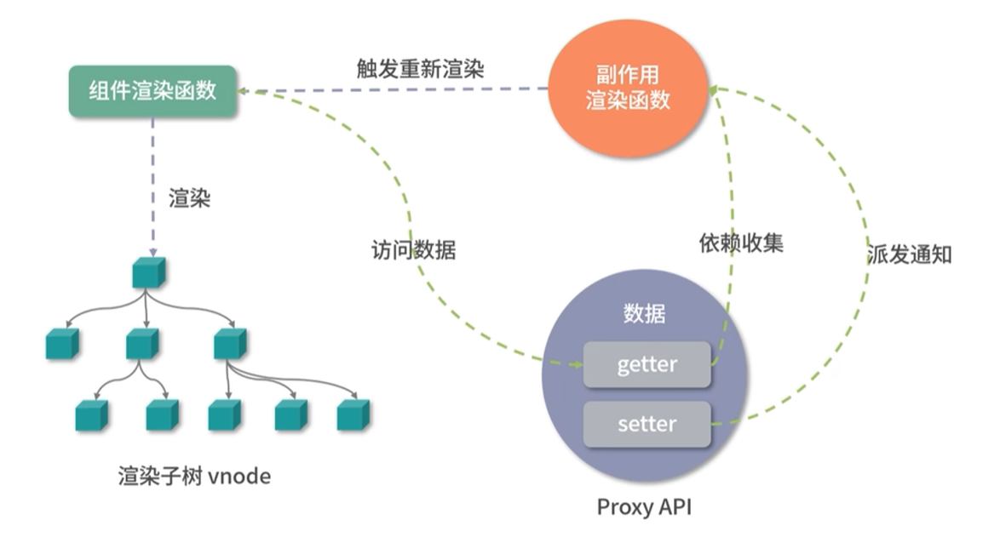
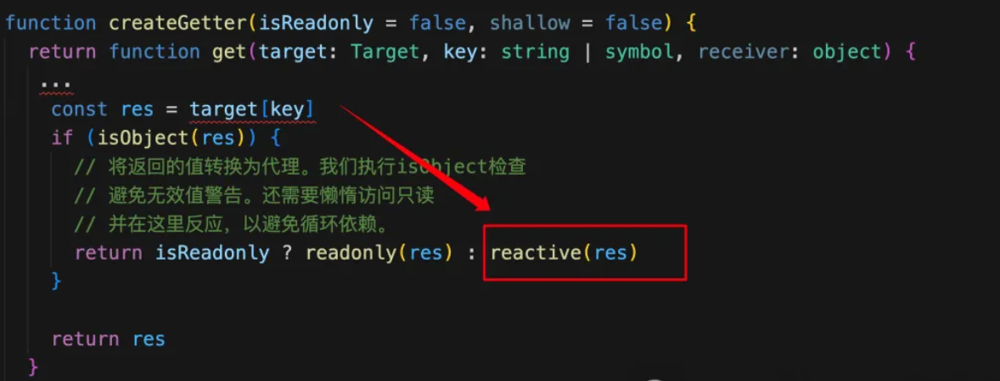
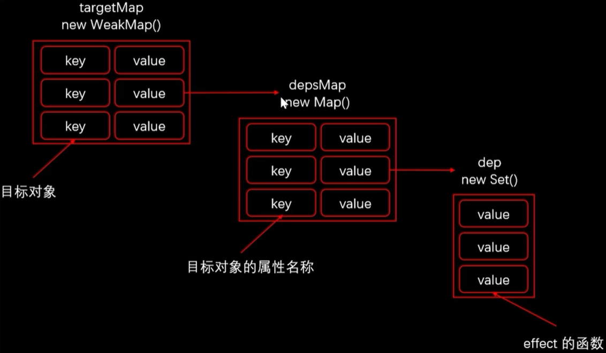
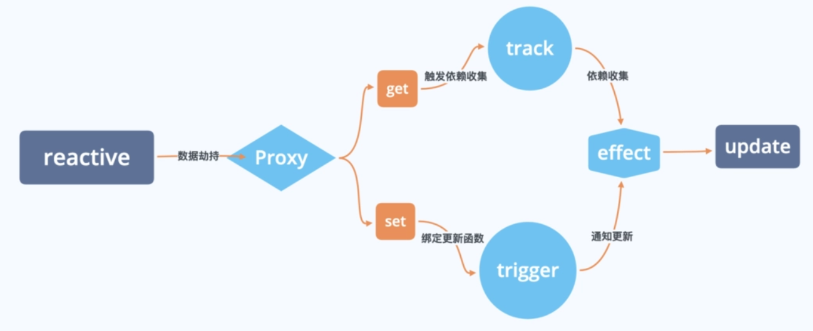

# 响应式原理

## 流程图



> Vue3 响应式原理过程与 Vue2 差异不大，主要是将 Vue2中 依赖收集和派发更新的 Watcher 对象替换成了 副作用渲染函数 Effect()

---


## **Proxy API**

Proxy 响应式实现：

```js

// Proxy 中 receiver: Proxy 或者继承 Proxy 的对象
// Reflect 中 receiver: 如果 target 对象中设置了 getter, getter 中的 this 指向 receiver
const proxy = new Proxy(target,{
	get(target,key,receiver){
 		target[key]
		return Reflect.get(target, key, receiver)
	},
	set(target, key,value,receiver){
    	target[key] = value
      	return  Reflect.set(target, key,value, receiver)
	},
	deleteProperty(target, key){
        delete target[key]
		return Reflect.deleteProperty(target,key)
    }
}
```


Proxy 响应式处理：

- Proxy 对象实现属性监听
- Proxy 只能代理一层对象，而不能代理多层
- 多层属性嵌套，在访问属性过程中处理下一级属性
- 默认监听动态添加的属性
- 默认监听属性的删除操作
- 默认监听数组索引和 length 属性
- 可以作为单独的模块使用

---


## **响应式 API**

- **reactive**
- **ref**
- **toRef**
- **computed**

---


## **reactive**

### **API 介绍**

> [**reactive()**:](https://cn.vuejs.org/api/reactivity-core.html#reactive)
>
> 返回一个对象的响应式代理。
>
> - **类型**
>
>   ```ts
>   function reactive<T extends object>(target: T): UnwrapNestedRefs<T>
>   ```
>
> - **详细信息**
>
>   响应式转换是“深层”的：它会影响到所有嵌套的属性。一个响应式对象也将深层地解包任何 [ref](https://cn.vuejs.org/api/reactivity-core.html#ref) 属性，同时保持响应性。
>
>   值得注意的是，当访问到某个响应式数组或 `Map` 这样的原生集合类型中的 ref 元素时，不会执行 ref 的解包。
>
>   若要避免深层响应式转换，只想保留对这个对象顶层次访问的响应性，请使用 [shallowReactive()](https://cn.vuejs.org/api/reactivity-advanced.html#shallowreactive) 作替代。
>
>   返回的对象以及其中嵌套的对象都会通过 [ES Proxy](https://developer.mozilla.org/en-US/docs/Web/JavaScript/Reference/Global_Objects/Proxy) 包裹，因此**不等于**源对象，建议只使用响应式代理，避免使用原始对象。

### **原理**

1. 接收一个参数，为对象创建 Proxy 对象。
2. 设置 Proxy 拦截器对象，设置 `get`、`set`、`deleteProperty`；
3. 在 get 拦截器中：
   1. 触发 track 方法依赖收集，收集 effect 副作用函数；
   2. 判断拦截的对象属性是否也为对象，如果对象属性值也是对象，则递归调用 reactive，创建新的 Proxy 对象。( 惰性响应式)

4. 在 set 拦截器中：判断新旧值是否相同，如果不相同，触发 trigger 调用 effct 副作用函数。

```js
// 判断是否为对象
const isobject = val => val !== null && typeof val === 'object'  

// 实现响应式
export function reactive(target){
    // 如果不是对象，无需代理
    if(!isobject(target))
        return target
    
    // 定义 proxy 的 handler 方法
    const handler= {
        // 获取属性
        get(target,key,receiver){
            //进行收集依赖
            track(target, key)
            // 返回当前对象
            const result = Reflect.get(target,key,receiver)
            // 判断是否为对象，是对象进行深度响应式
            return isobject(result) ? reactive(result) : result
        }
        // 设置属性
        set(target,key,value,receiver){
            // 获取旧值
            const oldValue = Reflect.get(target,key,receiver)
            // 获取对象 key 属性结果,Reflect 会返回一个 boolean 值
            let result = true
            // 如果值发生改变
            if(oldValue !== value){
                result = Reflect.set(target, key, value, receiver)
                // 触发更新
                trigger(target, key)
                return result
            }
        }
    	// 删除属性
        deleteProperty(target,key){
            // 判断是否有 key 属性
            const hadKey = Object.prototype.hasOwnProperty.call(target,key)
            // 删除 key 属性对象值
            const result = Reflect.deleteProperty(target, key)
            if(hadKey && result){
                // 触发更新
                trigger(target, key)
                console.log('delete 触发更新', key)
            }
            // 返回删除结果
            return result
        }
    // 返回代理对象
    return new Proxy(target,handler)
}

```


### **Reactive 惰性响应性**

> 详细参考文章：[面试官：Vue3中什么是Reactive的懒响应性？-51CTO.COM](https://www.51cto.com/article/785956.html)

Reactive 的实现原理是生成了一个 Proxy 实例。当 reactive 方法一旦获取到的属性值是对象，则会为该对象再次执行 reactive 方法，为属性生成一个新的 Proxy 对象。

因此只有在读取到深度数据时，才会创建深度数据的响应式 Proxy 对象。


惰性响应性指的就是：

* Reactive 最初只会为复杂数据类型执行第一层的响应性。
* 如果存在多层的复杂数据类型嵌套时，则会在读取深层数据对象，触发深层响应式对象的 getter 方法中，为深层数据对象创建新的 Proxy 代理对象。


#### **Proxy 的问题**

Proxy 只能代理一层对象，而不能代理多层。既 当代理对象 具备层级嵌套的时候，proxy 是不可以代理子层级的。

```js
const target = {
    name: '张三',
    child: {
      name: '小张三'
    }
  }

  const p = new Proxy(target, {
    set(target, property, value, receiver) {
      console.log('触发了 set');
      target[property] = value
      return true
    },
    get(target, property, receiver) {
      console.log('触发了 get');
      return target[property]
    }
  })

  p.name = '李四'  // 打印：触发了 set
  p.child.name = '小李四' // 打印：触发了 get。注意：并没有触发 child 的 set
```

> 在上述代码中，我们利用 proxy 代理了 target 对象。注意：此时的 target 是存在嵌套的复杂数据类型 child。
>
> * 当我们执行 p.name = '李四' 时，触发 set 行为，这是一个很正常的逻辑。
> * 但是，当我们执行 p.child.name = '小李四' 时，我们会发现 仅触发了一个 get（p.child），而没有触发 set 行为。
>
> * 这就证明：对于 Proxy 而言， 它只能代理 一层 的复杂数据类型，而不可以代理多层。

但是，在 Vue 中 多层的 Reactive 对象却可以实现响应性，那么这是如何做到的呢？ 具体的方式就是 Reactive的惰性响应性。

Vue 的源码，在源码监听 proxy getter 行为的地方，存在这样一段代码:



Reactive 的实现原理是生成了一个 Proxy 实例。所以说，这里的代码核心其实就是 reactive 方法 一旦获取到的属性是对象，则会为该对象再次执行 reactive 方法, 为属性生成一个新的 Proxy 对象。

因此只有在读取到深度数据时，才会创建深度数据的响应式 Proxy 对象。


### **依赖收集过程**

依赖收集过程方法：

- **effect**：定义“副作用函数”并监视响应式数据的变化
- **track**： 收集依赖

### **effect() 副作用函数** 

**定义与功能**

- `effect`是一个函数，用于定义“副作用函数”并监视响应式数据的变化。
- 当响应式数据被修改时，通过`effect`定义的函数会重新执行，实现响应式更新的效果。

**基本用法**

- `effect`函数接收一个函数作为参数，并返回一个响应式的Effect对象。
- 在传入的函数内部，你可以进行各种操作，如发起Ajax请求、修改浏览器标题等。

**示例**

```javascript
import { effect, reactive } from 'vue';  
  
const state = reactive({ count: 0 });  
  
const logCount = effect(() => {  
  console.log(`count is ${state.count}`);  
});  
  
state.count++; // 输出 "count is 1"
```

在上面的示例中，我们定义了一个响应式数据`state`和一个通过`effect`定义的函数`logCount`。当`state.count`的值发生变化时，`logCount`函数会自动重新执行。

**选项与特性**

- ```
  effect
  ```

  函数还可以接收一个选项对象作为第二个参数，用于控制Effect的行为。

  - `lazy: true`：将Effect的执行推迟到首次触发时机之后。
  - `scheduler`：调度器，用于控制Effect的执行时机。
  - `onTrack` 和 `onTrigger`：用于调试Effect。

**嵌套的 effect 与 effect 栈**

- 在Vue 3中，你可以创建嵌套的effect。当外部effect运行时，它会触发内部effect的执行。
- 当响应式数据发生变化时，Vue 3会重新运行与之相关的所有effect，包括嵌套的effect。


### **track() 依赖收集**

在Vue 3中，`track`方法并不是直接暴露给开发者使用的API，而是Vue内部用于实现响应式系统的一部分。

**作用：**

`track`方法主要用于**跟踪响应式数据**（如`ref`或`reactive`创建的数据）的访问。

当开发者访问响应式数据的属性时，Vue的响应式系统会调用`track`方法以记录这个访问。

**依赖收集：**

在Vue 3中，`track`方法是**实现依赖收集**的关键环节。

当数据被访问时，Vue会**记录下当前的“副作用函数”（effect）作为这个数据的依赖**。这样，当数据发生变化时，Vue就可以知道哪些副作用函数需要被重新执行。

**内部实现**：

`track`方法通常与`targetMap`（或类似的数据结构）一起使用，用于存储每个响应式数据与它的依赖之间的映射关系。

具体来说，每个响应式数据都可能有一个与之关联的`depsMap`（依赖映射），而`depsMap`中则存储了所有依赖于该数据的副作用函数。

**与`effect`的关系：**

在Vue 3中，开发者通常通过`effect`函数来创建副作用函数。

当副作用函数执行时，它可能会访问响应式数据，从而触发`track`方法的调用。

同时，当响应式数据发生变化时，Vue会遍历其依赖列表（即`depsMap`中存储的副作用函数），并重新执行这些函数。

**触发时机：**

`track`方法通常在**响应式数据被访问时触发**。

具体来说，当开发者在副作用函数中读取响应式数据的值时（例如`const value = refValue.value`），Vue的响应式系统会调用`track`方法来记录这个访问。


### **依赖收集过程对象**

依赖收集过程中会创建三个对象：

#### **targetMap**

- **定义**：`targetMap`是一个`WeakMap`类型的集合，用于存储当前活动的副作用函数（effect）与响应式数据之间的映射关系。
- **结构**：`targetMap`的键是响应式数据（或称为target），值是一个`Map`实例。这个`Map`的键是响应式数据的属性键（key），值是一个由依赖这个属性的副作用函数组成的`Set`。

> 为什么 targetMap 使用 WeakMap 而不是 Map?
>
> ​	WeakMap 对 key 是弱引用，不影响垃圾回收器的工作。据这个特性可知，一旦 key 被垃 圾回收器回收，那么对应的键和值就访问不到了。所以 WeakMap 经常用于存储那些只有当 key 所引用的 对象存在时(没有被回收)才有价值的信息。
>
> 如果 target 对象没有任何引用了，说 明用户侧不再需要它了，这时垃圾回收器会完成回收任务。但如果使用 Map 来代替 WeakMap，那么即使 用户侧的代码对 target 没有任何引用，这个 target 也不会被回收，最终可能导致内存溢出


#### **depsMap**

- **定义**：`depsMap`实际上是`targetMap`中值的`Map`实例。它存储了特定响应式数据属性的所有依赖（即副作用函数）。
- **结构**：`depsMap`的键是响应式数据的属性键（key），值是一个`Set`。这个`Set`包含了所有依赖该属性的副作用函数。

#### **dep**

- **定义**：在Vue 3的响应式系统中，`dep`通常指的是与某个响应式数据属性相关联的依赖集合 （即`depsMap`中值的`Set`）。但在某些上下文中， `dep`也可能指代更具体的依赖对象或结构 。
- **功能**：**`dep`负责存储和管理依赖于特定响应式数据属性的所有副作用函数（effect）**。当响应式数据属性发生变化时，`dep`会通知其中的所有副作用函数进行更新。
- dep 使用 Set() 数据结构原因：`Set`的一个核心特性是它只能存储唯一的值。在响应式系统中，同一个依赖（effect）不应该被多次添加到同一个属性的依赖集合中。**使用`Set`可以确保每个依赖只被添加一次**，从而避免了不必要的重复和额外的开销。

#### **它们之间的关系**

- **targetMap 与 depsMap**：`targetMap`是一个全局的映射表，用于存储响应式数据（target）与其属性依赖（depsMap）的关联关系。每个响应式数据都有一个与之对应的`depsMap`，该`depsMap`存储了所有依赖于该数据属性的副作用函数。
- **depsMap 与 dep**：`depsMap`中的每个值都是一个`dep`（即一个`Set`），它包含了所有依赖于特定响应式数据属性的副作用函数。当响应式数据属性发生变化时，Vue会遍历相应的`dep`，并重新执行其中的所有副作用函数。



### 依赖收集过程简述

1. 当一个副作用函数（effect）被创建或执行时，它会被标记为当前活动的副作用函数（`activeEffect`）。
2. 当副作用函数访问响应式数据的属性时，会触发该属性的getter函数。在getter函数内部，Vue会调用`track`函数来收集依赖。
3. `track`函数会首先检查是否应该收集依赖（例如，检查当前是否有活动的副作用函数）。如果应该收集依赖，它会从`targetMap`中获取或创建与该响应式数据关联的`depsMap`。
4. 然后，`track`函数会在`depsMap`中查找与访问的属性键（key）对应的`dep`（即`Set`）。如果找不到，则会在`depsMap`中为该属性键创建一个新的`dep`。
5. 最后，`track`函数会将当前活动的副作用函数（`activeEffect`）添加到与访问的属性键对应的`dep`中。这样，当该属性发生变化时，Vue就可以通过遍历`dep`来通知所有依赖该属性的副作用函数进行更新。


### **依赖收集过程实现**

```js
let activeEffect = null

//定义“副作用函数”并监视响应式数据的变化
export function effect(callback){
    activeEffect = callback
    callback()//访问响应式对象属性，去收集依赖
    activeEffect = null // 依赖收集结束后，清空依赖回调
}

//存储当前活动的副作用函数（effect）与响应式数据之间的映射关系
let targetMap = new WeakMap()
// 依赖收集
export function track(target, key){
    if(!activeEffect) return
    let depsMap = targetMap.get(target)
    // 当前读取属性是否有副作用函数（effect）
    if(!depsMap){
        // 创建响应式数据的 副作用函数
        const depsMap = new Map()
        // 存入
		    targetMap.set(target,depsMap)
    }
    // 获取当前 target 属性的依赖对象
	let dep = depsMap.get(key)
    if(!dep){
        // 创建当前 target 的依赖对象集合
        const dep = new set()
        // 存储 依赖对象和 target 映射关系
        depsMap.set(key,dep)
    }
    // 依赖对象中添加 副作用函数
	dep.add(activeEffect)
}
```


### **trigger 派发更新**

派发更新：

1. 获取 目标对象 key 属性依赖对s象；
2. 获取 key 属性依赖的副作用函数集合；
3. 遍历副作用函数集合，执行副作用函数。

- **trigger**

```js
export function trigger(target, key){
    // 获取目标对象 key 属性依赖对象
    const depsMap = targetMap.get(target)
    // 没有依赖对象，直接返回
    if(!depsMap) return
    // 获取 key 属性依赖的副作用函数集合
    const dep = depsMap.get(key)
    if(dep){
        // 遍历副作用函数，执行
        dep.forEach(effect =>{ 
            effect()
        }
    }
}
```


### 调度器

调度，指的是当 trigger 动作触发副作用函数 effect() 重新执行时，有能力决定副作用函数执行的时机、次数以及方式。

调度器（Scheduler）用于控制响应式副作用（如组件的渲染或计算属性的重新计算）的执行时机。

Vue 3 的响应式系统主要由几个部分组成：

1. **响应式对象**（如通过 `reactive` 或 `ref` 创建的）：这些对象使用 Proxy（或对于数组和 Map 使用特定的包装器）来拦截属性的读取和设置，从而能够追踪依赖和触发更新。
2. **依赖收集**：当组件渲染或计算属性被访问时，它们会收集其依赖的响应式属性。这些依赖被存储在内部的数据结构中，以便在响应式属性变化时能够通知它们。
3. **触发更新**：当响应式属性变化时，会触发依赖的更新。但是，**这些更新不会立即执行，而是被调度器调度到某个未来的时间点**。

#### 调度器的作用

调度器的作用在于决定何时以及如何执行这些响应式副作用 effect() 如组件的重新渲染）。Vue 3 使用了一个**基于微任务（microtask）**的调度策略，这意味着响应式更新会在当前宏任务（如事件处理或异步回调）完成后，但在浏览器进行下一轮重绘之前执行。

这种策略的优点包括：

- **性能优化**：通过将多个响应式更新合并到单个微任务中，可以减少重绘和重新计算的次数，从而提高性能。
  - 如：连续多次更新一个数据，只执行最后一次更新，就是通过调度器调度完成。
- **避免不一致的视图状态**：由于所有响应式更新都在事件处理或异步操作完成后立即执行，因此用户界面在每次宏任务结束后都会呈现一致的状态。

#### **调度器控制输出顺序**

##### 问题：

```javascript
const data = { foo: 1 }
const obj = new Proxy(data, { /* ... */ }) 
effect(() => {
	console.log(obj.foo)
})
obj.foo++
console.log('结束了')
```

> 以上代码输出：
>
> ```
> 1
> 2
> ‘结束了’
> ```
>
> 在副作用函数中，我们首先使用 console.log 语句打印 obj.foo 的值，接着对 obj.foo 执行自 增操作，最后使用 console.log 语句打印 '结束了'。

现在假设需求有变，输出顺序需要调整为:

```
1
‘结束了’
2
```

如何实现以上需求？

##### **实现：**

第一步：通过 effect 函数设计一个选项参数 options，允许用户指定调度器。

```javascript
  effect(
  () => {
      console.log(obj.foo)
  },
    //   第二个参数 options。 它是一个对象，其中允许指定 scheduler 调度函数
    {
    		// 调度器 scheduler 是一个函数 ,调度器接受副作用函数，对副作用函数执行时间控制
     	scheduler(fn) {
 
      }
    }
  )
```

第二步：在 effect 函数内部我们需要把 options 选 项挂载到对应的副作用函数上。

```javascript
 function effect(fn, options = {}) {
   // 定义执行副作用函数的函数
   const effectFn = () => {
			cleanup(effectFn)
			// 当调用 effect 注册副作用函数时，将副作用函数赋值给 activeEffect
			activeEffect = effectFn
		// 在调用副作用函数之前将当前副作用函数压栈
			effectStack.push(effectFn)
			fn()
			// 在当前副作用函数执行完毕后，将当前副作用函数弹出栈，并把 activeEffect 还原为之前的值 effectStack.pop()
			activeEffect = effectStack[effectStack.length - 1]
   }
 // 将 options 挂载到 effectFn 上
   effectFn.options = options // 新增
 // activeEffect.deps 用来存储所有与该副作用函数相关的依赖集合
   effectFn.deps = []
   cleanup(effectFn)
 // 当调用 effect 注册副作用函数时，将副作用函数赋值给 activeEffect
   activeEffect = effectFn
 // 在调用副作用函数之前将当前副作用函数压栈
   effectStack.push(effectFn)
   fn()
 // 在当前副作用函数执行完毕后，将当前副作用函数弹出栈，并把 activeEffect 还原为之前的值 effectStack.pop()
   activeEffect = effectStack[effectStack.length - 1]s
  // 执行副作用函数
    effectFn()
 }
```

第三步：在 trigger 函数中触发副作用函数重新执行时，就可以直接调用用户传递的调 度器函数，从而把控制权交给用户。

```javascript
function trigger(target, key) {
   // 获取副作用键值对
   const depsMap = bucket.get(target)
   if (!depsMap) return
   // 获取副作用函数列表
   const effects = depsMap.get(key)
   // 创建运行的副作用列表
   const effectsToRun = new Set()
   // 遍历副作用列表，不是当前激活的副作用列表则加入待执行列表
   effects && effects.forEach(effectFn => {
    if (effectFn !== activeEffect) {
        effectsToRun.add(effectFn)
     }
   })
   effectsToRun.forEach(effectFn => {
   // 如果一个副作用函数存在调度器，则调用该调度器，并将副作用函数作为参数传递
   if (effectFn.options.scheduler) { // 新增
      effectFn.options.scheduler(effectFn) // 新增
   } else {
        // 否则直接执行副作用函数（之前的默认行为）
       effectFn() // 新增
    }
 })
```

> 如上面的代码所示，在 trigger 动作触发副作用函数执行时，我们优先判断该副作用函数是否存在调度器，如果存在，则直接调用调度器函数，并把当前副作用函数作为参数传递过去，由用户自己控制如何执行；否则保留之前的行为，即直接执行副作用函数。

第四步：使用 setTimeout 开启一个宏任务来执行副作用函数 fn，通过宏任务，将任务放在一个事件循环最后执行，这样就能实现期望的打印顺序了。

```javascript
   const data = { foo: 1 }
   const obj = new Proxy(data, { /* ... */ })
 
   effect(
    () => {
       console.log(obj.foo)
    },
    // 下面是 options 配置
   {
    	// 调度器 scheduler 是一个函数
     	scheduler(fn) {
   			// 将副作用函数放到宏任务队列中执行
      	setTimeout(fn)
     	}
     }
   )
 
   obj.foo++
   console.log('结束了')

//输出：
// 1
// '结束了'
// 2
```


#### **调度器控制输出结果**

##### **问题：** 

```javascript
const data = { foo: 1 }
const obj = new Proxy(data, { /* ... */ }) 
effect(() => {
	console.log(obj.foo)
})
obj.foo++
obj.foo++
```

以上代码，在副作用函数中打印 obj.foo 的值，接着连续对其执行两次自增操作，在没有指定调度器的情况下，它的输出如下：

```
1
2
3
```

由输出可知，字段 obj.foo 的值一定会从 1 自增到 3，2 只是它的过渡状态。如果我们只关心最终结果而不关心过程，那么执行三次打印操作是多余的，我们期望的打印结果是：

```
1
3
```


##### **实现：**

> 思路：每次调度时，将副作用函数添加到 jobQueue 队列中，然后在微任务中刷新队列，如果队列正在刷新，则什么都不做；通过微任务刷新队列，可以保证任务在一个 tick 事件循环中只执行一次副作用函数。

```javascript
01 // 定义一个任务队列
02 const jobQueue = new Set()
03 // 使用 Promise.resolve() 创建一个 promise 实例，我们用它将一个任务添加到微任务队列
04 const p = Promise.resolve()
05
06 // 一个标志代表是否正在刷新队列
07 let isFlushing = false
08 function flushJob() {
09 // 如果队列正在刷新，则什么都不做
10 if (isFlushing) return
11 // 设置为 true，代表正在刷新
12 isFlushing = true
13 // 在微任务队列中刷新 jobQueue 队列
14 p.then(() => {
15 jobQueue.forEach(job => job())
16 }).finally(() => {
17 // 结束后重置 isFlushing
18 isFlushing = false
19 })
20 }
21
22
23 effect(() => {
24 console.log(obj.foo)
25 }, {
26 scheduler(fn) {
27 // 每次调度时，将副作用函数添加到 jobQueue 队列中
28 jobQueue.add(fn)
29 // 调用 flushJob 刷新队列
30 flushJob()
31 }
32 })
33
34 obj.foo++
35 obj.foo++
```

> - 首先，我们定义了一个任务队列 jobQueue，它是一个 Set 数据结构，目的是利用 Set 数据结构的自动去重能力。
> - 接着我们看调度器 scheduler 的实现，在每次调度执行时，先将当前副作用函数添加到 jobQueue 队列中，再调用 flushJob 函数刷新队列。
> - 在 flushJob 函数，该函数通过 isFlushing 标志判断是否需要执行，只有当其为 false 时才需要执行，而一旦 flushJob 函数开始执行，isFlushing 标志就会设置为 true，意思是无论调用多少次
> - flushJob 函数，在一个周期内都只会执行一次。
> - 在 flushJob 内通过 p.then 将一个函数添加到微任务队列，在微任务队列内完成对 jobQueue 的遍历执行。

### 响应式过程图




## **ref**

### **原理**

> 参考官方文档：
>
> - [响应式基础 | Vue.js (vuejs.org)open in new window](https://cn.vuejs.org/guide/essentials/reactivity-fundamentals.html#why-refs)
> - [深入响应式系统 | Vue.js (vuejs.org)open in new window](https://cn.vuejs.org/guide/extras/reactivity-in-depth.html)

实现伪代码：

```javascript
// 判断是否为对象
const isobject = val => val !== null && typeof val === 'object'
// 是对象进行深度响应式
const convert = isobject(result) ? reactive(result) : result

export function ref(raw){
    // 判断 raw 是否是ref 创建的对象，如果是的话直接返回
    if(isobject(raw)&& raw.__v_isRef){
        return
    }
    let value = convert(raw)
    const r = {
		__v_isRef: true, // 记录是否为响应式对象
        get value(){
            track(r, 'value')
            return value
        },
       set value(newValue){
           if(newValue !== value){
               raw = newValue
               value = convert(raw)
               trigger(r,'value')
           }
       }
    }
	return r
}
```

## **reactive vs ref**

**用途和返回值**

- **`reactive()`**：**深层响应式**,将使对象本身具有响应性。
  - 用于将一个普通的 JavaScript 对象转换成响应式对象。响应式对象是 [JavaScript 代理](https://developer.mozilla.org/en-US/docs/Web/JavaScript/Reference/Global_Objects/Proxy)，其行为就和普通对象一样。
  - 这意味着对象中的**所有嵌套属性也都会变成响应式的**，并且 Vue 能够追踪这些属性的变化。
  - `reactive()` **返回的是原始对象的响应式代理（Proxy）**。它和原始对象是不相等的。只有代理对象是响应式的，更改原始对象不会触发更新。
  - reactive 返回的对象**不可以解构和重新赋值**。reactive 返回的对象，重新赋值丢失响应式。
- **`ref()`**：将内部值包装在带有 value 属性的对象中。
  - 用于创建一个**响应式的数据引用对象**，其内部值可以是任意类型。
  - **Ref 可以持有任何类型的值**，包括深层嵌套的对象、数组或者 JavaScript 内置的数据结构，比如 `Map`。
  - Ref 会使它的值具有深层响应性。可以深层检测到数组和对象更改。
  - `ref()` **返回一个对象**，这个对象拥有一个 `.value` 属性，你通过 `.value` 来访问或修改内部值。ref 返回的对象，重新赋值成对象也是响应式的。
  - 使用 `ref` 可以确保即使是基本数据类型（如数字、字符串等）也能被 Vue 追踪其变化。
  - Vue 3 只会让对象的 **`.value` 属性本身变得响应式，而不会递归地使对象内部的属性也变成响应式**。

**局限性**

* **`reactive()`**：（参考官网：[响应式基础 | Vue.js (vuejs.org)](https://cn.vuejs.org/guide/essentials/reactivity-fundamentals.html#limitations-of-reactive)）

  * **有限的值类型**：它**只能用于对象类型** (对象、数组和如 `Map`、`Set` 这样的[集合类型](https://developer.mozilla.org/en-US/docs/Web/JavaScript/Reference/Global_Objects#keyed_collections))。它不能持有如 `string`、`number` 或 `boolean` 这样的[原始类型](https://developer.mozilla.org/en-US/docs/Glossary/Primitive)。
  * **不能替换整个对象**：由于 Vue 的响应式跟踪是通过属性访问实现的，因此我们必须始终保持对响应式对象的相同引用。这意味着我们不能轻易地“替换”响应式对象，因为这样的话与第一个引用的响应性连接将丢失。
  * **对解构操作不友好**：当我们将响应式对象的原始类型属性解构为本地变量时，或者将该属性传递给函数时，我们将丢失响应性连接。

* **`ref()`** ： 

  * 需要通过  `.value` 属性访问修改属性。

  * ref 作为响应式数组或原生集合类型 (如 `Map`) 中的元素被访问时，**不会**被解包。

    ```js
    const books = reactive([ref('Vue 3 Guide')])
    // 这里需要 .value
    console.log(books[0].value)
    
    const map = reactive(new Map([['count', ref(0)]]))
    // 这里需要 .value
    console.log(map.get('count').value)
    ```

    

**使用场景**

- **`reactive()`** ：
  - 更适合用于**对象类型的数据**，特别是当你有一个复杂对象，并且需要对其内部属性进行响应式处理时。它使得你可以很方便地在组件内部访问和修改对象的属性，并且这些修改会自动触发视图的更新。
- **`ref()`** ： 
  - 在处理基本数据类型或你需要明确地将一个值“装箱”成响应式引用时非常有用。
  - 此外，当你需要将响应式数据传递给子组件作为 `props` 时，`ref()` 也很方便，因为子组件可以直接通过 `.value` 来访问和修改这个值。

**模板中的使用**

- **`reactive()`** ：
  - 在模板中，直接使用 `reactive()` 创建的响应式对象时，你可以直接访问其属性，Vue 会自动处理响应式更新。
  - 但是，如果你需要在模板中通过 JavaScript 表达式访问或修改这些属性，并且希望保持响应性，那么你可能需要使用 `.value` 访问 `ref()` 包装的值的情况会比较少，因为模板会自动解包 `ref`。
- **`ref()`** ：
  - 当你使用 `ref()` 时，在模板中需要通过 `.value` 来访问或修改其内部值。但是，Vue 3 的模板编译器足够智能，可以自动解包在模板表达式中使用的 `ref`，所以你通常不需要在模板中显式地使用 `.value`（但在某些情况下，如传递给子组件的 `props` 或在 JavaScript 表达式中，你可能仍然需要这样做）。

**性能比较**

- `reactive()` 和 `ref()` 在性能上并没有本质的区别，因为它们都利用了 Vue 3 的响应式系统。
- `reactive()` 是对整个对象进行代理，因此在处理大型对象或深层嵌套对象时，可能会有更多的性能开销（尽管 Vue 3 的响应式系统已经过优化以减少这些开销）。
- `ref()` 通常用于较小的值或基本数据类型，因此性能影响较小。


## 浅层响应式

`reactive()` 和 `ref()` 会使它的值具有深层响应性，为了避免对大型数据的响应性开销来优化性能、或者有外部库管理其内部状态的情况。可以通过 [shallow ref](https://cn.vuejs.org/api/reactivity-advanced.html#shallowref)  和 [shallowRef()](https://cn.vuejs.org/api/reactivity-advanced.html#shallowref) 来放弃深层响应性。

### [shallowref](https://cn.vuejs.org/api/reactivity-advanced.html#shallowref)

* [`ref()`](https://cn.vuejs.org/api/reactivity-core.html#ref) 的浅层作用形式。
* 和 `ref()` 不同，浅层 ref 的内部值将会原样存储和暴露，并且不会被深层递归地转为响应式。只有对 `.value` 的访问是响应式的。`shallowRef()` 常常用于对大型数据结构的性能优化或是与外部的状态管理系统集成。


### [shallowReactive()](https://cn.vuejs.org/api/reactivity-advanced.html#shallowreactive)

* [`reactive()`](https://cn.vuejs.org/api/reactivity-core.html#reactive) 的浅层作用形式。**只对其顶层属性进行响应式处理**，而不会递归地使其内部属性也变成响应式。
* 和 `reactive()` 不同，这里没有深层级的转换：一个浅层响应式对象里只有根级别的属性是响应式的。属性的值会被原样存储和暴露，这也意味着值为 ref 的属性**不会**被自动解包了。


## **toRef**

> 官方文档 API： [响应式 API：工具函数 | Vue.js (vuejs.org)](https://cn.vuejs.org/api/reactivity-utilities.html#toref)
>
> 可以将值、refs 或 getters 规范化为 refs (3.3+)。
>
> 也可以基于响应式对象上的一个属性，创建一个对应的 ref。这样创建的 ref 与其源属性保持同步：改变源属性的值将更新 ref 的值，反之亦然。
>
> - **示例**
>
>   规范化签名 (3.3+)：
>
>   ```ts
>   // 按原样返回现有的 ref
>   toRef(existingRef)
>                 
>   // 创建一个只读的 ref，当访问 .value 时会调用此 getter 函数
>   toRef(() => props.foo)
>                 
>   // 从非函数的值中创建普通的 ref
>   // 等同于 ref(1)
>   toRef(1)
>   ```
>
>   对象属性签名：
>
>   ```js
>   const state = reactive({
>     foo: 1,
>     bar: 2
>   })
>                 
>   // 双向 ref，会与源属性同步
>   const fooRef = toRef(state, 'foo')
>                 
>   // 更改该 ref 会更新源属性
>   fooRef.value++
>   console.log(state.foo) // 2
>                 
>   // 更改源属性也会更新该 ref
>   state.foo++
>   console.log(fooRef.value) // 3
>   ```
>
>   请注意，这不同于：
>
>   ```js
>   const fooRef = ref(state.foo)
>   ```
>
>   上面这个 ref **不会**和 `state.foo` 保持同步，因为这个 `ref()` 接收到的是一个纯数值。
>
>   `toRef()` 这个函数在你想把一个 prop 的 ref 传递给一个组合式函数时会很有用：
>
>   ```vue
>   <script setup>
>   import { toRef } from 'vue'
>                 
>   const props = defineProps(/* ... */)
>                 
>   // 将 `props.foo` 转换为 ref，然后传入
>   // 一个组合式函数
>   useSomeFeature(toRef(props, 'foo'))
>                 
>   // getter 语法——推荐在 3.3+ 版本使用
>   useSomeFeature(toRef(() => props.foo))
>   </script>
>   ```
>
>   当 `toRef` 与组件 props 结合使用时，关于禁止对 props 做出更改的限制依然有效。尝试将新的值传递给 ref 等效于尝试直接更改 props，这是不允许的。在这种场景下，你可能可以考虑使用带有 `get` 和 `set` 的 [`computed`](https://cn.vuejs.org/api/reactivity-core.html#computed) 替代。详情请见[在组件上使用 `v-model`](https://cn.vuejs.org/guide/components/v-model.html) 指南。
>
>   当使用对象属性签名时，即使源属性当前不存在，`toRef()` 也会返回一个可用的 ref。这让它在处理可选 props 的时候格外实用，相比之下 [`toRefs`](https://cn.vuejs.org/api/reactivity-utilities.html#torefs) 就不会为可选 props 创建对应的 refs。


## **toRefs**

> 官方文档：[响应式 API：工具函数 | Vue.js (vuejs.org)](https://cn.vuejs.org/api/reactivity-utilities.html#torefs)
>
> 将一个响应式对象转换为一个普通对象，这个普通对象的每个属性都是指向源对象相应属性的 ref。每个单独的 ref 都是使用 [`toRef()`](https://cn.vuejs.org/api/reactivity-utilities.html#toref) 创建的。
>
> - **类型**
>
>   ```ts
>   function toRefs<T extends object>(
>     object: T
>   ): {
>     [K in keyof T]: ToRef<T[K]>
>   }
>   
>   type ToRef = T extends Ref ? T : Ref<T>
>   ```
>
> - **示例**
>
>   ```js
>   const state = reactive({
>     foo: 1,
>     bar: 2
>   })
>                 
>   const stateAsRefs = toRefs(state)
>   /*
>   stateAsRefs 的类型：{
>     foo: Ref<number>,
>     bar: Ref<number>
>   }
>   */
>                 
>   // 这个 ref 和源属性已经“链接上了”
>   state.foo++
>   console.log(stateAsRefs.foo.value) // 2
>                 
>   stateAsRefs.foo.value++
>   console.log(state.foo) // 3
>   ```
>
>   当从组合式函数中返回响应式对象时，`toRefs` 相当有用。使用它，消费者组件可以解构/展开返回的对象而不会失去响应性：
>
>   ```js
>   function useFeatureX() {
>     const state = reactive({
>       foo: 1,
>       bar: 2
>     })
>                 
>     // ...基于状态的操作逻辑
>                 
>     // 在返回时都转为 ref
>     return toRefs(state)
>   }
>                 
>   // 可以解构而不会失去响应性
>   const { foo, bar } = useFeatureX()
>   ```
>
>   `toRefs` 在调用时只会为源对象上可以枚举的属性创建 ref。如果要为可能还不存在的属性创建 ref，请改用 [`toRef`](https://cn.vuejs.org/api/reactivity-utilities.html#toref)。

### **实现**

```js
// 
export function toRefs(proxy) {
    const ret = proxy instanceof Array ? new Array(proxy.length) : {}
    
	for(const key in proxy){
        ret[key] = toProxyRef(proxy, key)
    }
    return ret
}

// 转换为响应式对象
function toProxyRef(proxy, key){
	const r={
    	__v_isRef: true,
        get value(){
            // 当前 Proxy 已经是响应式对象，无需依赖收集，直接返回数据
            return proxy[key]
		},
		set value(newValue) { 
            // 当前 Proxy 已经是响应式对象，无需派发更新，直接赋值数据
            proxy[key]= newValue
        }
	return r
}
```


## **computed**

> 官方文档：[响应式 API：核心 | Vue.js (vuejs.org)](https://cn.vuejs.org/api/reactivity-core.html#computed)
>
> 接受一个 [getter 函数](https://developer.mozilla.org/zh-CN/docs/Web/JavaScript/Reference/Functions/get#description)，返回一个只读的响应式 [ref](https://cn.vuejs.org/api/reactivity-core.html#ref) 对象。该 ref 通过 `.value` 暴露 getter 函数的返回值。它也可以接受一个带有 `get` 和 `set` 函数的对象来创建一个可写的 ref 对象。
>
> - **类型**
>
>   ```ts
>   // 只读
>   function computed<T>(
>     getter: (oldValue: T | undefined) => T,
>     // 查看下方的 "计算属性调试" 链接
>     debuggerOptions?: DebuggerOptions
>   ): Readonly<Ref<Readonly<T>>>
>   
>   // 可写的
>   function computed<T>(
>     options: {
>       get: (oldValue: T | undefined) => T
>       set: (value: T) => void
>     },
>     debuggerOptions?: DebuggerOptions
>   ): Ref<T>
>   ```
>
> - **示例**
>
>   创建一个只读的计算属性 ref：
>
>   ```js
>   const count = ref(1)
>   const plusOne = computed(() => count.value + 1)
>   
>   console.log(plusOne.value) // 2
>   
>   plusOne.value++ // 错误
>   ```
>
>   创建一个可写的计算属性 ref：
>
>   ```js
>   const count = ref(1)
>   const plusOne = computed({
>     get: () => count.value + 1,
>     set: (val) => {
>       count.value = val - 1
>     }
>   })
>   
>   plusOne.value = 1
>   console.log(count.value) // 0
>   ```
>
>   调试：
>
>   ```js
>   const plusOne = computed(() => count.value + 1, {
>     onTrack(e) {
>       debugger
>     },
>     onTrigger(e) {
>       debugger
>     }
>   })
>   ```
>
> - **参考**
>
>   - [指南 - 计算属性](https://cn.vuejs.org/guide/essentials/computed.html)
>   - [指南 - 计算属性调试](https://cn.vuejs.org/guide/extras/reactivity-in-depth.html#computed-debugging)
>   - [指南 - 为 `computed()` 标注类型](https://cn.vuejs.org/guide/typescript/composition-api.html#typing-computed) 
>   - [指南 - 性能优化 - 计算属性稳定性](https://cn.vuejs.org/guide/best-practices/performance.html#computed-stability) 


### **实现**

```js
export function computed(getter) {
    const result = ref()
	effect(()=>(result.value = getter()))
	return result
}
```

