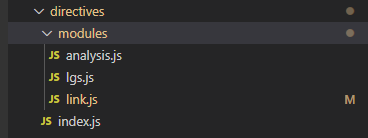

# webpackAPI分析

## webpack 模块方法

[Module Methods document](https://webpack.docschina.org/api/module-methods/#import-1)
[模块-中文文档](https://cloud.tencent.com/developer/section/1477327)

### **require.context **

`require.context`是一个用于获取特定上下文的函数，主要用于实现自动化导入模块；

#### **使用方式**

[require.context - 文档](https://webpack.docschina.org/guides/dependency-management/#%E5%B8%A6%E8%A1%A8%E8%BE%BE%E5%BC%8F%E7%9A%84-require-%E8%AF%AD%E5%8F%A5)

**使用示例**

* 使用 require.context 引入 ./modules 目录下所有指令文件并在 index.js中遍历全局注册所有指令
* 文件目录：
     
```javascript

/**
 * ./modules目录下保存全局指令,一次性获取所有指令遍历注册
 * 文件名称为指令名
 */

import Vue from 'vue'
//获取/modules目录下全部指令 doc: https://webpack.js.org/guides/dependency-management/#requirecontext
const files = require.context('./modules', true, /\.js$/)
let directives = {}
files.keys().forEach(fileName => {
    const directiveConfig = files(fileName)
    const directiveName = fileName.replace(/^\.\//,'').replace(/\.\w+$/,'')
    directives[directiveName] = directiveConfig.default || directiveConfig
})
/**
 * RegisterDirectives() 注册指令
 * @param { String } 指定指令名称: 参数为空注册所有全局指令，否则注册指定名称指令
 */
export default function RegisterDirectives(...args){
    if(args.length > 0) { //注册传入的指令
        args.map((directiveName) => {
           if(directives[directiveName]) {
                Vue.directive(directiveName, directives[directiveName])
           }else {
               console.error(`${directiveName} directives configuration was not found`)
           }
        })
    }else { //注册所有指令
        for(let directiveName in directives) {
            Vue.directive(directiveName, directives[directiveName])
        }
    }
}

```

* 使用方式

        引入指令： import RegisterDirectives from './directives/index.js'
        注册全部指令： RegisterDirectives()；
        注册指定指令： RegisterDirectives('link')； //注册 link 指令
    

#### **require.context 原理**

1. **目录遍历**：`require.context`通过执行该函数并传入相应的参数，获取到特定目录下的所有文件。这些参数包括要检索的目录、是否遍历子目录以及匹配文件的正则表达式等。
2. **自动导入**：在前端工程中，如果遇到从一个文件夹引入很多模块的情况，可以使用`require.context`。它会遍历文件夹中的指定文件，然后自动导入，使得不需要每次显式地调用`import`来导入模块。这样可以显著提高代码编写的效率和可维护性。
3. **模块匹配**：`require.context`会根据传入的匹配文件的正则表达式来筛选出符合条件的文件。这样可以方便地按照特定的规则来组织和匹配文件。
4. **缓存机制**：`require.context`还利用了Webpack的缓存机制来提高构建性能。当编译过程中遇到相同的文件时，Webpack会直接使用缓存的结果，而不需要重新编译，从而加快了构建速度。

Webpack的`require.context`通过自动化导入模块、目录遍历、模块匹配和缓存机制等原理，提高了代码编写的效率和构建性能，使得前端工程更加易于维护和管理。

#### **require.context 优缺点**

**优点：**

1. **动态加载**：`require.context` 可以在运行时动态地加载模块，而不需要在编译时知道所有需要加载的模块。这提供了很大的灵活性。
2. **递归目录**：它可以递归地遍历目录，自动加载匹配的文件。这使得在加载大量模块时非常方便，例如加载所有的测试文件或组件。
3. **减少冗余代码**：使用 `require.context` 可以避免编写大量的 `import` 或 `require` 语句，从而减少冗余代码。
4. **与 Webpack 生态系统集成**：由于 `require.context` 是 Webpack 的一部分，它可以很好地与 Webpack 的其他功能和插件集成。

**缺点：**

1. **加大包体积**：一次性引入所有文件时，webpack打包时会将 require.context匹配中的所有文件都打包，导致没有用到的文件被打包，加大包体积；

2. **不能按需加载**；

**适用场景**

## 参考

[深入理解webpack的require.context](https://juejin.im/post/5d37f1a3e51d45108c59a637)