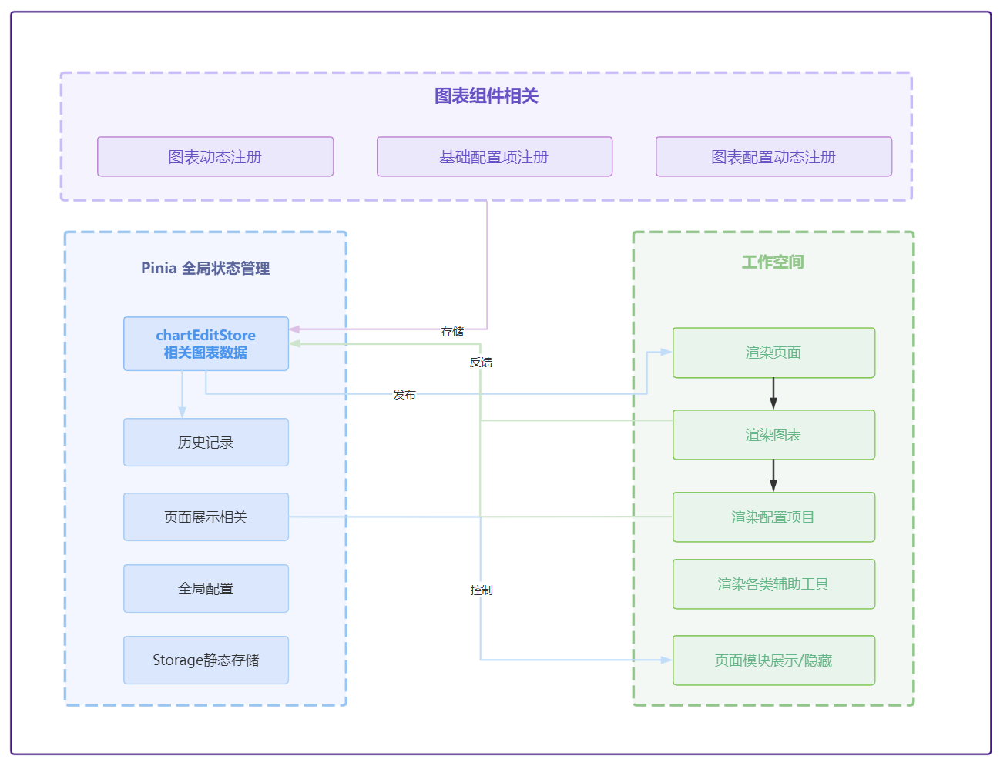
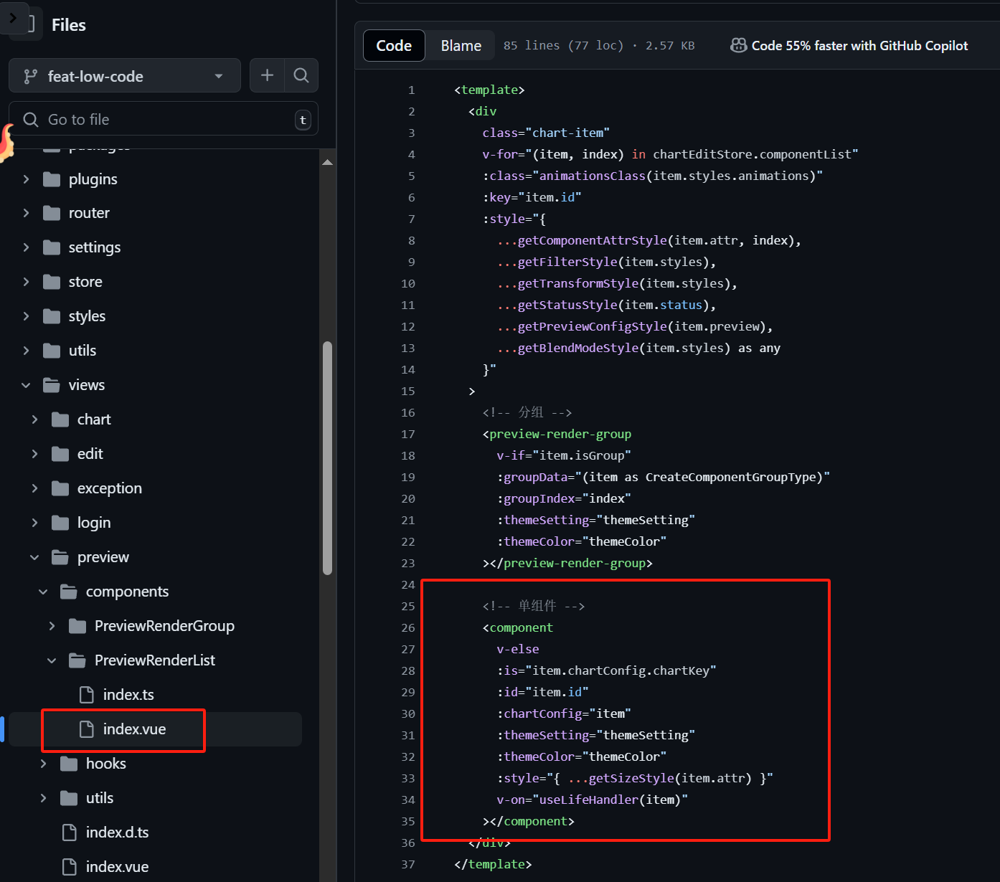
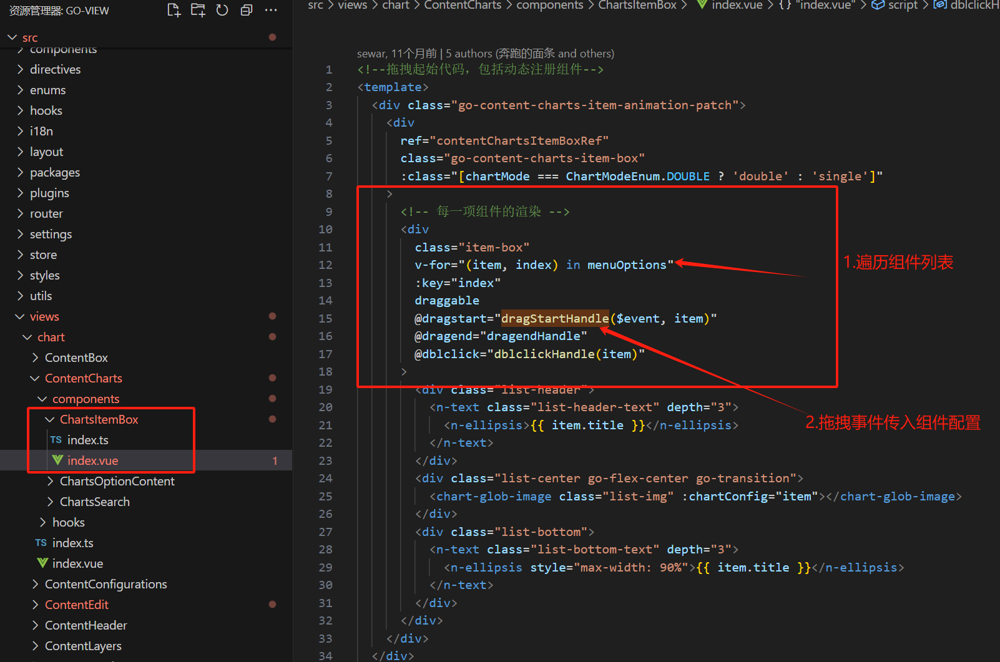
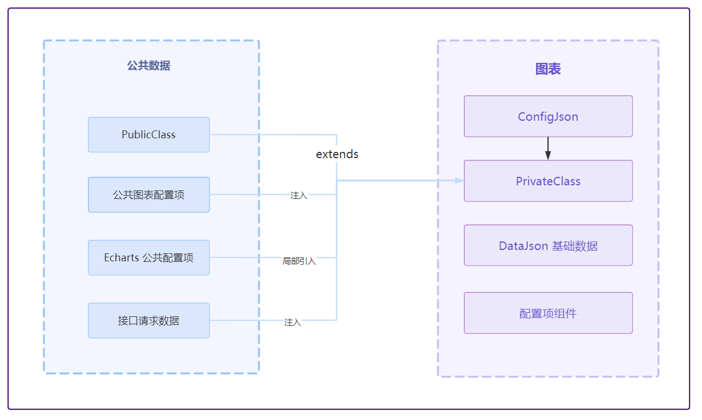
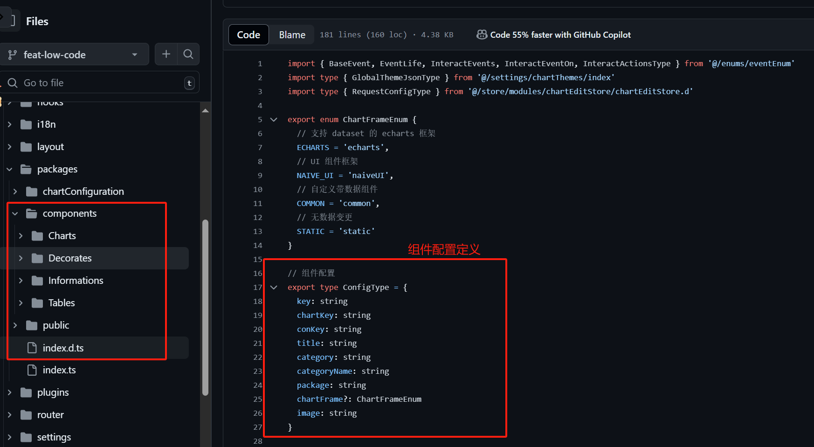
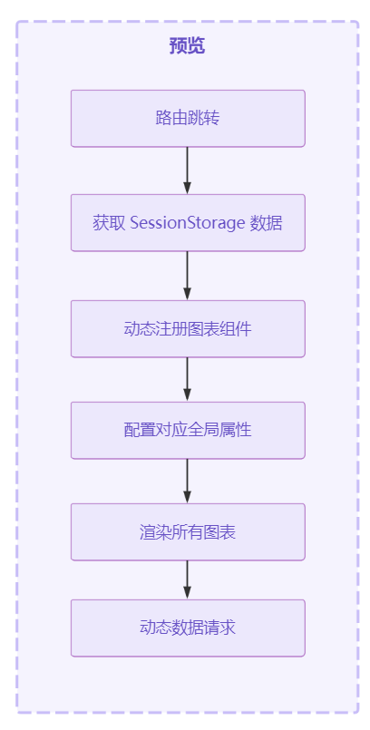

# 可视化低代码原理解析

以 GoView 低代码平台为例进行分析可视化低代码平台的实现原理。

> - [GoView 官网](https://www.mtruning.club/guide/start/)
> - [GoView 代码参考](https://github.com/Sewar-x/go-view)
>
> GoView 是纯前端项目，没有后台系统。因此为了能使用该代码平台，我根据该项目 使用 node + express 开发了后台：
>
> - [GoView  Node 服务](https://github.com/Sewar-x/go-view-node)

## 项目技术栈

## 项目架构

**协议 (Protocol)**：

- 在低代码编辑器中，协议指的是一组规则或标准，用于定义组件之间的交互方式、数据格式和通信协议。
- 这确保了不同组件能够协同工作，实现预期的功能。

**物料区 (Material Area)**：

- 物料区是低代码编辑器中用于存放可重用组件、模板、图标和其他UI元素的区域。
- 用户可以从物料区拖拽元素到编辑区，从而构建应用程序的界面。

**编辑区 (Editing Area)**：

- 编辑区是用户实际构建和修改应用程序界面的区域。
- 用户可以在编辑区内调整组件的布局、样式和属性，实时预览更改效果。

**设计器 (Designer)**：

- 设计师通常指的是低代码编辑器中用于创建和定制组件的工具集。
- 它可能包括拖放界面、属性面板、事件处理器等，允许用户以可视化的方式设计应用程序的界面和逻辑。

**渲染器 (Renderer)**：

- 渲染器负责将编辑区内的设计转换成可交互的界面。
- 它根据用户的配置和设计，生成最终用户界面的HTML、CSS和JavaScript代码，并在预览模式下展示给用户。

**出码器 (Code Generator)**：

- 出码器是低代码编辑器中将设计转换成实际代码的组件。
- 它根据用户的设计和配置，生成可用于生产环境的代码，如HTML、CSS、JavaScript或其他编程语言代码。这使得用户可以导出应用程序并将其部署到服务器或其他平台上。

## **协议**

> 在低代码编辑器中，协议指的是一组规则或标准，用于定义组件之间的交互方式、数据格式和通信协议。通常使用 JSON SCheme 进行定义。
>
> 具体协议规范可以参考阿里低代码引擎相关协议：
>
> [《低代码引擎搭建协议规范》](https://lowcode-engine.cn/site/docs/specs/lowcode-spec)
>
> [《低代码引擎物料协议规范》](https://lowcode-engine.cn/site/docs/specs/material-spec)
>
> [《低代码引擎资产包协议规范》](https://lowcode-engine.cn/site/docs/specs/assets-spec)

## **物料区**

> 详细信息可以参考：[物料扩展 | Low-Code Engine (lowcode-engine.cn)](https://lowcode-engine.cn/site/docs/guide/expand/editor/material)

物料是页面搭建的原料，按照粒度可分为组件、区块和模板：

1. 组件：组件是页面搭建最小的可复用单元，其只对外暴露配置项，用户无需感知其内部实现；
2. 区块：区块是一小段符合低代码协议的 schema，其内部会包含一个或多个组件，用户向设计器中拖入一个区块后可以随意修改其内部内容；
3. 模板：模板和区块类似，也是一段符合低代码协议的 schema，不过其根节点的 componentName 需固定为 Page，它常常用于初始化一个页面；

低代码编辑器中的物料需要进行一定的配置和处理，才能让用户在低代码平台使用起来。这个过程中，需要一份一份配置文件，也就是资产包。资产包文件中，针对每个物料定义了它们在低代码编辑器中的使用描述。

## **编辑区**

## **设计器**

## **渲染器**

### **核心渲染器**

GoView 渲染器使用 **Vue 的 `  <component/>` 组件实现渲染器**

渲染器位于 [`src/views/preview/components/PreviewRenderList/index.vue`](https://github.com/Sewar-x/go-view/blob/feat-low-code/src/views/preview/components/PreviewRenderList/index.vue) 

### **组件-渲染流程**

低代码平台从拖拽到渲染的流程是一个涉及前端交互、数据处理和组件渲染的复杂过程。

以下是一个概括性的流程说明：

#### **1. 初始化与数据准备**

- **全局注册组件** : 
  - 在初始化 Vue 实例时候，全局注册物料区的组件。
- **加载数据**：
  - 低代码平台通常在初始化时加载必要的 JSON 配置数据和组件库信息。这些数据存储在JSON文件或数据库中，包括组件的属性、样式、事件等信息。
- **设置画布**：
  - 在界面上创建一个画布（Canvas）或预览区，用于展示用户拖拽的组件和最终的渲染结果。

#### **2.拖拽实现**

- **注册拖拽事件**：
  - 为组件列表（或称为组件库、工具箱）中的每个可拖拽组件注册拖拽事件（如`dragstart`）。
  - 这通常通过HTML的`draggable`属性或JavaScript的拖放API实现。触发 `dragstart` 事件，进行以下处理：
    - 动态全局注册图表组件
    - 将配置项绑定到拖拽属性上
    - 修改组件状态为创建状态

- **监听拖拽动作**：
  - 物料区每个组件都有对应的 JSON 配置，当用户拖动一个组件时，平台会监听拖拽动作（如`dragover`、`dragenter`、`dragleave`等），并根据需要更新UI反馈（如高亮显示放置区域）。
- **处理放置**：
  - 当组件被拖拽到画布上的指定位置并释放时（`drop`事件），平台会处理放置逻辑，包括计算组件的最终位置、更新 JSON 数据模型。

#### 3. 数据处理与状态更新

- **更新数据模型**：
  - 将拖拽的组件信息（如位置、大小、属性等）更新到数据模型中。
  - 通常使用 Vue、React等前端框架的状态管理（如Vuex、Redux）管理数据模型。
- **双向绑定**：
  - 利用前端框架的双向绑定特性（如Vue的`v-model`、React的`useState`/`useReducer`），确保UI界面与数据模型保持同步。

#### 4. 存储数据模型

* 在点击保存时，将生成的整个 JSON 数据模型存储到数据库；

#### 5.组件渲染

- **获取组件数据**：
  - 获取组件公共数据
  - 获取图表配置数据
  - 请求动态接口数据
  - 合成渲染图表数据
- **组件实例化**：
  - 根据数据模型中的组件信息，实例化相应的组件对象。这通常涉及调用组件库中的构造函数或渲染函数。
- **渲染到画布**：
  - 将实例化的组件渲染到画布上。
  - 这通常通过DOM操作或前端框架的渲染机制实现。在 Vue 中通常使用 `<component>` 组件通过对 JSON 数据模型进行动态渲染。
- **样式与布局调整**：
  - 根据组件的属性和位置信息，调整组件的样式和布局。这可能包括设置组件的`top`、`left`、`width`、`height`等样式属性。

### **图表渲染流程**

1. 获取组件公共数据
2. 获取图表配置数据
3. 合成渲染图表数据
4. 通过渲染器渲染组件

**公共数据：**

1. PublicClass: 图表的 公共类，通过继承 图表类，实现继承公共方法和属性；
2. 公共图表配置项：将公共图表配置项和基础数据注入到组件中
3. Echart 公共配置项；
4. 图表请求接口数据；

### **图表配置**

组件配置位于 [`src/packages/index.d.ts`](https://github.com/Sewar-x/go-view/blob/feat-low-code/src/packages/index.d.ts)

### **预览-渲染流程**

预览核心渲染器使用 Vue 的 `<component/>` 组件。渲染流程：

1. 拿到需要渲染的所有的组件`groupData.groupList`，然后去遍历渲染；
2. 同时获取到组件对应的样式信息；
3. 当用户在右侧编辑区域对属性进行修改的时候，会触发style属性变更，继而会触发组件重新渲染。

## **出码器**

## 历史记录实现原理

## 参考资料

[架构综述 | Low-Code Engine (lowcode-engine.cn)](https://lowcode-engine.cn/site/docs/guide/design/summary)