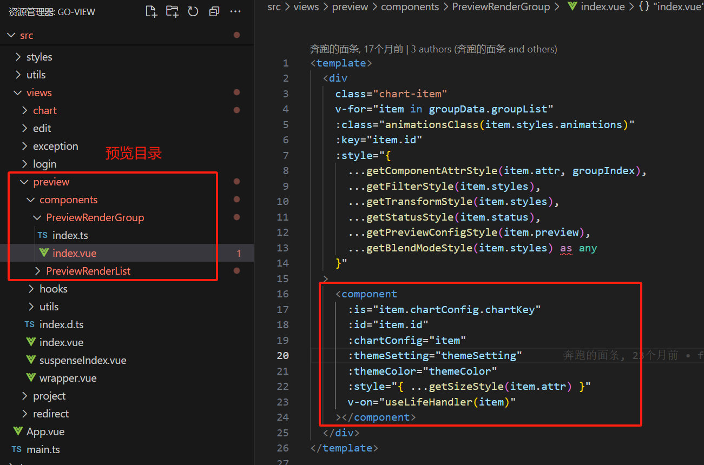

# 可视化低代码原理解析

以 GoView 低代码平台为例进行分析可视化低代码平台的实现原理。

> - [GoView 官网](https://www.mtruning.club/guide/start/)
> - [GoView 代码参考](https://github.com/Sewar-x/go-view)
>
> GoView 是纯前端项目，没有后台系统。因此为了能使用该代码平台，我根据该项目 使用 node + express 开发了后台：
>
> - [GoView  Node 服务](https://github.com/Sewar-x/go-view-node)

## 项目技术栈

## 项目架构

**协议 (Protocol)**：

- 在低代码编辑器中，协议指的是一组规则或标准，用于定义组件之间的交互方式、数据格式和通信协议。
- 这确保了不同组件能够协同工作，实现预期的功能。

**物料区 (Material Area)**：

- 物料区是低代码编辑器中用于存放可重用组件、模板、图标和其他UI元素的区域。
- 用户可以从物料区拖拽元素到编辑区，从而构建应用程序的界面。

**编辑区 (Editing Area)**：

- 编辑区是用户实际构建和修改应用程序界面的区域。
- 用户可以在编辑区内调整组件的布局、样式和属性，实时预览更改效果。

**设计器 (Designer)**：

- 设计师通常指的是低代码编辑器中用于创建和定制组件的工具集。
- 它可能包括拖放界面、属性面板、事件处理器等，允许用户以可视化的方式设计应用程序的界面和逻辑。

**渲染器 (Renderer)**：

- 渲染器负责将编辑区内的设计转换成可交互的界面。
- 它根据用户的配置和设计，生成最终用户界面的HTML、CSS和JavaScript代码，并在预览模式下展示给用户。

**出码器 (Code Generator)**：

- 出码器是低代码编辑器中将设计转换成实际代码的组件。
- 它根据用户的设计和配置，生成可用于生产环境的代码，如HTML、CSS、JavaScript或其他编程语言代码。这使得用户可以导出应用程序并将其部署到服务器或其他平台上。

## **协议**

## **物料区**

## **编辑区**

## **设计器**

## **渲染器**

### **核心渲染器**

GoView 渲染器使用 **Vue 的 `  <component/>` 组件实现渲染器**

渲染器位于 [`src/views/preview/components/PreviewRenderList/index.vue`](https://github.com/Sewar-x/go-view/blob/feat-low-code/src/views/preview/components/PreviewRenderList/index.vue) 

### **组件-渲染流程**

#### **整体流程**

1. 获取图表配置列表
2. 遍历图表列表，渲染预览图
3. 拖拽图表到编辑区中时，触发 `dragstart` 事件，进行以下处理：
   * 动态全局注册图表组件
   * 将配置项绑定到拖拽属性上
   *  修改组件状态为创建状态
4. 拖拽结束时， 修改组件状态为创建状态
5. 双击添加组件时，进行以下处理：
   * 动态注册图表组件
   * 创建新图表组件
   * 编辑数据中添加组件数据并选中状态

#### **图表渲染流程**

1. 获取组件公共数据
2. 获取图表配置数据
3. 合成渲染图表数据
4. 通过渲染器渲染组件

**公共数据：**

1. PublicClass: 图表的 公共类，通过继承 图表类，实现继承公共方法和属性；
2. 公共图表配置项：将公共图表配置项和基础数据注入到组件中
3. Echart 公共配置项；
4. 图表请求接口数据；

#### **图表配置**

组件配置位于 [`src/packages/index.d.ts`](https://github.com/Sewar-x/go-view/blob/feat-low-code/src/packages/index.d.ts)

### **预览-渲染流程**

预览核心渲染器使用 Vue 的 `<component/>` 组件。渲染流程：

1. 拿到需要渲染的所有的组件`groupData.groupList`，然后去遍历渲染；
2. 同时获取到组件对应的样式信息；
3. 当用户在右侧编辑区域对属性进行修改的时候，会触发style属性变更，继而会触发组件重新渲染。

## **出码器**

## 历史记录实现原理

## 参考资料

[架构综述 | Low-Code Engine (lowcode-engine.cn)](https://lowcode-engine.cn/site/docs/guide/design/summary)