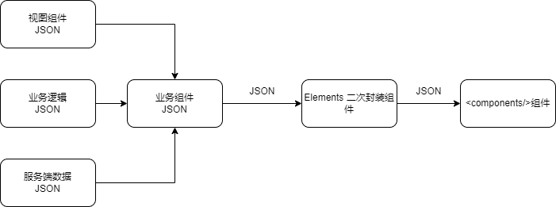

## 为什么要封装组件库？

### 背景

**当前公司/团队内部维护着部分B端系统，B 端系统与C端系统对比，通常有以下特点**：

1. **组件重复度较高**，用户界面定制化程度相对较小：通常主要为表格、表单、搜索、弹窗等；
2. **存在大量数据展示**：包含更多的表单、表格、图表和仪表盘。
3. **与服务端数据交互频繁**：B端系统可能需要处理大量数据和复杂计算，需要更多的数据接口；

**当前团队内部 B 端/内部系统 现状**：

* B 端/内部系统缺乏统一封装组件，**在系统内部组件重复开发**：
  * 如表格操作中的 查看、新增、编辑 通常表单项差异较小，三种操作类型通常重复开发；
  * 不同表单项之间存在相同组件，需要重复开发；
* 系统之间缺乏统一组件库，每个系统各自开发组件，**系统与系统之间重复组件无法共用**；

比如在 MakeX 赛事后台管理系统中，新增和编辑裁判管理界面中：

**以上设计方案存在问题**：

* 弹窗组件重复；
* 表单组件中部分组件重复;
* 可维护性较差：通常新增和编辑表单修改时候需要同步修改，以上模式需要同步修改两个组件。

**优化方案：**

以上组件中，可以将两个组件的弹窗组件抽离成一个公共弹窗，通过传入不同配置项目，显示不同的弹窗标题、操作和内容表单，这样可以最大程度减少代码量，并在修改表单时，可以同步修改新增和编辑表单，提高可维护性。

### 开源组件库存在问题

当前 B 端开源组件库（如： Ant Design Vue、Element Plus）大同小异，组件粒度相似，以下以 [ Ant Design Vue](https://www.antdv.com/components/overview)  组件库进行分析：

组件库都包含：

* 高级组件
* 通用组件：按钮、图标、排版
* 布局组件
* 导航组件
* 数据录入
* 数据展示
* 反馈组件
* 其他组件

组件分类较多，**组件粒度较细**，导致不同组件之间重复代码多。

如：Form 组件中，分为 `<a-form/>` 和 `<a-form-item/>` 组件，Form 表单项中每一项的组件为数据录入类组件中单独的组件。

在开发 Form 表单时候，组件粒度比较细，代码重复度比较高。

以上代码中 `<a-form-item>` 重复性较高，并且不同组件表单项重复。

### 解决方案

由于 B 端/内部系统的以上组件重复度高、组件内部数据处理较多、组件粒度较细问题，针对以上问题，我们可以：

* 通过对 B 端系统的开源组件进行二次封装，封装成后台管理系统常用的组件，如：表单、表格搜索、表格、弹窗表单、弹窗表格、描述列表等。将粒度较细的组件封装到常用的组件内部，最后通过配置进行动态生成对应组件。

* 封装统一组件库，解决跨项目组件复用问题，减少编写新代码的时间，加快开发速度，并统一组件交互和规范。

## 组件库设计规范

组件设计需要考虑以下问题：

* 组件是否易用：使用是否简单，不增加心智负担，不增加代码复杂度；
* 组件是否可扩展：在组件不能满足需求时，是否方便扩展定制化；
* 组件是否可维护：在使用组件后，是否会导致代码维护性更差；
* 样式兼容
* 国际化
* 主题色

## 组件设计方案

结合 Vue3 组件特定和 Composition API 特性，目前调研了几种组件的设计方案：

| 组件设计方案                             | 描述 | 参考 |
| ---------------------------------------- | ---- | ---- |
| Template 单文件组件                      |      |      |
| 完全 JSON Schema 配置                    |      |      |
| Template + JSON Schema 配置              |      |      |
| Template + Hooks 组件                    |      |      |
| Template + JSON Schema 配置 + Hooks 组件 |      |      |

## JSON 配置组件

JSON 配置组件是对 [ant design vue](https://www.antdv.com/components/form-cn) 组件的二次封装，通过二次封装 ant design vue  组件后，可以通过 JSON 配置生成 ant design vue 组件

### **设计思路**

一个业务组件，是对基础组件的二次封装，可以将业务组件拆分为以下几个部分：

* 视图组件 JSON 对象：描述视图有哪些组件组成的 JSON 对象；
* 业务逻辑 JSON 对象：描述组件的逻辑，包括组件事件描述，组件对象描述；
* 服务端数据 JSON 对象： 渲染组件数据内容，通过数据动态渲染组件内容；

业务逻辑组件通过对以上 JSON 对象处理，生成 业务组件 JSON，然后通过业务 JSON 对象传递给 ant design vue 组件，ant design vue 组件中底层使用 ant design vue 组件和 component 标签 组件解析 JSON 对象，生成最终的业务组件 。

### 组件介绍

