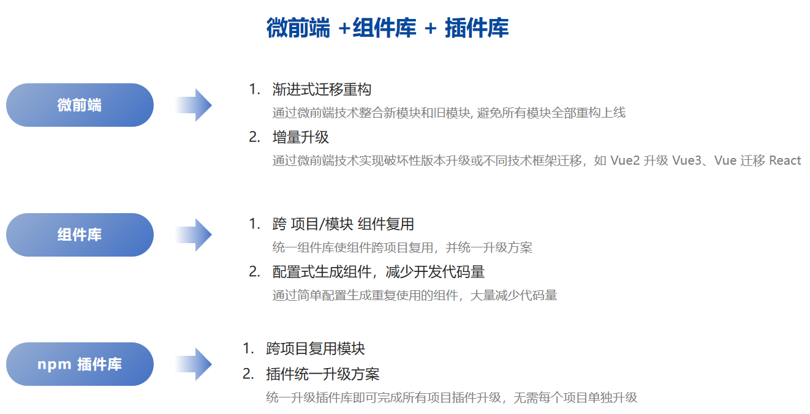
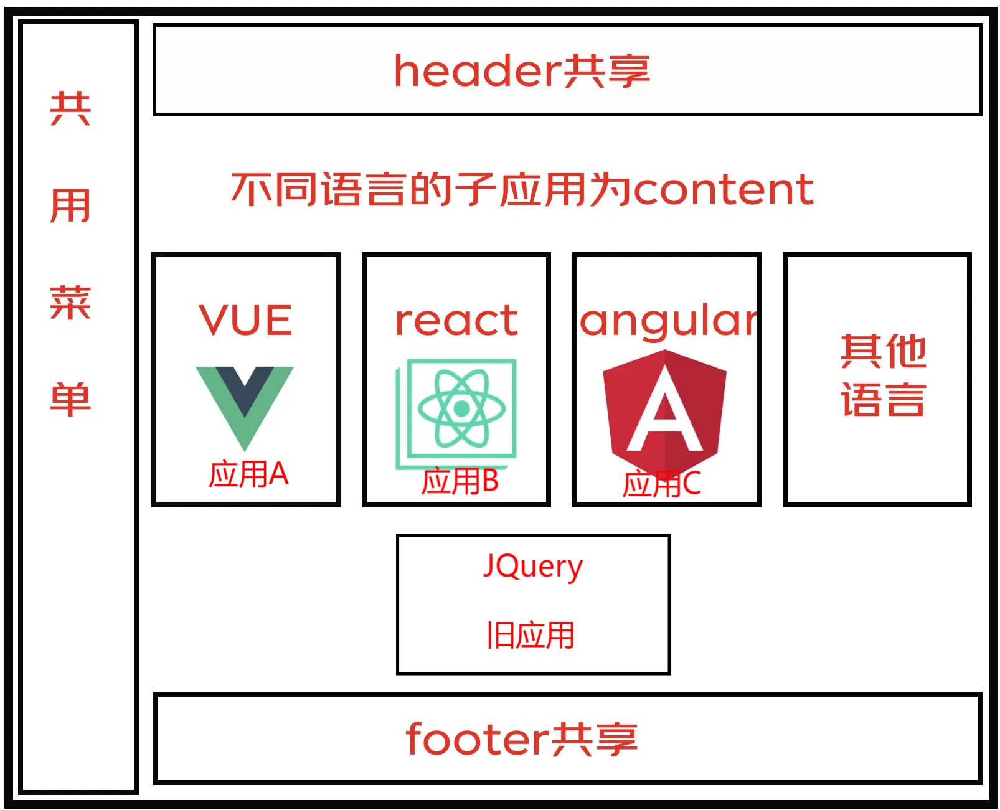
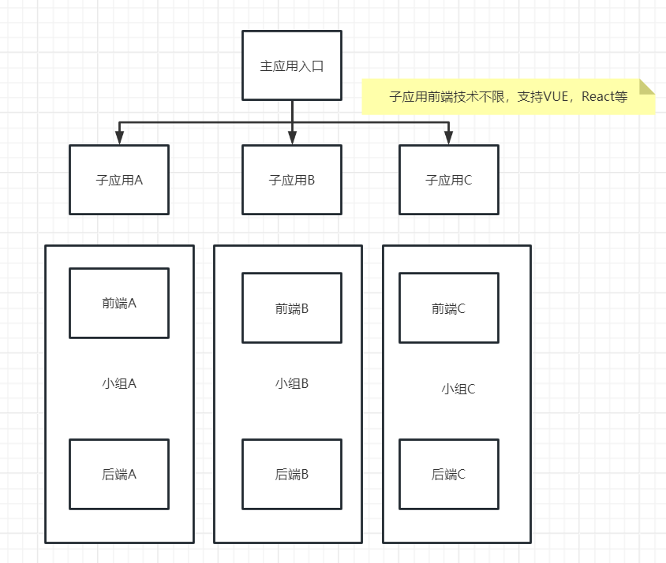
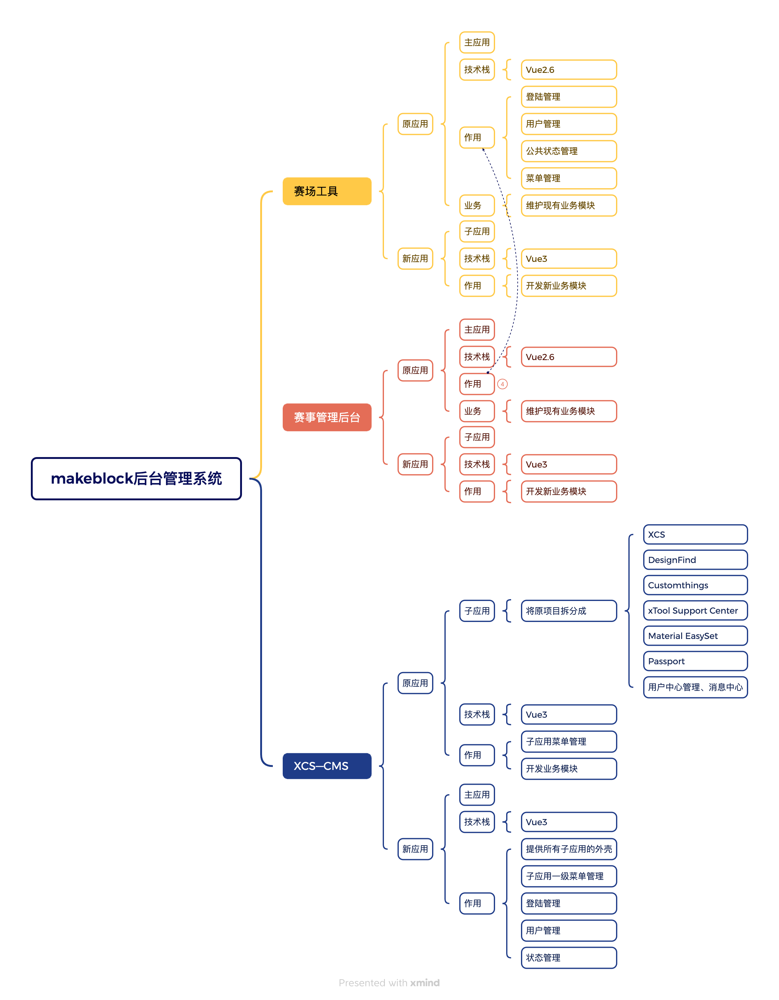
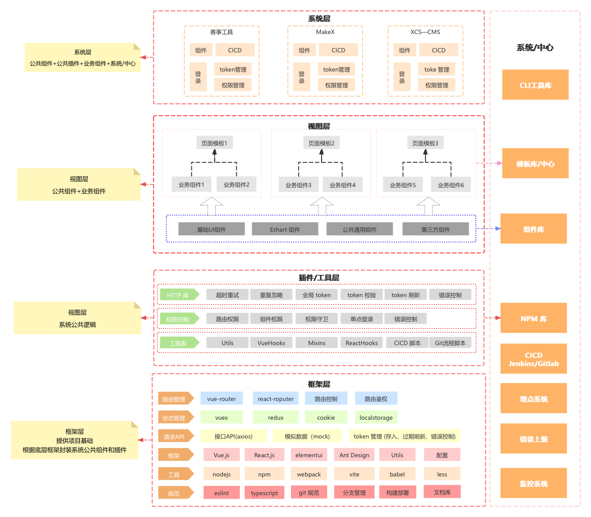

# 使用微前端重构后台管理项目

## 背景

当前部门维护了三个后台管理系统项目，其中两个项目使用 vue2 开发，一个使用 vue3开发。

当前三个项目使用的核心库/插件如下：

| 技术/项目       | 赛场工具                                 | MakeX赛事管理后台                        | XCS-CMS                                     |
| --------------- | ---------------------------------------- | ---------------------------------------- | ------------------------------------------- |
| 前端 MVVM 框架  | `"vue": "^2.6.11"`                       | `"vue": "^2.6.11"`                       | `"vue": "3.2.41"`                           |
| UI 组件库       | `"ant-design-vue": "^1.7.5"`             | `"ant-design-vue": "^1.7.2"`             | `"ant-design-vue": "3.2.20"`                |
| HTTP 库         |                                          | ` "axios": "^0.21.1"`                    | `"axios": "^0.21.1"`                        |
| OSS             | ` "ali-oss": "^6.16.0"`                  | ` "ali-oss": "^6.14.0"`                  | `"ali-oss": "^6.17.1"`                      |
| passport-client | `"@makeblock/passport-client": "^3.4.6"` | `"@makeblock/passport-client": "^3.4.7"` | `  "@makeblock/passport-client": "^3.4.10"` |
| 低代码表单      |                                          | `"k-form-design": "^3.7.2"`              |                                             |

以上项目中，当前面临以下问题：

1. 赛场工具和 MakeX 赛事工具使用 Vue2 开发，Vue2 当前已停止维护，Vue2已经不适合长期使用；
2. MakeX 赛事后台使用 `"k-form-design": "^3.7.2"` 低代码表单设计器作为表单设计器（该表单为 Vue2版本），并且另一个项目中使用该表单的渲染器，如果直接将项目升级成 Vue3 ，则该项目中表单设计器和另一个项目中表单渲染器也需要同时升级；
3. XCS—CMS 内容集成多个项目管理模块在同一个项目中，并且由多个小组共同开发；由于共同维护同一个项目，不同小组开发过程中发版会相互影响。
4. 后台管理系统组件和交互相同（都包含表格、表单、高级搜索等常用组件），但是不同项目之间组件相互隔离，导致相同组件重复开发。

----

## 目标

### 1. 渐进式 Vue2 升级 Vue3

- 在不影响原有功能模块前提下，同一个项目新的模块使用 Vue3 开发，旧模块仍然使用 Vue2 继续维护。在开发空闲时间再将 Vue2 旧模块逐步迁移至 Vue3。可以在保证不影响现有系统功能，逐步将项目技术栈升级成 Vue3。

- 通过渐进式升级，减少一次性重构的时间成本和人力成本。

### 2. 拆分 XCS—CMS 项目，减少不同项目协作问题

- 当前 XCS—CMS  包含XCS、DesignFind、Customthings、xTool Support Center、Material EasySet、Passport、用户中心管理、消息中心 多个项目的后台管理模块，并且由不同小组维护，导致发版容易冲突。

- 为了减少协作问题，可以将 XCS—CMS 拆分，拆分成多个小项目，并通过微前端技术整合所有项目，通过拆分项目导航栏，将不同项目分为一级路由，项目路由作为二级横向路由；

- 不同项目单独发版，避免发版流程相互影响。

### 3. 搭建公共组件库，减少组件重复开发，提高开发效率

- 后台管理系统组件通常都都包含表格、表单、高级搜索等常用组件
- 通过搭建公共组件库，在赛场工具、MakeX后台管理、XCS-CMS 各个子系统中，都使用并维护同一套组件库，可以减少组件重复开发工作，提高开发效率。

### 4.搭建公共项目模板，统一后台管理系统技术方案

- 通过搭建统一的公共模板，提供公共的插件，提供给所有后台管理系统，统一所有项目技术栈

- 所有后台管理系统使用了统一的 eslint、commitlint 等规范，并且使用 Vue、axios、ali-oss  等插件和 Jenkins 配置，因此可以通过搭建统一的模板，减少项目初始化工作。

---

## **重构方案**

### 1. 使用微前端拆分应用，对应用增量升级

使用微前端技术，将原项目拆分为二个系统：

* 主应用 (基座应用)：作为项目容器；
* 子应用：作为被内嵌项目，可以使用新项目作为子应用，也可以将旧项目作为子应用；

#### **主应用 (基座应用)**

最外层是**基座，** 基座是微前端应用集成的一个重要平台。

基座同时也肩负着管理公共资源、依赖、规范的责任。

**1.基座应用职责：**

* 控制子应用
* 负责主子应用通信
* 登录管理
* 权限管理
* 状态管理
* 路由管理
* 多语言管理
* 主题管理
* 用户信息管理
* 404页面 等
* 公共状态管理

**2.基座应用技术栈选取：**

* 主应用和子应用都可以使用任何技术栈，可以使用 Vue/React 重构基座应用/主应用；

**3.基座应用项目选取：**

* 可以使用 旧项目作为基座应用，也可以使用新项目作为基座应用；
  * 如果选用旧项目作为基座应用，则旧项目中的登录、权限、状态、路由、多语言、主题等 公共状态逻辑功能可以直接复用，无需重新开发，只需要将旧应用中接入微前端框架即可；（由于基座应用中登录、权限、状态、路由、多语言、主题等功能变动较小，因此使用旧项目作为基座使用对于项目的变动影响更小）
  * 如果选用新项目作为基座应用，则项目中公共逻辑功能 （登录、权限、状态、路由、多语言、主题等）需要重新开发，并且需要接入微前端框架，但随之项目管理可以更合理设计，并使用新的技术栈；

**4.基座结构：**

基座提供基础的功能和菜单栏，作为渲染容器。因此基座的页面结构为：

* 登录页面
* 内容页面：侧边栏菜单、header、footer（下图中公共菜单、header、footer 都由基座应用提供）

通过微前端方式拆分大项目，将大项目拆分成多个子应用，各个子应用由不同的 团队/小组 负责开发，并将基座应用作为所有子应用的容器和入口，控制所有子应用路由，但子应用也可以单独控制子路由：

#### **子应用**

微前端的子应用是指在微前端架构下，被拆分成多个小型、独立的前端应用单元。

**1.子应用特点：**

**1.1.独立性：**

- **独立开发**：每个子应用可以由不同的团队或开发者独立进行开发，降低了应用之间的耦合度，提高了开发效率和灵活性。
- **独立部署**：子应用可以独立进行部署，这意味着当某个子应用需要更新或修复时，可以单独进行，而无需影响其他子应用或整个系统的运行。
- **独立测试**：每个子应用都可以进行独立的测试，确保其功能完整性和稳定性。

**1.2. 技术栈多样性：**

- **不同框架或库**：微前端架构支持技术栈的多样性，不同的子应用可以使用不同的前端框架或库进行开发，如React、Vue、Angular等。
- **灵活组合**：这些使用不同技术栈的子应用可以根据需要进行灵活组合，形成一个完整的前端应用，为用户提供统一的用户体验。

**1.3. 协同工作：**

- **通信机制**：子应用之间通过微前端框架建立有效的通信机制，以实现数据共享、功能调用等协同工作。 
- **集成与配置**：在微前端框架中，需要将子应用集成到框架中，并进行相应的配置和代码修改，以确保它们能够正确运行和协同工作。

**1.4. 版本控制：**

- **独立版本号**：每个子应用都有自己独立的版本号，用于标识其版本信息和变更历史。

**2.子应用职责：**

* 子应用负责开发新的功能和页面；
* 不同子应用可以选取不同技术栈进行开发；

**3.子应用项目选取：**

* 选取旧项目作为子应用：需要隐藏旧项目后台管理系统中的菜单、header、footer，仅作为内容显示保留内嵌入新项目容器中；新项目容器需要重新开发公共逻辑（登陆管理、用户状态管理等）；
* 选取新项目作为子应用：新项目只需要开发新的页面和逻辑即可，旧项目公共逻辑复用；

#### 主子项目应用选取方案

把旧应用/新应用作为主应用有以下三种方案，各种方案优势劣势在表格中列举：

| 方案   | 主应用 | 子应用         | 优势                                                         | 劣势                                                         |
| ------ | ------ | -------------- | ------------------------------------------------------------ | ------------------------------------------------------------ |
| 方案一 | 旧项目 | 新项目         | 1.公共逻辑复用，减少开发工作量； 2.对项目侵入性较小，改造工作量较小，风险较低； | 旧应用容器依然为老技术栈，随着项目迭代，旧应用容器容易留下技术债务；  |
| 放案二 | 新项目 | 旧项目         | 新应用项目作为容器，技术栈更新，且项目结构管理更容易符合微前端项目结构 | 1. 公共逻辑需要重新开发，增加开发工作量； 2.对项目整体改造较大，风险较大 |
| 方案三 | 新项目 | 新项目和旧项目 | 1.新应用项目作为容器，技术栈更新，且项目结构管理更容易符合微前端项目结构； 2.整体技术栈迁移更容易； | 1. 公共逻辑需要重新开发，增加开发工作量； 2.对项目整体改造较大，风险较大 |

**建议方案：**

以赛事工具项目为切入口进行技术栈升级：

1. 以旧项目作为容器项目，接入微前端框架；
2. 以新项目作为子项目，开发新需求；
3. 以以上架构进行开发迭代，当需求逐渐迁移到新项目中以后，再以新技术栈开发项目容器，作为最新容器，再将旧项目作为子应用处理；
4. 先用新技术开发新项目作为子应用，后用新技术开发容器作为主应用替换旧项目容器，通过以上先替换子应用再替换主应用的逐步替换方式，逐步过渡整体技术栈；

方案设计导图如下：

### 2.搭建统一后台组件库

当前后台管理系统中的样式和交互比较统一，主要包括表格、表单、高级搜索、描述列表、弹窗等；

因此在开发后台管理系统中，可以根据公司内部人员使用习惯和样式，封装一套内部统一的组件，统一后台管理系统的样式和交互，减少开发工作量。

封装后台管理系统统一组件库在提高开发效率、增强代码复用性、降低维护成本等方面具有显著优势，但同时也存在定制性有限、学习成本高等劣势：

封装后台管理系统统一组件库在开发实践中具有显著的优势，同时也存在一些潜在的劣势。

以下是对这两方面的详细分析：

#### **优势**

1. **提高开发效率：**
   - 组件库提供了大量预制的、经过测试的UI组件，开发人员可以直接使用这些组件来构建界面，无需从头开始编写代码，从而节省了大量时间和人力成本。
   - 统一的组件库有助于保持项目的UI风格一致，减少因界面风格不一致而带来的额外工作。
2. **增强代码复用性：**
   - 组件库中的组件可以在不同的项目或项目中的不同部分重复使用，提高了代码的复用性，降低了重复造轮子的风险。
   - 通过将常用的功能封装成组件，可以避免在不同项目中重复编写相同的代码，减少了代码冗余。
3. **降低维护成本：**
   - 当需要更新或修复组件时，只需在组件库中进行修改，即可影响到所有使用该组件的项目，降低了维护的复杂度和成本。
   - 统一的组件库有助于减少因版本不一致而导致的兼容性问题。
4. **提升团队协作：**
   - 团队成员可以基于统一的组件库进行开发，减少了因界面风格不一致或组件使用差异而导致的沟通成本。
   - 外部开发者也可以通过访问和使用这些组件库，参与到项目的开发和维护中来，促进了开源社区的发展。
5. **提高代码质量：**
   - 组件库中的组件通常遵循一定的规范和质量标准，这有助于提升项目的整体代码质量。
   - 外部的压力（如其他开发者的反馈和贡献）也有助于推动组件库的不断完善和优化。

#### 劣势

1. **定制性有限：**
   - 虽然组件库提供了丰富的组件和样式，但在某些特定场景下，可能无法满足完全定制化的需求。此时，开发人员可能需要自行扩展或修改组件，增加了开发的复杂度。
2. **学习成本：**
   - 对于新手来说，需要花费一定的时间来学习和熟悉组件库的API和组件使用方式。特别是对于大型或复杂的组件库，学习成本可能会更高。
3. **版本管理和更新：**
   - 随着项目的进行和组件库的发展，组件库的版本可能会不断更新。开发人员需要关注组件库的更新情况，并及时将项目中的组件库更新到最新版本，以避免出现兼容性问题。这增加了版本管理的复杂度。
4. **资源消耗：**
   - 组件库通常包含大量的组件和样式，这可能会增加项目的体积和加载时间。对于性能要求较高的项目来说，可能需要采取额外的优化措施来减少资源消耗。
5. **维护成本增加：**
   - 如果组件库过于庞大或复杂，可能会增加维护的难度和成本。开发人员需要投入更多的时间和精力来维护组件库的稳定性和性能。

#### 组件库必备要素

参考开源组件库 

[Ant Design Vue]: https://www.antdv.com/docs/vue/introduce-cn

 来看，完善的组件库需要以下几个必备要素：

* 组件库
* 完善的文档介绍
* 完善的组件示例
* 完善的测试用例

#### 组件库设计方案

以 Ant Design Vue 中 

[Table 表格]: https://www.antdv.com/components/table-cn

作为示例进行分析：

1. table 表格列和操作通过前端 JSON 配置项传入生成；
2. table 表格数据通过后端接口数据传入生成；
3. 表格样式固定变化不大；

一个表格组件，主要变化为 表格列配置和接口数据；同理，表单、描述列表等组件也分为配置项和数据接口项目。

根据以上分析，可以将后台管理组件如下设计：

1. 通过封装组件 JSON 配置（组件 DSL），封装统一的表格、表单、高级搜索 等组件配置，通过配置项生成组件内容；
2. 通过接口和字段，自动填入组件数据；
3. 固定后端接口格式和部分字段，可以自动匹配对应组件 JSON 配置，自动生成对应组件类型，减少开发和对接工作量；

通过以上方案，可以设计 一套 DSL 配置组件；

> 我以 Element Plus 为基础，设计了一套 DSL 配置组件，示例：[表格组件 | XW-UI (sewar-x.github.io)](https://sewar-x.github.io/X-UI/zh-CN/components/element-plus/Vue3-通用组件/Table表格.html#示例) 

### 3.开发统一项目模板/脚手架

为主应用和子应用提供统一项目模板：

* 各应用提供统一的项目规范： ESlint、StyleLint、CommitLint 等规范；
* 提供统一的目录结构
* 提供统一的公共配置：Vite 配置、Jenkins 配置，环境变量配置等；
* 提供统一的公共插件：MicroApp 插件、 登录、token校验、权限控制、错误处理、http 等插件；

## 重构项目开发流程

1. 基座控制权限和路由、状态等，根据路由渲染不同的子应用；
2. 当有新的需求模块时候，使用新应用开发新需求；
3. 在容器应用中添加新应用导航；
4. 旧模块重构迁移时，当完成旧应用某个模块后，在旧应用容器中下线对应模块路由；
5. 将`新的模块路由/重构后的模块路由`更新到基座容器路由表中。
6. 公共组件在组件库中开发测试，并发布到私有npm，各项目通过更新组件库版本更新公共组件。

---

## 技术架构

---

## 技术选型

当前主流前端框架和构建工具为：

* Vue3 + Webpack（Vue2 已停止更新）
* Vue3 + Vite
* React + WebPack5

当前适合的微前端框架：

* [qiankun](https://qiankun.umijs.org/zh)
* [micro-app](https://qiankun.umijs.org/zh)
* [无界](https://wujie-micro.github.io/doc/)
* [EMP](https://emp2.netlify.app/) 

每个框架对 Vite 和 Webpack 支持程度不同。

由于当前团队内部主要技术栈为 Vue，并且组件库和插件库主要基于 Vue 封装。因此在选择主应用时，主要考虑使用 Vue 技术栈。

当前截至 2024 年 Vue 最新版本 Vue3 主要适配构建工具为 Vite，因此在选择 微前端框架时需要考虑框架对 Vite 的支持：

| 微前端框架     | Vite支持程度                                                 | Webpack支持程度                                     |
| -------------- | ------------------------------------------------------------ | --------------------------------------------------- |
| qiankun (乾坤) | 官方不支持，需要使用 **[vite-plugin-qiankun](https://github.com/tengmaoqing/vite-plugin-qiankun)** 适配 | 支持                                                |
| micro-app      | 支持                                                         | 支持                                                |
| 无界           | 官方不支持                                                   | 支持                                                |
| EPM            | 官方不支持                                                   | 支持 底层使用 webpack5、Module Federation 实现 |

由于主要使用微前端框架对旧项目技术重构升级，除了要考虑对 Vite 支持以外，还需要考虑微前端框架对 旧项目改造的侵入程度、社区活跃度等。

### **Qiankun + Vue3 + Vite**

[Qiankun](https://link.juejin.cn/?target=https%3A%2F%2Fgithub.com%2Fumijs%2Fqiankun) 是一个基于 [single-spa](https://link.juejin.cn/?target=https%3A%2F%2Fgithub.com%2FCanopyTax%2Fsingle-spa) ，阿里系开源的微前端框架，旨在帮助大家能更简单、无痛的构建一个生产可用微前端架构系统。

#### 优点

- 📦 **基于 [single-spa](https://link.juejin.cn?target=https%3A%2F%2Fgithub.com%2FCanopyTax%2Fsingle-spa)** 封装，提供了更加开箱即用的 API。
- 📱 **技术栈无关**，任意技术栈的应用均可 使用/接入，不论是 `React/Vue/Angular/JQuery` 还是其他等框架。
- 💪 **HTML Entry 接入方式**，让你接入微应用像使用 iframe 一样简单。
- 🛡 **样式隔离**，确保微应用之间样式互相不干扰。
  - `css`沙箱做了两套`strictStyleIsolation`、`experimentalStyleIsolation`两套适用不同场景的方案
- 🧳 **JS 沙箱**，确保微应用之间 全局变量/事件 不冲突。

#### 缺点

虽然 qiankun 有以上非常多的优势，但其劣势也非常明显：

- **目前主要支持 webpack，无法支持 `vite` 等 `ESM` 脚本运行；**

* **qiankun 官方不支持使用 Vite**：

  * 在使用 Vue3 +Vite 的子应用中，需要使用 **[vite-plugin-qiankun](https://github.com/tengmaoqing/vite-plugin-qiankun)** 进行适配。

  * 在使用 Vue3 + Vite 的主应用中，可以直接使用 qiankun。

> * 使用 **[vite-plugin-qiankun](https://github.com/tengmaoqing/vite-plugin-qiankun)**  接入 qiankun,参考：[Vue3 + Vite + qiankun微前端实践 - 掘金 (juejin.cn)](https://juejin.cn/post/7116002929168875533#heading-5)
>
> * qiankun 适配 Vite 参考：[在微前端qiankun中使用Vite你踩坑了吗？ - 掘金 (juejin.cn)](https://juejin.cn/post/7054009091961651237)
>
> * `vue3 + vite` 作为子应用出现的问题解决办法：[vue3 + vite 作为子应用出现的问题解决办法 · Issue #2966 · umijs/qiankun (github.com)](https://github.com/umijs/qiankun/issues/2966)

以 `vue3 + vite `的 demo 为例，在使用 Vue3 + Vite 适配 qiankun 时，会遇到以下两个需要解决的问题：

#### **开发模式问题**

* 在开发环境下，如果我们使用 vite 来构建 vue3 子应用，基于 vite 的构建机制，会在子应的 `html` 的入口文件的 `script` 标签上携带 `type=module`。

* 而 qiankun 父应用引入子应用，本质上是将 html 做为入口文件，并通过 `import-html-entry` 库去加载子应用所需要的资源列表 Js、css，然后通过 eval 直接执行。

* 一开始`import-html-entry`会过滤掉 `type=module`的文件，导致缺失 js 却直接 eval 最终执行出错，后期这个问题官方已经支持

  > 参考文章：[ Support of type=module and nomodule attribute in import-html-entry](https://link.juejin.cn?target=https%3A%2F%2Fgithub.com%2Fumijs%2Fqiankun%2Fissues%2F507)

* 而基于 vite 构建的 js 中`import、export`并没有被转码，会导致直接报错（浏览器不允许在非 type=module 的 script 里面使用 import）

#### **生产模式**

* 生产模式下，因为 Vite 没有诸如 qiankun 中 webpack 支持运行时 `publicPath`,也就是`__webpack_public_path__`，换句话说就是 vite 不支持运行时 publicPath。
* 运行时  publicPath 其主要作用是用来解决微应用动态载入的脚本、样式、图片等地址不正确的问题。
*  目前在Vite官方文档没查阅到相关的配置，但在Github中找到一个插件 [vite-plugin-dynamic-publicpath](https://link.juejin.cn/?target=https%3A%2F%2Fgithub.com%2Fjy0529%2Fvite-plugin-dynamic-publicpath)。

### **MicroApp + Vue3 + Vite**

> micro-app 官网：[介绍 (micro-zoe.github.io)](https://micro-zoe.github.io/micro-app/docs.html#/)

[Micro App](https://link.juejin.cn?target=https%3A%2F%2Fmicro-zoe.github.io%2Fmicro-app%2F) 是京东出的一款基于 `Web Component` 原生组件进行渲染的微前端框架，不同于目前流行的开源框架，它从组件化的思维实现微前端，旨在降低上手难度、提升工作效率。

它是目前市面上接入微前端成本最低的框架，并且提供了 JS沙箱、样式隔离、元素隔离、预加载、资源地址补全、插件系统、数据通信 等一系列完善的功能。

#### 优点

- 简单：只需一行代码，实现微前端；
- **无需改造子应用；**
- 无关技术栈：任何框架皆可使用；
- 静态资源补全；
- JS沙箱；
- 样式隔离；
- Qiankun 微前端框架的优势他都有；
- **同时支持 Webpack 和 Vite;**

### 选型建议

虽然 qiankun 社区活跃度更高，但 micro-app 对 Vite 支持度更好。

> Micro-app 官方文档：[介绍 (micro-zoe.github.io)](https://micro-zoe.github.io/micro-app/docs.html#/)

在采用 micro-app 作为微前端框架接入项目中，可以采用以下技术栈适配：

| 应用          | 微前端框架 | 主应用技术     | 子应用技术  |
| ------------- | ---------- | -------------- | ----------- |
| 赛事工具      | micro-app  | Vue2 + Webpack | Vue3 + Vite |
| MakeX管理后台 | micro-app  | Vue2 + Webpack | Vue3 + Vite |
| XCS—CMS       | micro-app  | Vue3 + Vite    | Vue3 + Vite |

---

## 总结

根据以上内容分析，通过以 赛事工具 项目为切入口，可以选择以下重构方案：

1. 使用微前端技术，将 赛事工具项目进行拆分，拆分为主应用和子应用：
   * 主应用：使用旧项目作为主应用，无需重复开发路由和状态等公共逻辑，后续子应用接入稳定后再使用新技术替换主应用；
   * 子应用：使用新技术项目作为子应用开发新需求，子应用也可以有独立运行，拥有（登陆、全局状态等逻辑）
2. 使用 micro-app 微前端框架接入子应用和主应用；
3. 使用 JSON 配置模式对 Ant Design Vue 进行二次封装，封装一套统一的后台组件库；
4. 使用 Vue3 + Vite 封装一套统一的后台管理项目模板，统一规范和技术方案。

