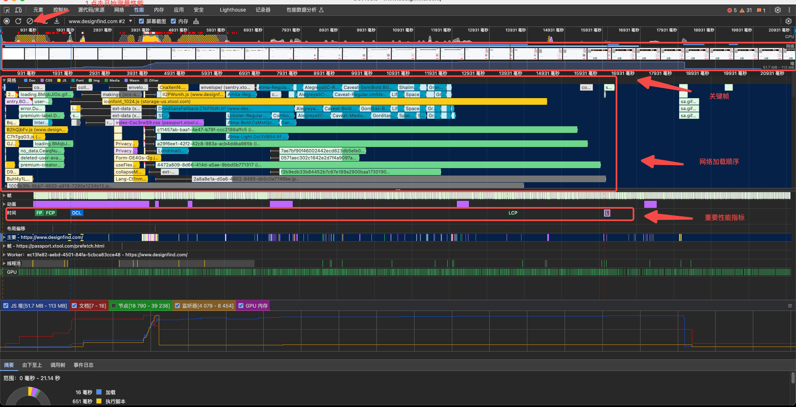
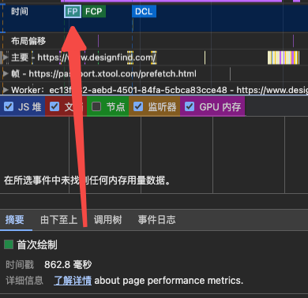
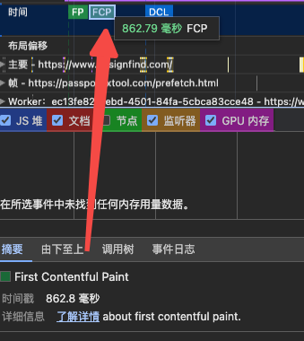
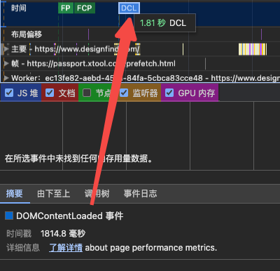
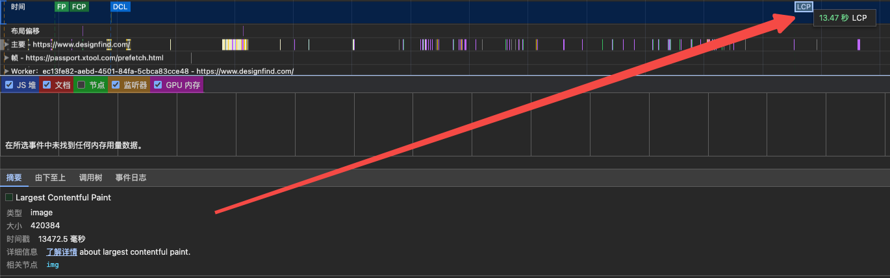
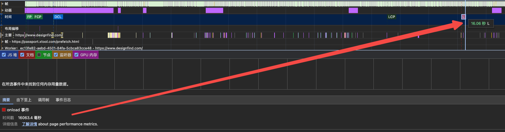
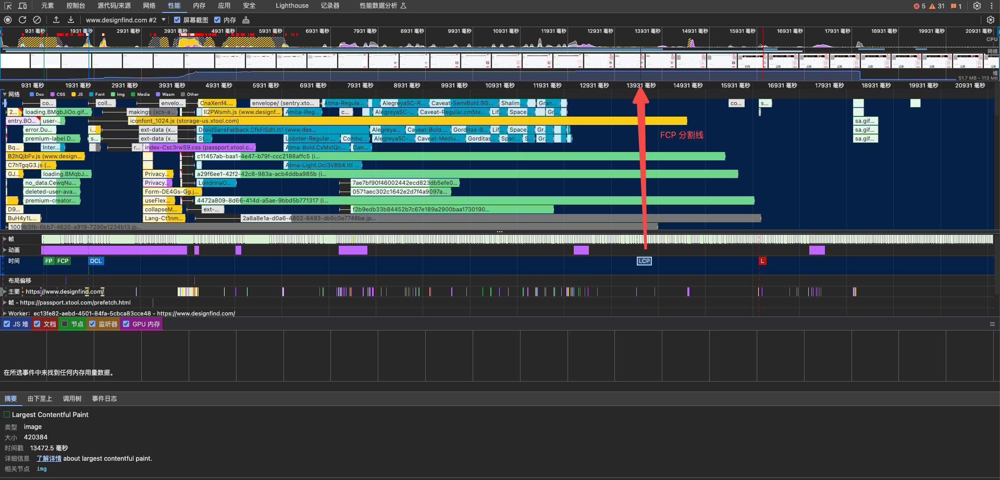
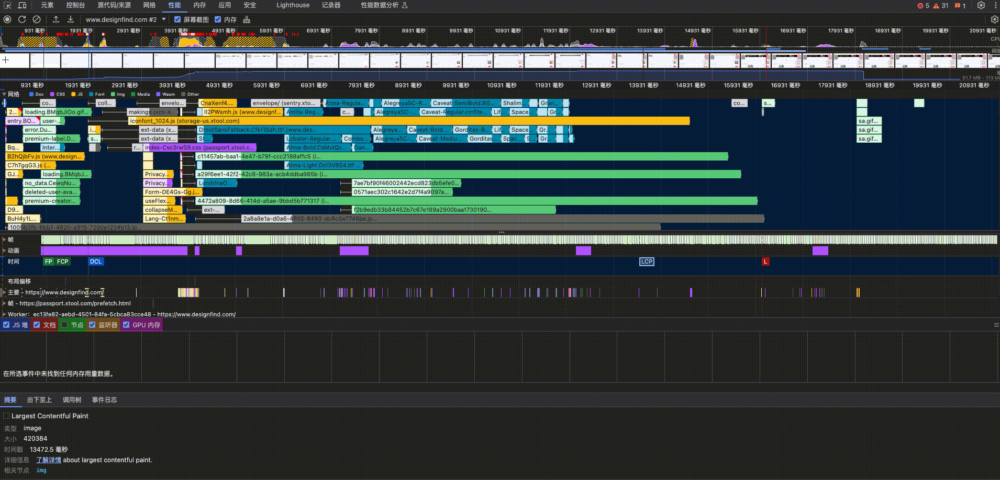

# 性能优化实践

## 为什么要性能优化

## 如何衡量性能

### 性能优化指标

## 如何检测性能

### Web性能检测工具

| 工具名称                                                     | 特点                                             | 优点                                                  | 缺点                             |
| ------------------------------------------------------------ | ------------------------------------------------ | ----------------------------------------------------- | -------------------------------- |
| [Google Lighthouse](https://developer.chrome.com/docs/lighthouse?hl=zh-cn) | 一个开源的自动化工具，用于改善网站性能和质量     | 免费、开源、集成在Chrome DevTools中、提供详细审计报告 | 需要手动运行，不支持实时监控     |
| [Chrome 性能分析面板](https://developer.chrome.com/docs/devtools/performance/overview?hl=zh-cn) |                                                  |                                                       |                                  |
| [WebPageTest](https://www.webpagetest.org/)                  | 在线工具，提供详细的性能测试和分析               | 免费、提供多种测试选项、可视化结果                    | 需要网络连接，不适合本地测试     |
| GTmetrix                                                     | 一个网站性能分析工具，提供页面加载速度的详细报告 | 用户友好、集成多种测试工具、提供优化建议              | 免费版功能有限，高级功能需要付费 |
| [PageSpeed Insights](https://developers.google.com/speed/pagespeed/) | Google提供的工具，评估网站性能并提供优化建议     | 免费、简单易用、提供优化得分                          | 测试范围相对有限                 |
| [Pingdom Website Speed Test](https://tools.pingdom.com/)     |                                                  |                                                       |                                  |

### Web性能监控工具

| 工具名称  | 特点                                          | 优点                                   | 缺点                                         |
| --------- | --------------------------------------------- | -------------------------------------- | -------------------------------------------- |
| New Relic | 一个APM（应用性能管理）工具，提供实时性能监控 | 实时监控、深入分析、支持多种语言和框架 | 价格昂贵，可能不适合小型项目或预算有限的团队 |
| Dynatrace | 提供全栈性能监控，包括前端和后端              | 强大的分析工具、自动基准测试、智能警报 | 高级功能成本高，学习曲线陡峭                 |
| Datadog   | 提供实时性能监控和分析                        | 支持多种语言和框架、用户友好的仪表板   | 价格可能较高，对于小型项目可能过于复杂       |
| Pingdom   | 一个SaaS服务，提供网站性能监控和分析          | 实时监控、报警系统、用户友好的仪表板   | 付费服务，价格可能较高                       |

### 如何区分性能检测工具和性能监控工具

1. **使用场景**：
   - **性能检测工具**：通常用于手动或定期的测试，以评估网站在特定时间点的性能。它们适合用于性能审计、优化和测试。
   - **性能监控工具**：用于实时监控网站性能，提供持续的性能数据和警报。它们适合用于持续的性能监控和故障排除。

2. **功能特点**：
   - **性能检测工具**：提供一次性的性能评估，包括页面加载时间、资源优化建议等。
   - **性能监控工具**：提供实时性能数据，包括响应时间、错误率、系统健康状况等，并能够设置警报以响应性能问题。

3. **结果反馈**：
   - **性能检测工具**：提供详细的测试报告和优化建议，但通常不提供实时数据。
   - **性能监控工具**：提供实时性能数据和警报，帮助快速识别和解决性能问题。

4. **成本和复杂性**：
   - **性能检测工具**：通常成本较低，易于使用，适合预算有限的团队。
   - **性能监控工具**：可能成本较高，功能更复杂，适合需要高级监控和分析的大型项目或企业。

## 如何监控性能

## 如何优化性能

> [Lighthouse 优化指导](https://developer.chrome.com/docs/devtools/lighthouse?hl=zh-cn#experiment)

## 性能优化实践

### 使用 Chrome devtools Performance 监控

**按照以下步骤测量站点：**

1. 打开 chrome  一个新tab，并使用无痕模式（注意：使用无痕模式避免缓存对测量结果影响）；
2. 输入 https://www.designfind.com/
3. 打开  Chrome devtools Performance，点击 chrome devtools 为独立面板；
4. 使测试页面显示在屏幕中，点击 Chrome devtools Performance 中的刷新按钮，开始测量；
5. 查看测量结果：

观察以上页面性能面板中时间栏的各项指标，使用鼠标点击时间栏的 FP、FCP、DCL、LCP、L:

* FP：
* FCP: 
* DCL: 
* FCP:
* L: 

查看以上时间，发现LCP 时间为 **13.47秒** ，远远高于**2.5 秒**（*良好的 LCP 值应不超过 2.5 秒*，评分标准参考：[LCP 得分多少算好？](https://web.dev/articles/lcp?hl=zh-cn#what-is-a-good-lcp-score)）

FCP 开始计算时间为 13.47秒，从关键帧区域绿色分割线中查看：

滑动以上关键帧区域，查看图像变化：

**问题分析：**

从以上关键帧图像变化可知：检测页面顶部使用轮播图展示，当第一张轮播图未加载完成时，就轮播到第二张，第二张轮播图加载时，轮播到第三张，直到第三张轮播图加载时，LCP到达分割线，因此 LCP 认为第三张轮播图为最大内容。（参考：[LCP 如何处理元素布局和大小更改？](https://web.dev/articles/lcp?hl=zh-cn#what-is-lcp)）

**优化方案：**

> [优化 Largest Contentful Paint](https://web.dev/articles/optimize-lcp?hl=zh-cn)

## 参考资料

[Web 性能](https://developer.mozilla.org/zh-CN/docs/Web/Performance)