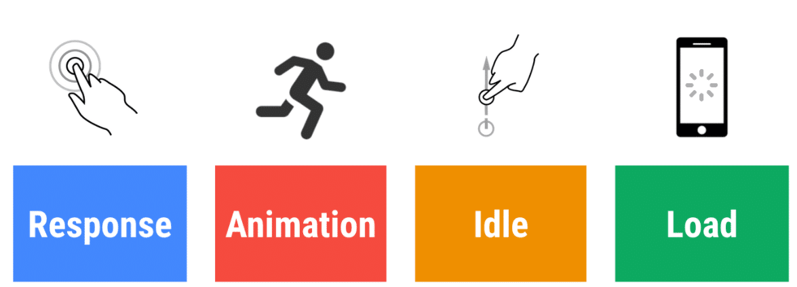
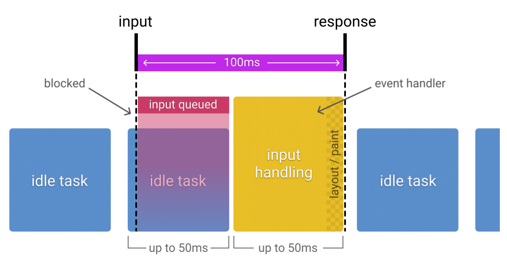
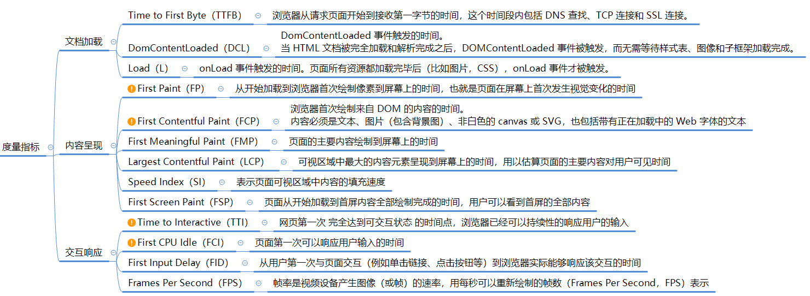
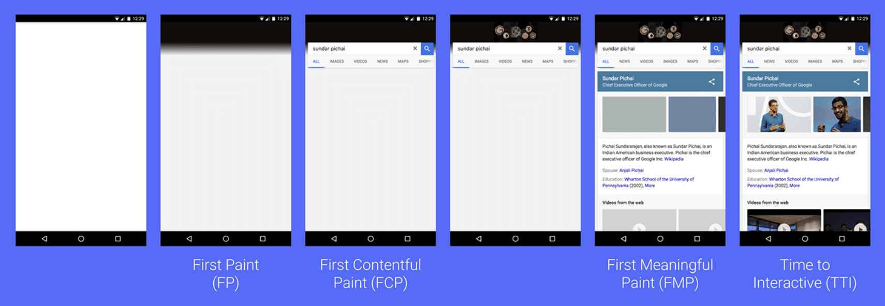
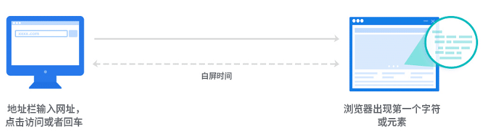
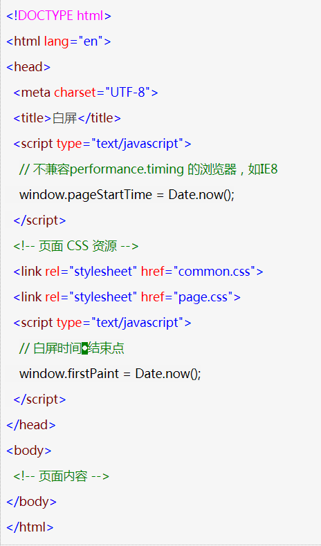
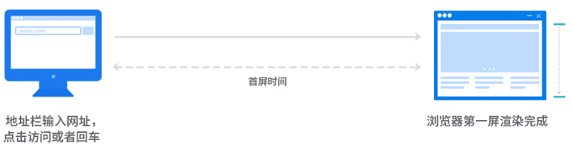
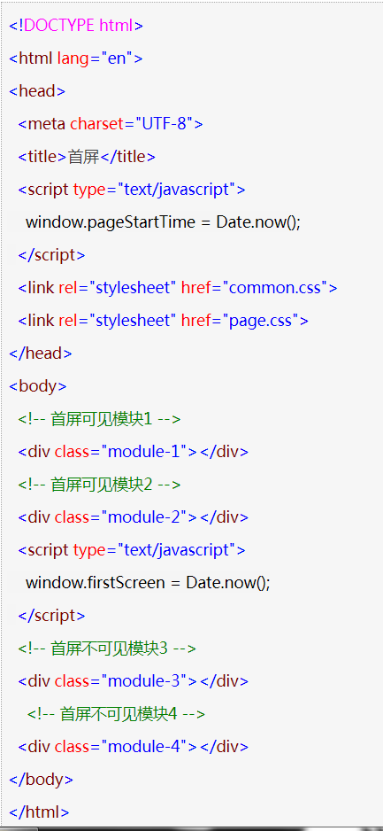
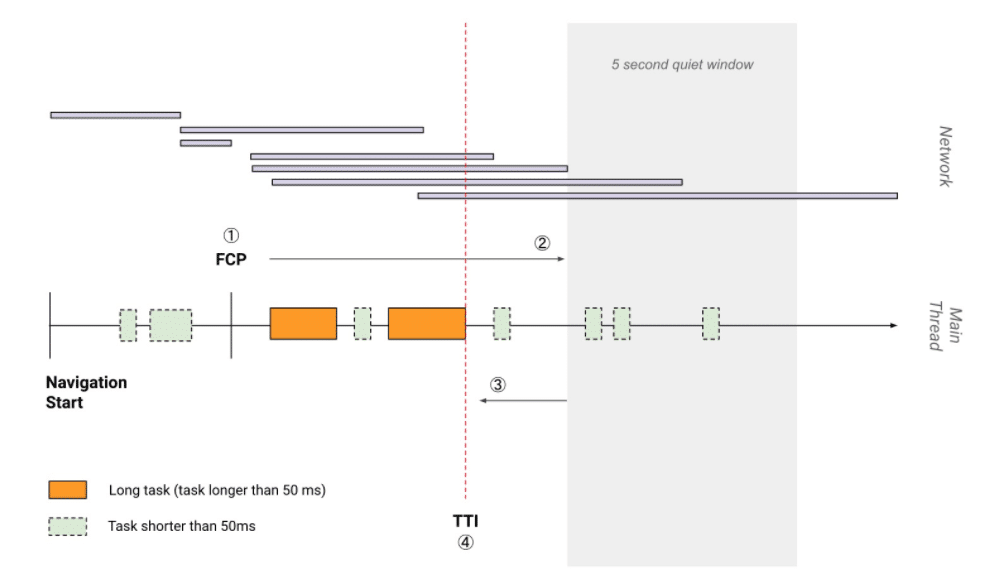
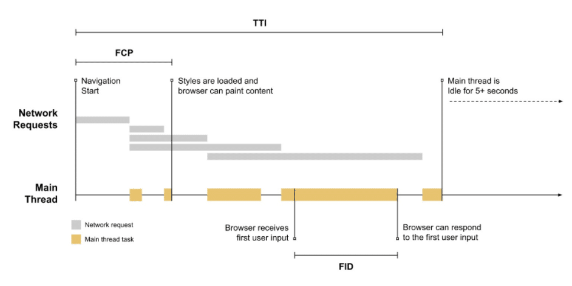

# 性能优化指标和监控

## RAIL 性能模型

* **RAIL**是一种以**用户为中心的**性能模型，它提供了一种考虑性能的结构。该模型将用户体验分解为关键操作（例如，点击、滚动、加载），并帮助您为每个操作定义性能目标。

* 关键操作：


* 聚焦用户：

以下是用户对性能延迟的感知：

| 延迟时间        | 用户感知                   |
| --------------- | -------------------------- |
| 0-16ms          | 很流畅                     |
| 0-100ms         | 基本流畅                   |
| 100-1000ms      | 感觉到网站上有一些加载任务 |
| 1000ms or more  | 失去耐心了                 |
| 10000ms or more | 直接离开，不会再访问了     |

### **Response**

 事件处理最好在50ms内完成。

* 目标：用户的输入到响应的时间不超过100ms，给用户的感受是瞬间就完成了。
* 优化方案：
  - 事件处理函数在50ms内完成，考虑到 idle task 情况，事件会排队，等待时间大概在50ms。
  - 适用于click，toggle，starting animations 等，不适用于 drag 和 scroll。
  - 复杂的 js 计算尽可能放在后台，如web worker，避免对用户输入造成阻塞。
  - 超过50ms的响应，一定要提供反馈，比如倒计时，进度百分比等。
* idle task：除了要处理输入事件，浏览器还有其它任务要做，这些任务会占用部分时间，一般情况会花费50ms的时间，输入事件的响应则排在其后。
  * idle task 对 input response 的影响：

### **Animation**

 在10ms内产生一帧。

* 目标：产生每一帧的时间不要超过10ms，浏览器 1秒渲染 60帧，为了保证浏览器60帧，每一帧的时间在16ms左右，但浏览器需要用6ms来渲染每一帧。旨在视觉上的平滑。用户对帧率变化感知很敏感。一般情况下，每一帧都必须完成下面的所有：

  

  * 16毫秒的时间中包含浏览器将新帧绘制到屏幕上的时间，所以留给上述5步的时间几乎在10ms 内。

* 优化方案：

  * 在一些高压点上，比如动画，不要使用 cpu，如：取offset，设置style等操作。尽可能地保证60帧的体验。
  * 在渲染性能上，针对不同的动画做一些特定优化

* 动画不只是UI的视觉效果，以下行为都属于

  - 视觉动画，如渐隐渐显，tweens，loading等
  - 滚动，包含弹性滚动，松开手指后，滚动会持续一段距离
  - 拖拽，缩放，经常伴随着用户行为

### **Idle**  

最大化空闲时间

* 目标：最大化空闲时间，以增大50ms内响应用户输入的几率

* 优化方案：
  * 用空闲时间来完成一些延后的工作，如先加载页面可见的部分，然后利用空闲时间加载剩余部分，此处可以使用 ；[requestIdleCallback API](https://developer.mozilla.org/en-US/docs/Web/API/Window/requestIdleCallback)
  * 在空闲时间内执行的任务尽量控制在50ms以内，如果更长的话，会影响input handle的pending时间；
  * 如果用户在空闲时间任务进行时进行交互，必须以此为最高优先级，并暂停空闲时间的任务；

### **Load** 

传输内容到页面可交互的时间不超过5秒

* 如果页面加载比较慢，用户的交点可能会离开。加载很快的页面，用户平均停留时间会变长，跳出率会更低，也就有更高的广告查看率

* 目标:
  * 优化加载速度，可以根据设备、网络等条件。目前，比较好的一个方式是，让你的页面在一个中配的3G网络手机上打开时间不超过5秒
  * 对于第二次打开，尽量不超过2秒
* 优化方案
  * 在手机设备上测试加载性能，选用中配的3G网络（400kb/s，400ms RTT），可以使用 [WebPageTest](https://www.webpagetest.org/easy) 来测试
  * 要注意的是，即使用户的网络是4G，但因为丢包或者网络波动，可能会比预期的更慢
  * [禁用渲染阻塞的资源，延后加载](https://web.dev/render-blocking-resources/)
  * 可以采用 [lazy load](https://web.dev/native-lazy-loading/)，[code-splitting](https://web.dev/reduce-javascript-payloads-with-code-splitting/) 等 [其他优化](https://web.dev/fast/) 手段，让第一次加载的资源更少

### 分析 RAIL 的工具

- [Chrome DevTools](https://developers.google.com/web/tools/chrome-devtools)
- [Lighthouse](https://web.dev/measure/)
- [WebPageTest](https://webpagetest.org/easy)

**参考资料**

[The RAIL Performance Model](https://developers.google.com/web/tools/chrome-devtools/profile/evaluate-performance/rail?hl=en)

## 优化指标




| 指标名称                                                     | 描述                                                         | 重要性 |
| ------------------------------------------------------------ | ------------------------------------------------------------ | ------ |
| **加载时间（Load Time）**                                    | 页面从请求发送到用户屏幕上出现第一个像素点的时间。包括DNS解析、TCP连接、服务器处理、传输时间等。 | 非常高 |
| [**首屏时间（Time to First Byte, TTFB）**](https://web.dev/articles/ttfb?hl=zh-cn) | 浏览器开始收到服务器响应的第一个字节的时间。反映服务器响应速度。 | 高     |
| **首屏渲染时间（First Contentful Paint, FCP）**              | 页面开始渲染内容的时间，即浏览器渲染出页面第一个DOM内容的时间点。 | 高     |
| **DOMContentLoaded时间**                                     | 页面DOM结构加载完成并解析完毕，无需等待样式表、图片和子框架的完成加载。 | 中等   |
| **页面加载完成时间（Load Event）**                           | 页面加载完毕的时间，包括所有依赖的资源如图片、样式表和脚本等。触发`window.onload`事件。 | 中等   |
| **页面交互响应时间**                                         | 用户与页面交互（如点击按钮）到页面响应（如显示新内容）的时间。 | 高     |
| **请求次数（Request Count）**                                | 页面加载过程中发起的HTTP请求数量。过多的请求会影响加载时间。 | 高     |
| **请求大小（Transfer Size）**                                | 页面加载过程中传输的总数据量。包括HTML、CSS、JavaScript、图片等资源。 | 高     |
| **缓存命中率（Cache Hit Rate）**                             | 从缓存中获取资源的请求比例。高缓存命中率可以显著减少加载时间和带宽消耗。 | 高     |
| **代码压缩比**                                               | 原始代码与压缩后代码大小的比例。JavaScript、CSS和HTML等文件压缩可以有效减少传输时间。 | 中等   |
| **图片优化**                                                 | 对图片进行压缩、格式转换（如JPEG转WebP）、尺寸调整等优化，以减少文件大小和加载时间。 | 高     |
| **代码分割（Code Splitting）**                               | 将代码分割成多个块，根据需求异步加载，以减少初始加载时间。   | 高     |
| **懒加载（Lazy Loading）**                                   | 对非关键资源（如图片、视频等）延迟加载，直到它们进入可视区域。 | 高     |
| **使用CDN**                                                  | 通过内容分发网络（CDN）将资源分发到全球多个节点，减少用户到服务器的距离，从而加快加载速度。 | 高     |
| **服务器响应时间**                                           | 服务器处理请求并返回响应的时间。受服务器性能、数据库查询效率等因素影响。 | 高     |
| **HTTP/2和HTTP/3**                                           | 使用更高效的HTTP协议版本，如HTTP/2的多路复用、服务器推送等功能，以及HTTP/3的QUIC协议，以减少延迟和提高传输效率。 | 高     |


### **关键指标**

* 当从浏览器打开一个页面，经历：**白屏 → 背景图 → 出现部分内容 → 首屏内容全部出现**，但图片还在加载中 → 首屏内容全部出现，图片也已经加载完成。

  


在此过程中的关键指标：

| 用户体验核心指标                                          | 定义                                                         |
| --------------------------------------------------------- | ------------------------------------------------------------ |
| **白屏时间**<br />First Paint<br />FP                     | 从**浏览器开始接收页面请求到页面上绘制出第一个像素点**（通常是背景色或默认颜色）的时间。<br />这个时间点标志着浏览器开始渲染页面的过程，但此时页面上可能还没有任何实际的内容（如文字、图片等）可见。 |
| **首次渲染内容**<br />First Contentful Paint<br /> FCP    | 首次渲染出页面上的第一片有意义内容的时间点。<br />这里的“有意义的内容”指的是任何文本、图像、非白色画布或SVG的渲染。 |
| **重要内容渲染时间**<br />First Meaningful Paint<br />FMP | 主要内容绘制到屏幕上的时间                                   |
| **首屏时间**<br />First Screen Paint<br />FSP             | 可视区域内容已完全呈现的时间                                 |
| **可流畅交互时间**<br />Time to Interactive<br /> TTI     | 用户第一次可以持续与页面交互的时间                           |


### **白屏时间（FP）**

#### **FP定义**

* 从开始加载到浏览器**首次绘制像素**到屏幕上的时间，也就是页面在屏幕上首次发生视觉变化的时间。
* 变化可能是简单的背景色更新或不引人注意的内容
* First Paint 不包括默认的背景绘制，但包括非默认的背景绘制。
* 通常认为浏览器**开始渲染 `<body>` 标签或者解析完 `<head> `标签的时刻就是页面白屏结束的时间点**



#### 影响因素

1.**网络状况：**

- 用户到服务器的网络连接速度直接影响数据的传输时间，进而影响白屏时间。

2.**服务器性能：**

- 服务器的处理速度和响应能力对白屏时间有显著影响。服务器需要快速处理用户的请求并返回HTML文档。

3.**HTML文档大小：**

- HTML文档的大小决定了其下载时间，进而影响白屏时间。大文件需要更长的下载时间。

4.**浏览器解析速度：**

- 浏览器解析HTML文档的速度也会影响白屏时间。不同的浏览器和不同的浏览器版本在解析速度上可能存在差异。

5.**DNS查询时间：**

- DNS查询将域名转换为IP地址的时间也是影响白屏时间的一个因素。虽然这个时间通常较短，但在某些情况下（如DNS服务器响应慢）也可能对白屏时间产生较大影响。

6.**TCP连接建立时间：**

- 建立TCP连接的时间也是影响白屏时间的一个因素。TCP连接是数据传输的基础，其建立时间的长短会直接影响数据传输的开始时间。


#### **优化策略**

> 根据以上影响因素，可以参考：[前端性能优化方案 | Sewen 博客 (sewar-x.github.io)](https://sewar-x.github.io/myblog/article/性能优化和调试/前端性能优化方案.html)

1. **优化HTML结构**：减少不必要的标签和嵌套，使HTML文档更加简洁、高效。
2. **压缩HTML文档**：使用压缩技术减少HTML文档的大小，从而加快下载速度。
3. **利用HTTP缓存**：利用浏览器的缓存机制减少重复资源的加载时间。
4. **CDN加速**：将静态资源部署到CDN上，利用CDN的分布式节点加速资源的加载。
5. **减少DNS查询时间**：使用DNS预解析技术减少DNS查询时间。
6. **优化服务器性能**：提升服务器的处理速度和响应能力，减少服务器响应时间。


#### **计算白屏时间**

* 可使用 Performance API 时：`白屏时间 = firstPaint - performance.timing.navigationStart`

* 不可使用 Performance API 时：`白屏时间 = firstPaint - performance.timing.navigationStart`





### **首次内容绘制（FCP）**

**首次渲染内容（First Contentful Paint, FCP）**是一个重要的前端性能指标，它用于测量网页在用户的设备上渲染出第一片有意义内容的时间点。

这个指标直接关系到用户对网站加载速度的第一印象，是Web性能用户体验的关键部分。

#### **FCP的定义**

> [首次内容绘制 (First Contentful Paint)](https://developer.chrome.com/docs/lighthouse/performance/first-contentful-paint?hl=zh-cn)

FCP是指浏览器首次渲染出页面上的第一片有意义内容的时间点。这里的“有意义的内容”指的是任何文本、图像、非白色画布或SVG的渲染。

如果网页是一个空白页面，那么FCP就是0，因为没有任何内容被渲染出来。

反之，如果网页在一开始就渲染了一大片文本或图像，那么FCP就是那个文本或图像被渲染出来的时间点。

#### **FCP的测量方式**

FCP的测量方式是记录浏览器开始渲染页面的时刻，并标志着第一个像素点（通常是文本、图像等内容的第一个像素）被绘制到屏幕上。这个时间点通常反映了用户感知到页面加载的开始，而不是整个页面完全加载完成的时间。

#### 影响FCP的因素

1. **网络状况**：网络延迟和带宽限制会直接影响资源的加载时间，从而影响FCP。
2. **服务器性能**：服务器的处理速度和响应时间也会影响FCP。
3. **HTML文档结构**：HTML文档的结构决定了页面内容的加载顺序。如果首屏内容在HTML文档中的位置较深，或者依赖于其他资源的加载，那么FCP时间就会相应延长。
4. **资源加载时间**：页面上的图片、CSS、JavaScript等资源需要被加载和解析后才能进行渲染。这些资源的加载时间会直接影响FCP。
5. **浏览器渲染性能**：不同浏览器和版本的渲染性能存在差异，这也会影响FCP。
6. **JavaScript执行时间**：如果页面中的JavaScript代码执行时间过长，会阻塞页面的渲染，从而导致FCP时间延长。

#### **优化FCP的策略**

1. **优化HTML结构**：将首屏内容放置在HTML文档的靠前位置，减少解析时间。
2. **压缩资源文件**：对图片、CSS、JavaScript等资源文件进行压缩，减少文件大小，加快加载速度。
3. **使用CDN**：将静态资源部署到CDN上，利用CDN的分布式节点加速资源的加载。
4. **异步加载非关键资源**：将不是首屏加载必需的资源设置为异步加载，以减少首次加载时需要下载的内容量。
5. **优化JavaScript执行**：减少JavaScript代码量，优化代码执行效率，避免长时间执行阻塞页面渲染。
6. **利用缓存**：利用浏览器的缓存机制减少重复资源的加载时间。

> 如何优化 FCP，请参阅以下效果指南：
>
> - [移除阻塞渲染的资源](https://developer.chrome.com/docs/lighthouse/performance/render-blocking-resources?hl=zh-cn)
> - [缩减 CSS 大小](https://developer.chrome.com/docs/lighthouse/performance/unminified-css?hl=zh-cn)
> - [移除未使用的 CSS](https://developer.chrome.com/docs/lighthouse/performance/unused-css-rules?hl=zh-cn)
> - [移除未使用的 JavaScript](https://developer.chrome.com/docs/lighthouse/performance/unused-javascript?hl=zh-cn)
> - [预先连接到所需的源](https://developer.chrome.com/docs/lighthouse/performance/uses-rel-preconnect?hl=zh-cn)
> - [缩短服务器响应用时 (TTFB)](https://web.dev/articles/ttfb?hl=zh-cn)
> - [避免多个网页重定向](https://developer.chrome.com/docs/lighthouse/performance/redirects?hl=zh-cn)
> - [预加载密钥请求](https://developer.chrome.com/docs/lighthouse/performance/uses-rel-preload?hl=zh-cn)
> - [避免网络载荷过大](https://developer.chrome.com/docs/lighthouse/performance/total-byte-weight?hl=zh-cn)
> - [使用高效的缓存政策提供静态资源](https://developer.chrome.com/docs/lighthouse/performance/uses-long-cache-ttl?hl=zh-cn)
> - [避免 DOM 规模过大](https://developer.chrome.com/docs/lighthouse/performance/dom-size?hl=zh-cn)
> - [最大限度地缩短关键请求深度](https://developer.chrome.com/docs/lighthouse/performance/critical-request-chains?hl=zh-cn)
> - [确保文本在网页字体加载期间保持可见](https://developer.chrome.com/docs/lighthouse/performance/font-display?hl=zh-cn)
> - [尽量减少请求数量并减小传输大小](https://developer.chrome.com/docs/lighthouse/performance/resource-summary?hl=zh-cn)


#### 参考资料

* [First Contentful Paint ](https://developer.chrome.com/docs/lighthouse/performance/first-contentful-paint?hl=zh-cn)

- [FCP 指标指南](https://web.dev/articles/fcp?hl=zh-cn)
- [Lighthouse 评分指南](https://developer.chrome.com/docs/lighthouse/performance/performance-scoring?hl=zh-cn)
- [Paint Timing 规范](https://w3c.github.io/paint-timing)


### **首屏时间（FSP）**

#### FSP**定义**

* 页面从开始加载到首屏内容全部绘制完成的时间，用户可以看到首屏的全部内容。

* 首屏时间（First Screen Paint, FSP），在更常见的术语中，它通常被称为“首屏时间”（Time to Above the Fold, TTF）或“首屏内容渲染完成时间”（First Contentful Paint, FCP，但注意FCP更侧重于首次渲染出任何内容的时间点，而不仅仅是首屏）。
* 首屏时间是指浏览器从响应用户输入网络地址，到首屏内容（即用户在不滚动页面的情况下首先看到的页面部分）渲染完成的时间。



#### **计算首屏时间方法**

* **首屏模块标签标记法**：	一种传统的采集方式，通常适用于首屏内容不需要通过拉取数据才能生存以及页面不考虑图片等资源加载的情况。
  * `首屏时间= firstScreen - performance.timing.navigationStart;`



* **统计首屏内加载最慢的图片的时间**：通常首屏内容加载最慢的就是图片资源,因此会把首屏内加载最慢的图片的时间当做首屏的时间。
  * 方法：首屏时间=加载最慢的图片的时间点 - performance.timing.navigationStart
  * 由于浏览器对每个页面的 TCP 连接数有限制，使得并不是所有图片都能立刻开始下载和显示，因此在 DOM树 构建完成后将会去遍历首屏内的所有图片标签，并且监听所有图片标签 onload 事件，最终遍历图片标签的加载时间的最大值，并用这个最大值减去 navigationStart 即可获得近似的首屏时间
* **自定义首屏内容计算法**：由于统计首屏内图片完成加载的时间比较复杂。因此我们在业务中通常会通过自定义模块内容，来简化计算首屏时间。
  * 方法：忽略图片等资源加载情况，只考虑页面主要 DOM，只考虑首屏的主要模块，而不是严格意义首屏线以上的所有内容。

* 现代浏览器问题：不会等待CSS树（所有CSS文件下载和解析完成）和DOM树（整个body标签解析完成）构建完成而是马上开始显示中间结果，所以经常在低网速的环境中，观察到页面由上至下缓慢显示完，或者先显示文本内容后再重绘成带有格式的页面内容		

* 影响首屏内容完整绘制：避免横向屏幕外和纵向屏幕外元素的绘制阻塞首屏内容的渲染。

  * 如在开发过程中，把内容列表代码放在导航代码前面，浏览器会先渲染完列表内容再渲染导航，如果超过屏幕外的列表内容很长，会严重影响首屏内导航显示到屏幕的时间。


### **可流畅交互时间（TTI）**

是衡量网页性能的一个重要指标，它表示网页第一次完全达到**可交互状态的时间点**。

#### **TTI定义**

TTI指的是从用户开始加载网页到网页上的UI组件可以流畅交互（如响应按钮点击、在文本框输入文字等）的时间点。

此时，不仅页面上的**主要内容已经加载并渲染完成**，而且**主线程的工作也已经达到“流畅”的程度**，即主线程的任务执行时间均不超过50毫秒，从而能够迅速响应用户的交互操作。

#### **影响因素**

1. **资源加载时间**：包括HTML文档、CSS样式表、JavaScript脚本以及图片等资源的加载和解析时间。
2. **浏览器解析和渲染性能**：不同浏览器和版本的解析和渲染速度存在差异，会直接影响TTI。
3. **主线程任务执行时间**：主线程上执行的任务（如JavaScript脚本）的复杂度和执行时间会影响TTI。如果主线程上长时间运行重任务，会导致页面无法及时响应用户的交互操作。

#### **计算方式**

TTI的计算过程相对复杂，需要满足一定的条件。

一般来说，TTI的计算是从FCP（首次内容绘制）之后开始，持续观察一段时间（如5秒），确保在这段时间内没有长任务（执行时间超过50ms）且没有过多的GET请求正在进行。

然后，回溯至这段时间内最后一个长任务结束的时间点，该时间点即为TTI。

#### **优化方法**

1. **优化资源加载**：减少不必要的资源请求，优化资源的大小和格式，使用CDN加速资源加载等。
2. **代码拆分和懒加载**：将JavaScript代码拆分成多个块，按需加载；对图片等资源进行懒加载，减少首屏加载时间。
3. **优化主线程任务**：避免在主线程上执行复杂的计算或耗时的操作，尽量将这类任务放在Web Workers等后台线程中执行。
4. **使用现代前端框架和库**：现代前端框架和库（如React、Vue等）提供了更高效的DOM操作和组件更新机制，有助于提升页面的交互性能。

#### **评估工具**

TTI可以通过多种工具和库进行评估，如Lighthouse、WebPageTest、Chrome DevTools等。这些工具可以模拟用户加载页面的过程，并提供详细的性能报告，包括TTI等关键指标的测量结果。

#### **总结**

TTI是衡量网页性能的重要指标之一，它反映了网页何时能够真正进入可交互状态。优化TTI可以提升用户体验，减少用户等待时间，提高网站的整体性能。开发者应该关注TTI指标，并采取相应的优化措施来提升网页的交互性能。


### [加载第一个字节所需时间 (TTFB)](https://web.dev/articles/ttfb?hl=zh-cn)

#### TTFB 定义

> 指标详细解释参考：[什么是 TTFB？](https://web.dev/articles/ttfb?hl=zh-cn)

#### 优化TTFB

> 详细优化方案参考：[优化加载第一个字节所需时间](https://web.dev/articles/optimize-ttfb?hl=zh-cn)

### [最大内容渲染时间 (LCP)](https://web.dev/lighthouse-largest-contentful-paint/)

> [最大内容渲染时间  Largest Contentful Paint (LCP) ](https://developer.chrome.com/docs/lighthouse/performance/lighthouse-largest-contentful-paint?hl=zh-cn)
>
> [LCP 定义](https://web.dev/articles/lcp?hl=zh-cn#what-is-lcp)
>
> [优化 Largest Contentful Paint ](https://web.dev/articles/optimize-lcp?hl=zh-cn)

可视区域中最大的内容元素呈现到屏幕上的时间，用以估算页面的主要内容对用户可见时间。

#### **LCP 呈现时间由以下子部分组成**

| CP 子部分         | 说明                                                         |
| :---------------- | :----------------------------------------------------------- |
| 首字节时间 (TTFB) | 从用户开始加载网页到浏览器收到 HTML 文档响应的第一个字节的时间。 |
| 资源加载延迟      | TTFB 与浏览器开始加载 LCP 资源之间的时间差。                 |
| 资源加载时间      | 加载 LCP 资源本身所需的时间。                                |
| 元素渲染延迟      | LCP 资源完成加载到 LCP 元素完全呈现之间的时间差。            |

如果 LCP 元素不需要资源加载即可渲染，则会省略资源加载延迟时间。例如，如果元素是以系统字体渲染的文本节点。


#### **测量方法**

```js
try {
  const po = new PerformanceObserver((entryList) => {
    const entries = entryList.getEntries();
    const lastEntry = entries[entries.length - 1];

    // 优先取 renderTime，如果没有则取 loadTime
    let lcp = lastEntry.renderTime || lastEntry.loadTime;
    window.perfData.push({
      'LCP', lcp
    });
  });
  po.observe({type: 'largest-contentful-paint'});
} catch (e) {
  // Do nothing 
}
```

### [探索最大 Contentful Paint 的延迟](https://developer.chrome.com/docs/devtools/performance-insights?hl=zh-cn)


### [First Meaningful Paint](https://web.dev/first-meaningful-paint/)

* 概念：FMP度量用户何时可以看到页面的主要内容。
* FMP的原始分数是用户初始化页面加载到页面呈现主要折叠内容之间的时间(以秒为单位)。
* FMP本质上显示了在最大的折叠上的布局变化发生之后的显示时间。
* 在 Lighthouse 6.0 中已不推荐使用 FMP，建议使用 [Largest Contentful Paint](https://web.dev/largest-contentful-paint/) 代替。

### [速度指数 SI](https://web.dev/speed-index/)

> [总阻塞时间 Total Blocking Time](https://developer.chrome.com/docs/lighthouse/performance/speed-index?hl=zh-cn)

* Speed Index 度量**页面加载过程中内容可视化显示的速度**。
* Lighthouse首先在浏览器中捕捉页面加载的视频，并计算帧间的视觉进程。然后Lighthouse使用Speedline Node.js模块生成速度指数分数。

#### 如何提高速度指数得分

- [尽量减少主线程工作](https://developer.chrome.com/docs/lighthouse/performance/mainthread-work-breakdown?hl=zh-cn)
- [缩短 JavaScript 执行时间](https://developer.chrome.com/docs/lighthouse/performance/bootup-time?hl=zh-cn)
- [确保文本在网页字体加载期间保持可见状态](https://developer.chrome.com/docs/lighthouse/performance/font-display?hl=zh-cn)


### [First CPU Idle](https://web.dev/first-cpu-idle/)

* 页面第一次可以响应用户输入的时间。

* 在 Lighthouse 6.0 中，已不推荐使用 FCI，原因是虽然 FCI 提供了比 TTI 更有意义的度量，但这种差异还不足以证明维护两个类似度量的合理性。建议考虑使用 [Total Blocking Time](https://web.dev/lighthouse-total-blocking-time/) 和 TTI。

### [Time to Interactive](https://web.dev/interactive/)

* （TTI）表示网页第一次 **完全达到可交互状态** 的时间点，浏览器已经可以持续性的响应用户的输入。
* 完全达到可交互状态的时间点是在最后一个长任务（Long Task）完成的时间, 并且在随后的 5 秒内网络和主线程是空闲的。



* 长任务是需要 50 毫秒以上才能完成的任务

* 测量方式：TTI 的计算依赖于对 Long Task 和主线程是否空闲的观察，目前并不在 Web 性能标准规范中，但在一些性能监视工具中实现了。Google 提供了采集 TTI 的 API：[tti-polyfill](https://github.com/GoogleChromeLabs/tti-polyfill)

  ```javascript
  const ttiPolyfill = require('tti-polyfill');
  ttiPolyfill.getFirstConsistentlyInteractive().then((tti) => {
    window.perfData.push({
      'tti': tti
    });
  });
  ```

### [Max Potential First Input Delay](https://web.dev/lighthouse-max-potential-fid/)

* FID:从用户第一次与页面交互（例如单击链接、点击按钮等）到浏览器实际能够响应该交互的时间。
* 输入延迟是因为浏览器的主线程正忙于做其他事情，所以不能响应用户。发生这种情况的一个常见原因是浏览器正忙于解析和执行应用程序加载的大型 JavaScript 文件。
* 第一次输入延迟通常发生在第一次内容绘制（FCP）和可持续交互时间（TTI）之间，因为页面已经呈现了一些内容，但还不能可靠地交互。
* 如果用户刚好在主线程最忙时与页面交互，延迟响应的时间就会较长，如果与页面交互是在主线程空闲期间，浏览器可能会立即响应。所以对于 FID 这个指标，我们需要关注的是整体的 FID 值分布，而不是单一值。

~

* 测量方式：Google 提供了一个 JS 库 [github.com/GoogleChrom…](https://github.com/GoogleChromeLabs/first-input-delay) 用于测量 FID


### [总阻塞时间 TBT](https://web.dev/lighthouse-total-blocking-time/)

> [总阻塞时间 Total Blocking Time ](https://developer.chrome.com/docs/lighthouse/performance/lighthouse-total-blocking-time?hl=zh-cn)

* TBT测量页面被阻止响应用户输入(如鼠标点击、屏幕点击或键盘按下)的总时间。
* 该总和是通过添加所有长任务的阻塞部分之间的第一次有内容的绘制和时间到交互式。
* 任何执行时间超过50毫秒的任务都是长任务。50ms后的时间量为阻塞部分。例如，如果Lighthouse检测到一个70毫秒长的任务，那么阻塞部分将是20毫秒

#### 如何提高 TBT 分数

如需了解如何使用 Chrome 开发者工具的“性能”面板诊断长时间运行的任务的根本原因，请参阅[导致任务过长的原因是什么？](https://web.dev/articles/long-tasks-devtools?hl=zh-cn#what_is_causing_my_long_tasks)。

通常，造成任务耗时较长的最常见的原因包括：

- 不必要的 JavaScript 加载、解析或执行。分析“Performance”面板中的代码时，您可能会发现主线程执行的工作并不是加载页面所必需的。[通过代码拆分减少 JavaScript 载荷](https://web.dev/reduce-javascript-payloads-with-code-splitting/?hl=zh-cn)、[移除未使用的代码](https://web.dev/remove-unused-code/?hl=zh-cn)或[高效加载第三方 JavaScript](https://web.dev/efficiently-load-third-party-javascript/?hl=zh-cn)，应该可以提高 TBT 得分。
- 低效的 JavaScript 语句。例如，分析“性能”面板中的代码后，假设您看到对 `document.querySelectorAll('a')` 的调用会返回 2000 个节点。重构代码以使用仅返回 10 个节点的更具体的选择器，应该可以提高 TBT 分数。

### 


## **参考资料**

[Lighthoust Performance audits](https://web.dev/lighthouse-performance/)

| 分类         | 文章                                                         |
| ------------ | ------------------------------------------------------------ |
| 性能优化指标 | [Core Web Vitals](Core Web Vitals)                           |
| 性能监控工具 | [chrome 性能分析工具](https://developer.chrome.com/docs/devtools/performance/reference?hl=zh-cn) |
|              | [lighthose 性能分析工具](https://developer.chrome.com/docs/lighthouse/performance/performance-scoring?hl=zh-cn) |
| 性能优化实践 | [使用 Fetch Priority API 优化资源加载](https://web.dev/articles/fetch-priority?hl=zh-cn) |
|              | [TTFB 优化](https://web.dev/articles/optimize-ttfb?hl=zh-cn) |