# 性能监控工具

## 总览

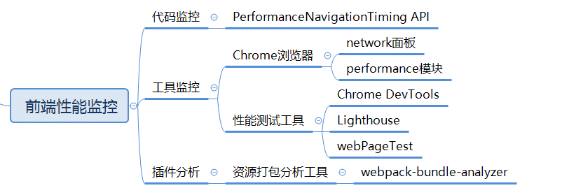

* 前端性能监控：代码监控、工具监控、插件分析工具。
  * **代码监控：**依托于js代码并部署到需监控的页面，手动计算时间差或者使用浏览器的的API进行数据统计。
    * 影响代码监控数据的因素：
      * 浏览器渲染机制；
      * 浏览器对API的实现程度，如：`performance API`；
  * **工具监控：**不用将统计代码部署到页面中，输入需统计的url并且选择运行次url的浏览器版本，通过工具对 url 进行请求分析后便可以给出各种性能指标，比如瀑布流、静态文件数量、首屏渲染时间等。
  * **插件分析工具：** 通过插件分析开发时各依赖包的大小，通过减少主要包体积优化。


## 代码监控

* 代码监控主要使用[**Navigation Timing API**](https://developer.mozilla.org/zh-CN/docs/Web/API/Navigation_timing_API) 提供的可用于衡量一个网站性能的数据。主要提供以下两个接口：
  * [`Performance`](https://developer.mozilla.org/zh-CN/docs/Web/API/Performance)：获取到当前页面中与性能相关的信息。它是 High Resolution Time API 的一部分，同时也融合了 Performance Timeline API、[Navigation Timing API](https://developer.mozilla.org/en-US/docs/Web/API/Navigation_timing_API)、 [User Timing API](https://developer.mozilla.org/en-US/docs/Web/API/User_Timing_API) 和 [Resource Timing API](https://developer.mozilla.org/en-US/docs/Web/API/Resource_Timing_API)。
  * [`PerformanceNavigationTiming`](https://developer.mozilla.org/zh-CN/docs/Web/API/PerformanceNavigationTiming)：提供了方法和属性来存取关于游览器文档navigation事件的相关数据。如文档实际加载/卸载的时间。

### Performance API

* [`window.performance`](https://www.w3.org/TR/2014/WD-navigation-timing-2-20140325/) 是W3C性能小组引入的新的API，目前IE9以上的浏览器都支持。

* Performance API 用于精确度量、控制、增强浏览器的性能表现。这个 API 为测量网站性能， 提供以前没有办法做到的精度。

* 结构：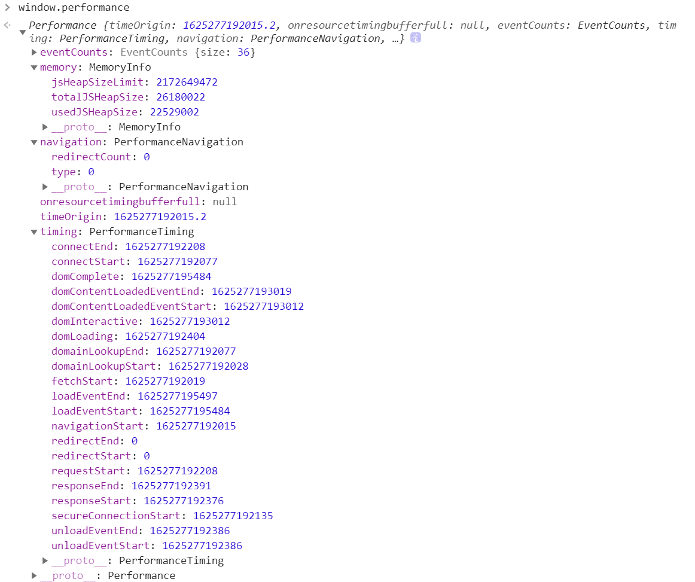

  * ​	`memory`：JavaScript 占用的内存。

  * `navigation`：统计网页导航相关的数据：

    1. `redirectCount`:重定向的数量（只读），但是这个接口有同源策略限制，即仅能检测同源的重定向；
    2. type 返回值：
       - 0 : TYPE_NAVIGATE (用户通过常规导航方式访问页面，比如点一个链接，或者一般的get方式)
       - 1 : TYPE_RELOAD (用户通过刷新，包括JS调用刷新接口等方式访问页面)
       - 2 : TYPE_BACK_FORWARD (用户通过后退按钮访问本页面)

  * `timing`：统计数据 网络、解析等时间数据。

    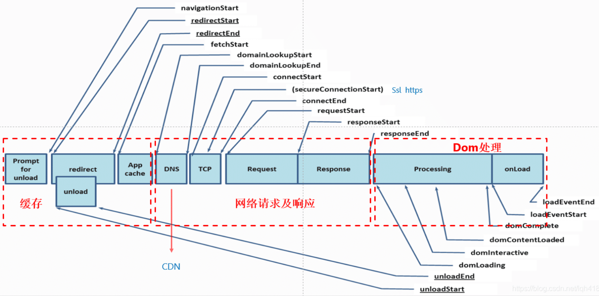

    * > - `startTime`：有些浏览器实现为[`navigationStart`](https://msdn.microsoft.com/en-us/library/ff974724(v=vs.85).aspx)，代表浏览器开始unload前一个页面文档的开始时间节点。比如我们当前正在浏览 baidu.com，在地址栏输入google.com并回车，浏览器的执行动作依次为：**unload当前文档（即baidu.com）->请求下一文档（即google.com）**。navigationStart的值便是触发unload当前文档的时间节点。
      >
      >   > 如果当前文档为空，则navigationStart的值等于fetchStart。
      >
      > - `redirectStart`和`redirectEnd`：如果页面是由redirect而来，则redirectStart和redirectEnd分别代表redirect开始和结束的时间节点；
      >
      > - `unloadEventStart`和`unloadEventEnd`：如果前一个文档和请求的文档是同一个域的，则`unloadEventStart`和`unloadEventEnd`分别代表浏览器unload前一个文档的开始和结束时间节点。否则两者都等于0；
      >
      > - `fetchStart`是指在浏览器发起任何请求之前的时间值。在fetchStart和`domainLookupStart`之间，浏览器会检查当前文档的缓存；
      >
      > - `domainLookupStart`和`domainLookupEnd`分别代表DNS查询的开始和结束时间节点。如果浏览器没有进行DNS查询（比如使用了cache），则两者的值都等于`fetchStart`；
      >
      > - `connectStart`和`connectEnd`分别代表TCP建立连接和连接成功的时间节点。如果浏览器没有进行TCP连接（比如使用持久化连接webscoket），则两者都等于`domainLookupEnd`；
      >
      > - `secureConnectionStart`：可选。如果页面使用HTTPS，它的值是安全连接握手之前的时刻。如果该属性不可用，则返回undefined。如果该属性可用，但没有使用HTTPS，则返回0；
      >
      > - `requestStart`代表浏览器发起请求的时间节点，请求的方式可以是请求服务器、缓存、本地资源等；
      >
      > - `responseStart`和`responseEnd`分别代表浏览器收到从服务器端（或缓存、本地资源）响应回的第一个字节和最后一个字节数据的时刻；
      >
      > - `domLoading`代表浏览器开始解析html文档的时间节点。我们知道IE浏览器下的document有`readyState`属性，`domLoading`的值就等于`readyState`改变为`loading`的时间节点；
      >
      > - `domInteractive`代表浏览器解析html文档的状态为`interactive`时的时间节点。`domInteractive`并非DOMReady，它早于DOMReady触发，代表html文档解析完毕（即dom tree创建完成）但是内嵌资源（比如外链css、js等）还未加载的时间点；
      >
      > - `domContentLoadedEventStart`：代表`DOMContentLoaded`事件触发的时间节点：
      >
      >   > 页面文档完全加载并解析完毕之后,会触发DOMContentLoaded事件，HTML文档不会等待样式文件,图片文件,子框架页面的加载(load事件可以用来检测HTML页面是否完全加载完毕(fully-loaded))。
      >
      > - `domContentLoadedEventEnd`：代表`DOMContentLoaded`事件完成的时间节点，此刻用户可以对页面进行操作，也就是jQuery中的domready时间；
      >
      > - `domComplete`：html文档完全解析完毕的时间节点；
      >
      > - `loadEventStart`和`loadEventEnd`分别代表onload事件触发和结束的时间节点

  * **计算性能指标：**

    * DNS查询耗时 = domainLookupEnd - domainLookupStart
    * TCP链接耗时 = connectEnd - connectStart
    * request 请求耗时 = responseEnd - responseStart
    * 解析 dom 树耗时 = domComplete - domInteractive
    * 白屏时间 = domloadng - fetchStart
    * domready 时间 = domContentLoadedEventEnd - fetchStart
    * onload 时间 = loadEventEnd - fetchStart

* 使用 getTime 来计算脚本耗时:

  * 缺点: 
  * getTime 方法（以及 Date 对象的其他方法） 都只能精确到毫秒级别（一秒的千分之一），无法计算更小的时间差。
    * 这种写法只能获取代码运行过程中的时间进度，无法知道一些后台事件的时间进度，比如浏览器用 了多少时间从服务器加载网页。
  * 实现:

  ```javascript
  // 计算加载时间
  function getPerformanceTiming () { 
      var performance = window.performance;
    
      if (!performance) {
          // 当前浏览器不支持
          console.log('你的浏览器不支持 performance 接口');
          return;
      }
    
      var t = performance.timing;
      var times = {};
    
      //【重要】页面加载完成的时间
      //【原因】这几乎代表了用户等待页面可用的时间
      times.loadPage = t.loadEventEnd - t.navigationStart;
    
      //【重要】解析 DOM 树结构的时间
      //【原因】反省下你的 DOM 树嵌套是不是太多了！
      times.domReady = t.domComplete - t.responseEnd;
    
      //【重要】重定向的时间
      //【原因】拒绝重定向！比如，http://example.com/ 就不该写成 http://example.com
      times.redirect = t.redirectEnd - t.redirectStart;
    
      //【重要】DNS 查询时间
      //【原因】DNS 预加载做了么？页面内是不是使用了太多不同的域名导致域名查询的时间太长？
      // 可使用 HTML5 Prefetch 预查询 DNS ，见：[HTML5 prefetch](http://segmentfault.com/a/1190000000633364)           
      times.lookupDomain = t.domainLookupEnd - t.domainLookupStart;
    
      //【重要】读取页面第一个字节的时间
      //【原因】这可以理解为用户拿到你的资源占用的时间，加异地机房了么，加CDN 处理了么？加带宽了么？加 CPU 运算速度了么？
      // TTFB 即 Time To First Byte 的意思
      // 维基百科：https://en.wikipedia.org/wiki/Time_To_First_Byte
      times.ttfb = t.responseStart - t.navigationStart;
    
      //【重要】内容加载完成的时间
      //【原因】页面内容经过 gzip 压缩了么，静态资源 css/js 等压缩了么？
      times.request = t.responseEnd - t.requestStart;
    
      //【重要】执行 onload 回调函数的时间
      //【原因】是否太多不必要的操作都放到 onload 回调函数里执行了，考虑过延迟加载、按需加载的策略么？
      times.loadEvent = t.loadEventEnd - t.loadEventStart;
    
      // DNS 缓存时间
      times.appcache = t.domainLookupStart - t.fetchStart;
    
      // 卸载页面的时间
      times.unloadEvent = t.unloadEventEnd - t.unloadEventStart;
    
      // TCP 建立连接完成握手的时间
      times.connect = t.connectEnd - t.connectStart;
    
      return times;
  }
  ```

* 获取首次渲染、首次有内容的渲染
  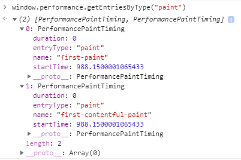

### Resource Timing API

* [`Resource Timing API `](https://developer.mozilla.org/zh-CN/docs/Web/API/Resource_Timing_API) 为网络事件(如重定向的开始和结束事件, DNS查找的开始和结束事件, 请求开始, 响应开始和结束时间等)生成有高分辨率时间戳( [high-resolution timestamps](https://developer.mozilla.org/zh-CN/docs/Web/API/DOMHighResTimeStamp) )的资源加载时间线, 并提供了资源大小和资源类型.

* PerformanceResourceTiming 接口在 Performance Timeline 面板上有展现，并且其扩展 PerformanceEntry 接口。

* 使用 **performance.getEntries()方法**  数组形式，返回一个 PerformanceEntry 列表，这些请求的时间统计信息，有多少个请求，返回数组就会有多少个成员。有以下属性：

  * name：这个属性必须返回请求资源的解析URL。如果重定向到其他URL，此属性也不更改。

  * entryType：entryType属性返回 DOMString “resource”。entryType 类型不同数组中的对象结构也不同。initiatorType 表：

  * | **值 **  | **描述 **                             |
    | -------- | ------------------------------------- |
    | mark     | 通过 mark() 方法添加到数组中的对象    |
    | paint    | 通过 measure() 方法添加到数组中的对象 |
    | measure  | first-contentful-paint 首次内容绘制   |
    | resource | 所有资源加载时间，用处最多            |

  * startTime：startTime属性返回一个 DOMHighResTimeStamp [ HR-TIME-2 ]，表示用户代理获取资源开始排队等待之前的时间。如果在获取资源时存在 HTTP 重定向或类同情况，并且所有重定向或类同情况都来自与当前文档同源，或者通过了timing  allow check 算法，则此属性返回 redirectStart 的值。否则，此属性返回 fetchStart 的值。

  * duration：该duration属性返回一个 DOMHighResTimeStamp，等于 responseEnd 和 startTime 之间的差。

  

## 工具监控

| 工具                                                         | 优势 | 劣势 |
| ------------------------------------------------------------ | ---- | ---- |
| [chrome 开发工具性能面板](https://developer.chrome.com/docs/devtools/performance/overview?hl=zh-cn) |      |      |
| [性能数据分析面板](https://developer.chrome.com/docs/devtools/performance-insights?hl=zh-cn) |      |      |
| [LightHouse](https://developer.chrome.com/docs/lighthouse/overview?hl=zh-cn) |      |      |


## Chrome 开发工具

### **网络监控**

> 官方文档：[网络面板](https://developer.chrome.com/docs/devtools/network/overview?hl=zh-cn)

#### **瀑布流分析**

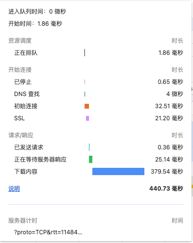

瀑布流中显示了一个网络请求的详细分解，包括各个阶段的时间消耗。

> 详细查看官方文档：[预览时间细分数据](https://developer.chrome.com/docs/devtools/network/reference?hl=zh-cn#timing-explanation)

以下是影响下载内容时间的主要因素，以及它们在瀑布流中的体现：

1. **进入队列时间**：
   - 这是指请求进入浏览器请求队列的时间。如果浏览器有多个请求，它们可能会被排队等待发送。
   - 在开始连接之前以及满足以下条件时，浏览器会将请求加入队列：` <ph type="x-smartling-placeholder">`
     - 有更高优先级的请求。
     - 此源已打开六个 TCP 连接，达到上限。应用对象 仅限 HTTP/1.0 和 HTTP/1.1。
     - 浏览器正在短暂分配磁盘缓存中的空间。
   
2. **开始时间（Queueing）**：
   - 从“进入队列时间”到“开始时间”的1.86毫秒是请求在队列中等待的时间。这段时间可能受到浏览器是否正在处理其他任务或请求的影响。

3. **DNS查找**：
   - DNS查找时间是将域名解析为IP地址所需的时间。

4. **初始连接（Connecting）**：
   - 这个阶段包括建立与服务器的连接所需的时间，包括TCP握手。

5. **SSL握手**：
   - 如果请求是加密的（使用HTTPS），则需要进行SSL握手。这个时间受到密钥交换和证书验证过程的影响。

6. **请求/响应**：
   - 这个阶段包括发送请求到服务器并等待响应的时间。在图片中，已发送请求的时间为0.36毫秒，而正在等待服务器响应的时间为25.14毫秒。

7. **下载内容（Content Download）**：
   - 这个阶段是实际从服务器下载数据的时间。这个阶段的时间受到网络带宽、服务器响应速度和数据大小的影响。

8. **服务器计时**：
   - 服务器处理请求并发送响应所需的时间。在图片中，服务器计时的时间是未知的，但它是影响总下载时间的重要因素。

9. **网络带宽和延迟**：
   - 客户端和服务器之间的网络带宽以及网络延迟也会影响下载时间。带宽越低或延迟越高，数据传输所需的时间就越长。

10. **服务器性能**：
    - 服务器处理请求的速度，包括后端逻辑处理、数据库查询等，都会影响响应时间。

11. **客户端性能**：
    - 客户端设备的性能，包括CPU速度、内存容量和网络接口，也可能影响请求的处理速度。

12. **其他因素**：
    - 包括网络拥堵、中间网络设备（如路由器、防火墙）的处理能力、以及可能的网络攻击或异常流量。

在优化网络请求的性能时，了解这些因素有助于确定性能瓶颈所在，并采取相应的措施来减少延迟和提高数据传输效率。

#### **优先级**

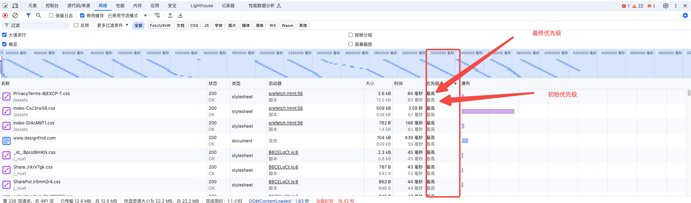

**Priority** 列显示初始（最低值）和最终（最高值）提取优先级。

`Priority` 列显示了网络请求的优先级。这个优先级是指浏览器在处理和调度网络请求时，决定哪些请求应该首先被发送和处理的顺序。

**初始优先级（最低值）**:

- **初始优先级**指的是当请求首次被发起时，浏览器根据请求的类型（例如，脚本、样式表、图片等）和其他因素（如页面渲染的需要）所赋予的优先级。
- 这个优先级可能会因为浏览器的初始评估而变化，例如，浏览器可能会认为某些资源对于页面的首次渲染更为关键，因此给予它们更高的优先级。
- 初始优先级通常是基于浏览器的预加载扫描和页面内容分析来确定的，目的是优化页面加载的性能。

**最终优先级（最高值）:**

- **最终优先级**指的是在请求生命周期结束时，浏览器根据页面的实际渲染情况和资源的实际使用情况，对请求的优先级进行调整后的结果。
- 这个优先级反映了浏览器在处理请求过程中，根据页面的动态变化和用户交互，对资源加载顺序的重新评估。
- 例如，如果一个图片资源在页面渲染过程中被推迟加载，它的优先级可能会降低；相反，如果一个脚本对于用户操作响应非常关键，它的优先级可能会提高。

**优先级的意义:**

- 优先级系统帮助浏览器更有效地管理网络资源，确保用户体验的流畅性和页面加载的性能。
- 开发者可以通过观察优先级的变化来识别可能的性能瓶颈，例如，如果关键资源的优先级被降低，可能导致页面加载速度变慢。
- 通过调整资源的加载顺序和优化资源的大小，开发者可以改善页面的性能，提升用户体验。


### **性能监控**

> 官方文档: [性能面板](https://developer.chrome.com/docs/devtools/performance/overview?hl=zh-cn)

---


## 性能数据分析面板

> 官方文档：[性能数据分析面板](https://developer.chrome.com/docs/devtools/performance-insights?hl=zh-cn)


## LightHouse

#### 安装/使用

针对不同的适用场景，我们可以通过多种方式来安装并使用 Lighthouse：

- 浏览器插件。Chrome 插件的形式提供了更加友好的用户界面，方便读取报告。
- Chrome DevTools。该工具集成在最新版本的 Chrome 浏览器中，无需安装即可使用。
- Lighthouse CLI 命令行工具。方便将 Lighthouse 集成到持续集成系统中。
- 编程的方式。我们也能通过 Node.js 模块引入 Lighthouse 工具包，以编程的形式来使用它。

具体安装方式查看 [使用 Lighthouse](https://lavas-project.github.io/pwa-book/appendix01/1-lighthouse.html#%E4%BD%BF%E7%94%A8-lighthouse-%E6%B5%8B%E8%AF%84-pwa)

#### 测评报告

* 使用 Lighthouse 对网站进行测评后，我们会得到一份评分报告，它包含了：

  * 性能（Performance）
  * 访问无障碍（Accessibility）
  * 最佳实践（Best Practice）
  * 搜索引擎优化（SEO）
  * PWA（Progressive Web App）

  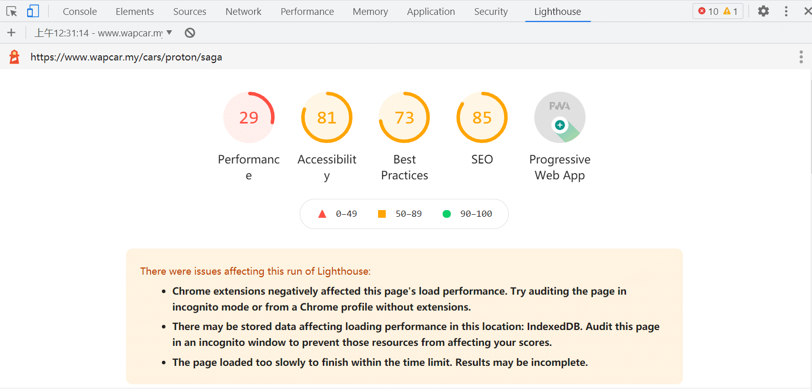

* 报告中带有相关优化建议：

  * 性能（Performance）结果: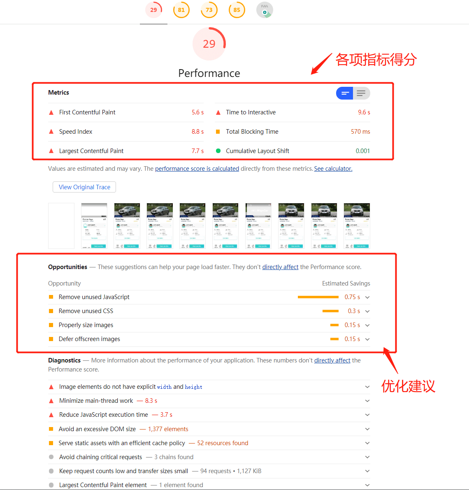
    * 性能评分分为了三部分：
      * [Metrics](https://web.dev/lighthouse-performance/#metrics) 部分的指标项会直接影响分数，可以作为我们的主要参考点。
      * [Opportunities](https://web.dev/lighthouse-performance/#opportunities) 提供了详细的建议和文档，来解释低分的原因，帮助我们具体进行实现和改进。
      * [Diagnostics](https://web.dev/lighthouse-performance/#diagnostics) 部分的列表项则为进一步改善性能的实验和调整，给出了指导。
  * 访问无障碍（Accessibility）测试结果：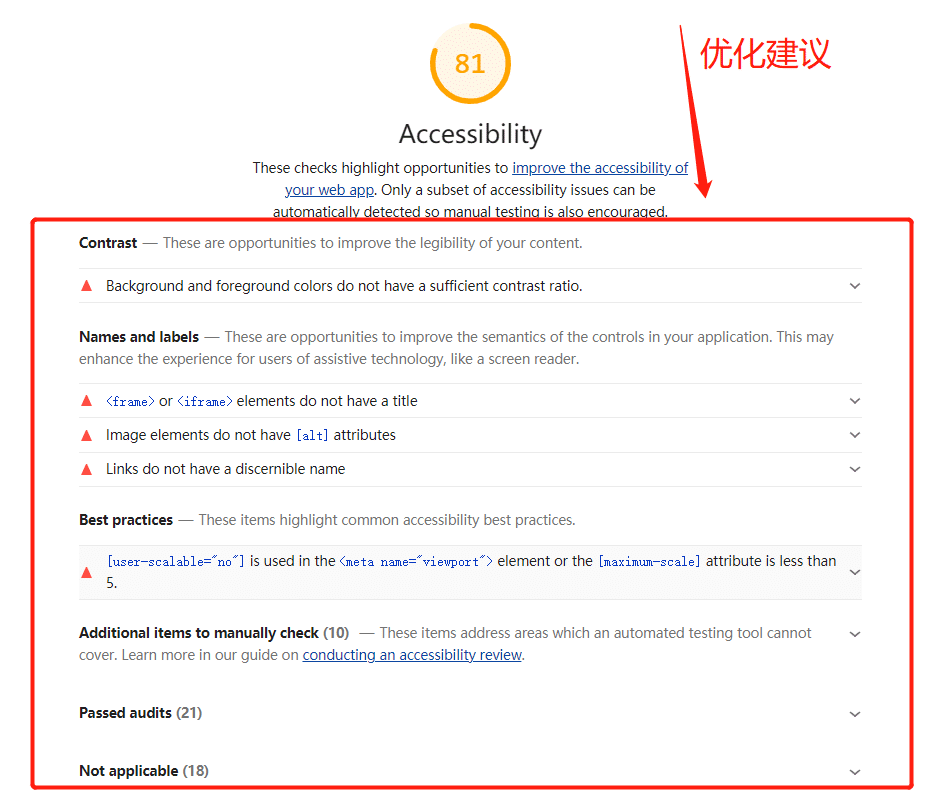
  * 最佳实践（Best Practice）测试结果：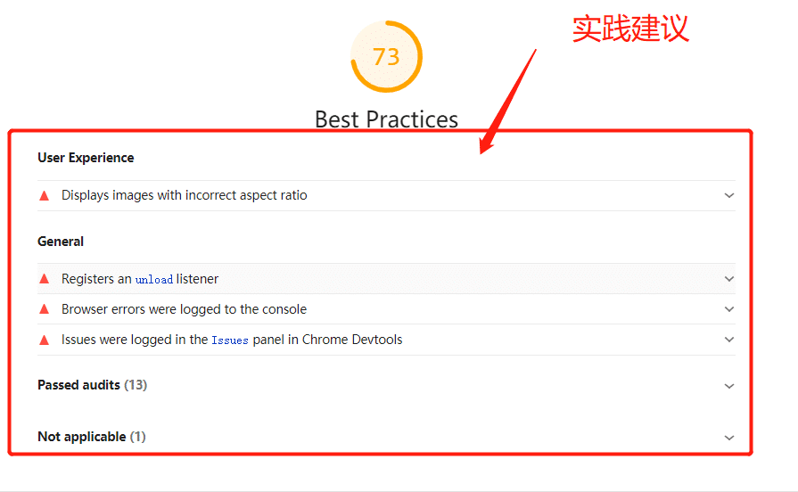
  * SEO 测试结果：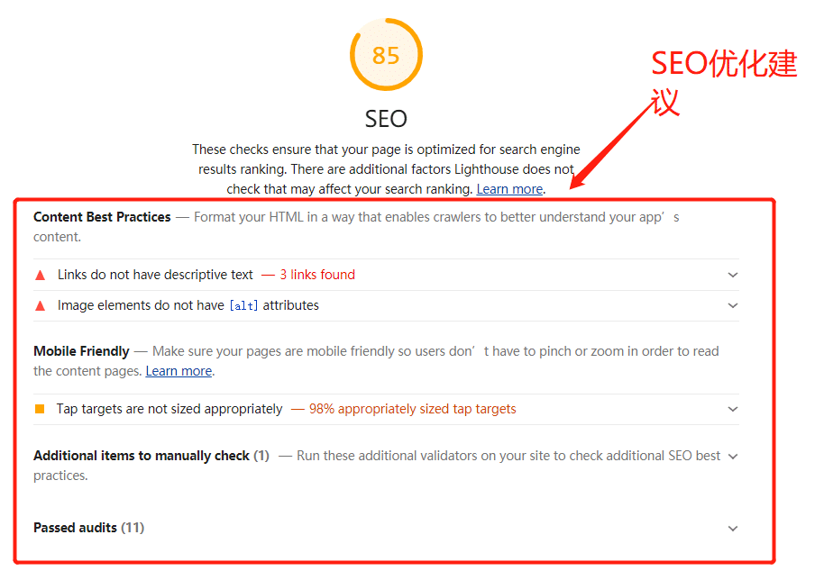
  * PWA 测试结果：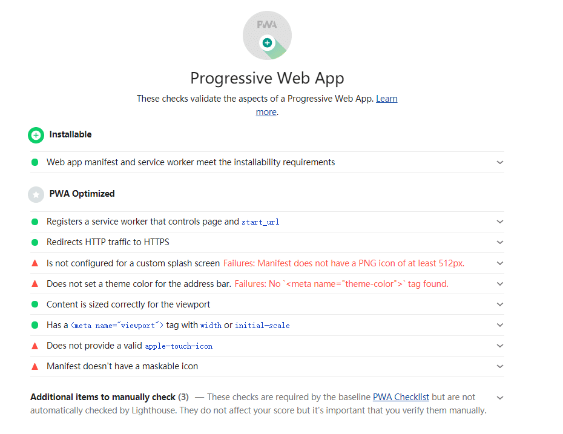

## Performance 评分

* 性能评分的分值区间是：0到100。

  * 如果出现0分，通常是在运行 Lighthouse 时发生了错误，满分100分代表了站点已经达到了98分位值的数据，而50分则是75分位值的数据。
  * 分值区间和颜色的对应关系如下：
    - 0 - 49（慢）：红色
    - 50 - 89（平均值）： 橙色
    - 90 - 100（快）： 绿色

* 性能指标评分的计算方式：每一项性能指标对评分的贡献都有其计算逻辑，Lighthouse 会将原始的性能值映射成为 0-100 之间的数字。评分使用 HTTPArchive 上的真实站点性能数据作为样本，统计出对数正态分布。

  * 例如，您的 FCP 分数是基于[HTTP 存档中的数据](https://httparchive.org/reports/loading-speed#fcp)，您的页面的 FCP 时间与真实网站的 FCP 时间的比较。例如，在 99% 中执行的站点在大约 1.2 秒内呈现 FCP。如果您网站的 FCP 为 1.2 秒，则您的 FCP 分数为 99。请参阅[如何确定指标分数](https://web.dev/performance-scoring/#metric-scores)以了解如何设置 Lighthouse 分数阈值。参考[Lighthouse 如何确定分数](https://web.dev/first-contentful-paint/#how-lighthouse-determines-your-fcp-score)

* 性能评分的分配权重：各个指标对性能评分的贡献并不相同，Lighthouse 提供了[评分详情表](https://docs.google.com/spreadsheets/d/1Cxzhy5ecqJCucdf1M0iOzM8mIxNc7mmx107o5nj38Eo/edit#gid=0)，形式如下图，来查阅具体权重分配情况。权重较大的指标，对性能评分的影响更大一些，最终的总体性能评分是这些性能指标分数的加权平均值。我们可以用这个分数计算的[表格](https://docs.google.com/spreadsheets/d/1dXH-bXX3gxqqpD1f7rp6ImSOhobsT1gn_GQ2fGZp8UU/edit?ts=59fb61d2#gid=283330180)作为参考，以了解不同的指标是如何影响最终评分的。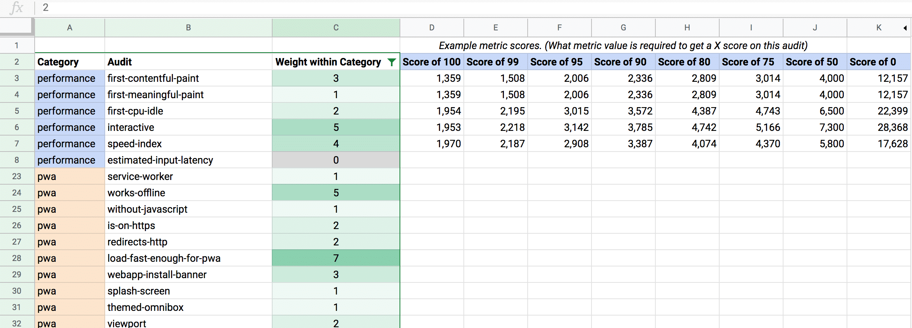

  从表中可以看出，性能的指标项权重分配如下：

  * 3X - 首次内容绘制
  * 1X - 首次有效绘制
  * 2X - 首次 CPU 空闲
  * 5X - 可交互时间
  * 4X - 速度指标
  * 0X - 输入延迟估值

* 不同 Lighthouse 版本对权重不同：

  * [Lighthouse 8 ](https://web.dev/performance-scoring/#lighthouse-8)

  | Audit                                                        | Weight |
  | :----------------------------------------------------------- | :----- |
  | [First Contentful Paint](https://web.dev/first-contentful-paint/) | 10%    |
  | [Speed Index](https://web.dev/speed-index/)                  | 10%    |
  | [Largest Contentful Paint](https://web.dev/lcp/)             | 25%    |
  | [Time to Interactive](https://web.dev/interactive/)          | 10%    |
  | [Total Blocking Time](https://web.dev/lighthouse-total-blocking-time/) | 30%    |
  | [Cumulative Layout Shift](https://web.dev/cls/)              | 15%    |

  * [Lighthouse 6 ](https://web.dev/performance-scoring/#lighthouse-6)

  | Audit                                                        | Weight |
  | :----------------------------------------------------------- | :----- |
  | [First Contentful Paint](https://web.dev/first-contentful-paint/) | 15%    |
  | [Speed Index](https://web.dev/speed-index/)                  | 15%    |
  | [Largest Contentful Paint](https://web.dev/lcp/)             | 25%    |
  | [Time to Interactive](https://web.dev/interactive/)          | 15%    |
  | [Total Blocking Time](https://web.dev/lighthouse-total-blocking-time/) | 25%    |
  | [Cumulative Layout Shift](https://web.dev/cls/)              | 5%     |

  * Lighthouse 5

  | Audit                                                        | Weight |
  | :----------------------------------------------------------- | :----- |
  | [First Contentful Paint](https://web.dev/first-contentful-paint/) | 20%    |
  | [Speed Index](https://web.dev/speed-index/)                  | 27%    |
  | [First Meaningful Paint](https://web.dev/first-meaningful-paint/) | 7%     |
  | [Time to Interactive](https://web.dev/interactive/)          | 33%    |
  | [First CPU Idle](https://web.dev/first-cpu-idle/)            | 13%    |


* 使用[Lighthouse 评分计算器](https://googlechrome.github.io/lighthouse/scorecalc/)来帮助了解您应该为达到某个 Lighthouse 性能分数而设定的阈值。

## **参考资料**

[Lighthoust Performance audits](https://web.dev/lighthouse-performance/)

[Web Vitals  | Articles  | web.dev](https://web.dev/articles/vitals?hl=zh-cn)